<div align="center">


<p>
  <a href="README.md"><kbd>English</kbd></a>
  <a href="README.fr.md"><kbd><b>Français</b></kbd></a>
  <a href="README.zh-CN.md"><kbd>中文</kbd></a>
  <a href="README.ja.md"><kbd>日本語</kbd></a>
</p>

<p><b>Vos personnages préférés deviennent de petits compagnons animés pour Codex.</b></p>

<p>
  <code>✦ 26 PERSONNAGES</code>
  <code>✦ 27 ÉDITIONS</code>
  <code>✦ 9 ANIMATIONS</code>
  <code>✦ 16 DIRECTIONS</code>
</p>

<sub>🌙 Choisissez un personnage · Décompressez l’archive · Laissez-le vous accompagner</sub>

</div>

> **Application de bureau uniquement :** les packs de familiers personnalisés fonctionnent actuellement uniquement dans l’application Codex pour ordinateur. L’application mobile Codex ne peut pas afficher les familiers ; leur installation sur mobile et leur synchronisation entre appareils ne sont pas prises en charge.

<p align="center">
  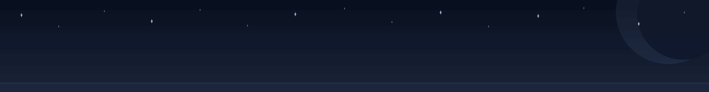
</p>

<div align="center">

## ✦ Instants animés ✦

<sub>Respirer, bondir, saluer, réfléchir — de petits gestes qui donnent une vraie présence au personnage.</sub>

</div>

<table align="center">
  <tr>
    <td align="center" valign="top" width="33%">
      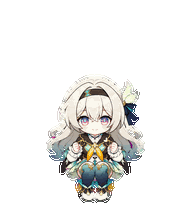<br>
      <b>Saut</b><br>
      <sub>Un petit bond plein d'espoir, les cheveux argentés soulevés au sommet</sub>
    </td>
    <td align="center" valign="top" width="33%">
      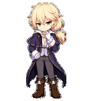<br>
      <b>Vérification</b><br>
      <sub>Un regard posé sur le résultat, déjà tourné vers le prochain coup</sub>
    </td>
    <td align="center" valign="top" width="33%">
      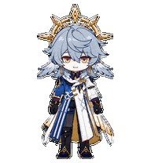<br>
      <b>Salut</b><br>
      <sub>Un salut gracieux, porté par le calme cérémoniel de Sunday</sub>
    </td>
  </tr>
  <tr>
    <td align="center" valign="top" width="33%">
      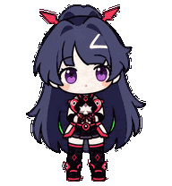<br>
      <b>Travail</b><br>
      <sub>Une concentration calme pendant l’exécution</sub>
    </td>
    <td align="center" valign="top" width="33%">
      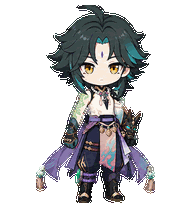<br>
      <b>Attente</b><br>
      <sub>Une pause attentive avant votre prochaine décision</sub>
    </td>
    <td align="center" valign="top" width="33%">
      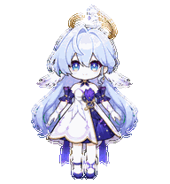<br>
      <b>Salut</b><br>
      <sub>Un accueil doux et élégant, digne de la scène</sub>
    </td>
  </tr>
</table>

<div align="center">
  
</div>

<div align="center">

## ✦ Choisissez votre compagnon ✦

<sub>Chaque portrait est animé. Sélectionnez l’image d’un personnage pour rejoindre son dossier.</sub>

</div>

<table align="center">
  <tr>
    <td align="center" valign="top" width="33%">
      <sub>✦ PERSONNAGE 01 ✦</sub><br>
      <a href="#character-01-xiao"></a><br>
      <b>「 Xiao 」</b><br>
      <sub>◇ Vigilant · Discret · Adepte ◇</sub>
    </td>
    <td align="center" valign="top" width="33%">
      <sub>✦ PERSONNAGE 02 ✦</sub><br>
      <a href="#character-02-dan-heng-imbibitor-lunae"></a><br>
      <b>「 Dan&nbsp;Heng 」</b><br>
      <sub>◇ Élégance froide · Présence paisible ◇</sub>
    </td>
    <td align="center" valign="top" width="33%">
      <sub>✦ PERSONNAGE 03 ✦</sub><br>
      <a href="#character-03-jing-yuan"></a><br>
      <b>「 Jing&nbsp;Yuan 」</b><br>
      <sub>◇ Assurance tranquille · Regard attentif ◇</sub>
    </td>
  </tr>
  <tr>
    <td align="center" valign="top" width="33%">
      <sub>✦ PERSONNAGE 04 ✦</sub><br>
      <a href="#character-04-zhongli"></a><br>
      <b>「 Zhongli 」</b><br>
      <sub>◇ Calme · Fiable · Digne ◇</sub>
    </td>
    <td align="center" valign="top" width="33%">
      <sub>✦ PERSONNAGE 05 ✦</sub><br>
      <a href="#character-05-raiden-mei"></a><br>
      <b>「 Raiden&nbsp;Mei 」</b><br>
      <sub>◇ Posée · Curieuse · Prête ◇</sub>
    </td>
    <td align="center" valign="top" width="33%">
      <sub>✦ PERSONNAGE 06 ✦</sub><br>
      <a href="#character-06-obanai"></a><br>
      <b>「 Obanai 」</b><br>
      <sub>◇ Réservé · Alerte · Avec Kaburamaru ◇</sub>
    </td>
  </tr>
  <tr>
    <td align="center" valign="top" width="33%">
      <sub>✦ PERSONNAGE 07 ✦</sub><br>
      <a href="#character-07-yae-miko"></a><br>
      <b>「 Yae&nbsp;Miko 」</b><br>
      <sub>◇ Grâce malicieuse · Élégance du sanctuaire ◇</sub>
    </td>
    <td align="center" valign="top" width="33%">
      <sub>✦ PERSONNAGE 08 ✦</sub><br>
      <a href="#character-08-furina"></a><br>
      <b>「 Furina 」</b><br>
      <sub>◇ Charme théâtral · Élégance aquatique · Malice lumineuse ◇</sub>
    </td>
    <td align="center" valign="top" width="33%">
      <sub>✦ PERSONNAGE 09 ✦</sub><br>
      <a href="#character-09-acheron"></a><br>
      <b>「 Acheron 」</b><br>
      <sub>◇ Calme insondable · Orage violet · Regard lointain ◇</sub>
    </td>
  </tr>
  <tr>
    <td align="center" valign="top" width="33%">
      <sub>✦ PERSONNAGE 10 ✦</sub><br>
      <a href="#character-10-ellen-joe"></a><br>
      <b>「 Ellen&nbsp;Joe 」</b><br>
      <sub>◇ Sang-froid · Regard somnolent · Répartie vive ◇</sub>
    </td>
    <td align="center" valign="top" width="33%">
      <sub>✦ PERSONNAGE 11 ✦</sub><br>
      <a href="#character-11-hu-tao"></a><br>
      <b>「 Hu&nbsp;Tao 」</b><br>
      <sub>◇ Malice solaire · Charme des fleurs de prunier · Courage sans détour ◇</sub>
    </td>
    <td align="center" valign="top" width="33%">
      <sub>✦ PERSONNAGE 12 ✦</sub><br>
      <a href="#character-12-robin"></a><br>
      <b>「 Robin 」</b><br>
      <sub>◇ Grâce sereine · Voix céleste · Élégance ailée ◇</sub>
    </td>
  </tr>
  <tr>
    <td align="center" valign="top" width="33%">
      <sub>✦ PERSONNAGE 13 ✦</sub><br>
      <a href="#character-13-kaeya"></a><br>
      <b>「 Kaeya 」</b><br>
      <sub>◇ Assurance décontractée · Charme joueur · Regard attentif ◇</sub>
    </td>
    <td align="center" valign="top" width="33%">
      <sub>✦ PERSONNAGE 14 ✦</sub><br>
      <a href="#character-14-firefly"></a><br>
      <b>「 Firefly 」</b><br>
      <sub>◇ Douce espérance · Courage tranquille · Une vie à elle ◇</sub>
    </td>
    <td align="center" valign="top" width="33%">
      <sub>✦ PERSONNAGE 15 ✦</sub><br>
      <a href="#character-15-kevin-kaslana"></a><br>
      <b>「 Kevin 」</b><br>
      <sub>◇ Résolution glaciale · Puissance silencieuse · Volonté inébranlable ◇</sub>
    </td>
  </tr>
  <tr>
    <td align="center" valign="top" width="33%">
      <sub>✦ PERSONNAGE 16 ✦</sub><br>
      <a href="#character-16-kamisato-ayaka"></a><br>
      <b>「 Ayaka 」</b><br>
      <sub>◇ Grâce maîtrisée · Élégance glacée · Douceur discrète ◇</sub>
    </td>
    <td align="center" valign="top" width="33%">
      <sub>✦ PERSONNAGE 17 ✦</sub><br>
      <a href="#character-17-blade"></a><br>
      <b>「 Blade 」</b><br>
      <sub>◇ Fureur contenue · Lame écarlate · Volonté immortelle ◇</sub>
    </td>
    <td align="center" valign="top" width="33%">
      <sub>✦ PERSONNAGE 18 ✦</sub><br>
      <a href="#character-18-ruan-mei"></a><br>
      <b>「 Ruan&nbsp;Mei 」</b><br>
      <sub>◇ Intuition sereine · Grâce florale · Mélodie discrète ◇</sub>
    </td>
  </tr>
  <tr>
    <td align="center" valign="top" width="33%">
      <sub>✦ PERSONNAGE 19 ✦</sub><br>
      <a href="#character-19-kaedehara-kazuha"></a><br>
      <b>「 Kazuha 」</b><br>
      <sub>◇ Silence d'érable · Grâce vagabonde · Résolution portée par le vent ◇</sub>
    </td>
    <td align="center" valign="top" width="33%">
      <sub>✦ PERSONNAGE 20 ✦</sub><br>
      <a href="#character-20-hoshimi-miyabi"></a><br>
      <b>「 Miyabi 」</b><br>
      <sub>◇ Calme précis · Regard écarlate · Art du sabre maîtrisé ◇</sub>
    </td>
    <td align="center" valign="top" width="33%">
      <sub>✦ PERSONNAGE 21 ✦</sub><br>
      <a href="#character-21-aventurine"></a><br>
      <b>「 Aventurine 」</b><br>
      <sub>◇ Élégance calculée · Éclat doré · Pari maîtrisé ◇</sub>
    </td>
  </tr>
  <tr>
    <td align="center" valign="top" width="33%">
      <sub>✦ PERSONNAGE 22 ✦</sub><br>
      <a href="#character-22-ganyu">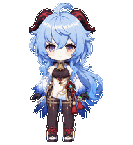</a><br>
      <b>「 Ganyu 」</b><br>
      <sub>◇ Douce patience · Grâce de givre · Sérénité qilin ◇</sub>
    </td>
    <td align="center" valign="top" width="33%">
      <sub>✦ PERSONNAGE 23 ✦</sub><br>
      <a href="#character-23-sunday">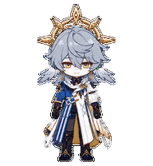</a><br>
      <b>「 Sunday 」</b><br>
      <sub>◇ Grâce mesurée · Regard doré · Harmonie silencieuse ◇</sub>
    </td>
    <td align="center" valign="top" width="33%">
      <sub>✦ NOUVEAU ✦</sub><br>
      <a href="#character-24-mitsuri-kanroji">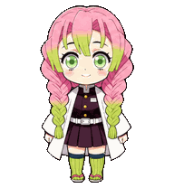</a><br>
      <b>「 Mitsuri 」</b><br>
      <sub>◇ Chaleur sincère · Énergie lumineuse · Tendresse résolue ◇</sub>
    </td>
  </tr>
  <tr>
    <td align="center" valign="top" width="33%">
      <sub>✦ NOUVEAU ✦</sub><br>
      <a href="#character-25-kafka">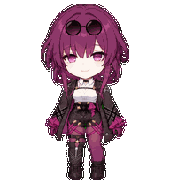</a><br>
      <b>「 Kafka 」</b><br>
      <sub>◇ Calme velouté · Charme dangereux · Maîtrise tranquille ◇</sub>
    </td>
    <td align="center" valign="top" width="33%">
      <sub>✦ NOUVEAU ✦</sub><br>
      <a href="#character-26-otto-apocalypse">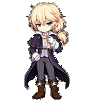</a><br>
      <b>「 Otto 」</b><br>
      <sub>◇ Élégance de cour · Regard calme · Toujours plusieurs coups d'avance ◇</sub>
    </td>
    <td align="center" valign="top" width="33%">
      <sub>✦ SUIVANT ✦</sub><br>
      <a href="#contribute-a-character"></a><br>
      <b>「 Qui&nbsp;nous&nbsp;rejoindra&nbsp;? 」</b><br>
      <sub>Apportez une référence · Faites éclore un compagnon</sub>
    </td>
  </tr>
</table>

<div align="center">
  
</div>

<div align="center">

## ✦ Archives des personnages ✦

<sub>Ouvrez une fiche pour découvrir le personnage, sa planche d’animations et son téléchargement.</sub>

</div>

<a id="character-01-xiao" name="character-01-xiao"></a>
<details open>
<summary><b>🌙 DOSSIER 01 — Xiao</b>　<sub>Yaksha gardien / édition 2D</sub></summary>

<br>

<table>
  <tr>
    <td align="center"></td>
    <td>
      <b>Style :</b> sticker anime 2D<br>
      <b>Détails emblématiques :</b> yeux dorés, marque violette sur le front, cheveux aux pointes turquoise, tatouage d’adepte, ornements de jade et masque Yaksha<br>
      <b>Tempérament :</b> vigilant et contenu, avec une présence plus douce à l’échelle du bureau<br><br>
      <a href="genshin-impact/xiao/xiao-2d.zip"><b>⬇️ Télécharger l’édition 2D</b></a> ·
      <a href="work/xiao/2d/qa/contact-sheet-extended.png">Planche d’animations</a> ·
      <a href="work/xiao/2d/qa/look-directions.png">16 directions du regard</a>
    </td>
  </tr>
</table>

</details>

<a id="character-02-dan-heng-imbibitor-lunae" name="character-02-dan-heng-imbibitor-lunae"></a>
<details>
<summary><b>🐉 DOSSIER 02 — Dan Heng · Imbibitor Lunae</b>　<sub>Vidyadhara / édition 2D</sub></summary>

<br>

<table>
  <tr>
    <td align="center"></td>
    <td>
      <b>Style :</b> sticker anime 2D<br>
      <b>Détails emblématiques :</b> cornes de dragon cyan, oreilles pointues, longue chevelure sombre, manches blanches et ornements de jade et d’or<br>
      <b>Tempérament :</b> froid, posé et d’une élégance discrète<br><br>
      <a href="honkai-star-rail/dan-heng-imbibitor-lunae/dan-heng-imbibitor-lunae-2d-codex-pet-v2.zip"><b>⬇️ Télécharger l’édition 2D</b></a> ·
      <a href="work/dan-heng-imbibitor-lunae/2d/qa/contact-sheet-extended.png">Planche d’animations</a> ·
      <a href="work/dan-heng-imbibitor-lunae/2d/qa/look-directions.png">16 directions du regard</a>
    </td>
  </tr>
</table>

</details>

<a id="character-03-jing-yuan" name="character-03-jing-yuan"></a>
<details>
<summary><b>🦁 DOSSIER 03 — Jing Yuan</b>　<sub>Général des Chevaliers des Nuages / édition 2D</sub></summary>

<br>

<table>
  <tr>
    <td align="center"></td>
    <td>
      <b>Style :</b> sticker anime 2D<br>
      <b>Détails emblématiques :</b> longue chevelure argentée, yeux dorés, ruban rouge et uniforme noir, blanc, rouge et or<br>
      <b>Tempérament :</b> détendu, observateur et sûr de lui<br><br>
      <a href="honkai-star-rail/jing-yuan/jing-yuan-2d-codex-pet-v2.zip"><b>⬇️ Télécharger l’édition 2D</b></a> ·
      <a href="work/jing-yuan/2d/qa/contact-sheet-extended.png">Planche d’animations</a> ·
      <a href="work/jing-yuan/2d/qa/look-directions.png">16 directions du regard</a>
    </td>
  </tr>
</table>

</details>

<a id="character-04-zhongli" name="character-04-zhongli"></a>
<details>
<summary><b>🔶 DOSSIER 04 — Zhongli</b>　<sub>Conseiller / édition 2D</sub></summary>

<br>

<table>
  <tr>
    <td align="center"></td>
    <td>
      <b>Style :</b> sticker anime 2D<br>
      <b>Détails emblématiques :</b> yeux ambrés, long manteau raffiné et palette chaleureuse de brun et d’or<br>
      <b>Tempérament :</b> stable, rassurant et naturellement digne<br><br>
      <a href="genshin-impact/zhongli/zhongli-2d-codex-pet-v2.zip"><b>⬇️ Télécharger l’édition 2D</b></a> ·
      <a href="work/zhongli/2d/qa/contact-sheet-extended.png">Planche d’animations</a> ·
      <a href="work/zhongli/2d/qa/look-directions.png">16 directions du regard</a>
    </td>
  </tr>
</table>

</details>

<a id="character-05-raiden-mei" name="character-05-raiden-mei"></a>
<details>
<summary><b>⚡ DOSSIER 05 — Raiden Mei</b>　<sub>Valkyrie / deux éditions visuelles</sub></summary>

<br>

Un même personnage, deux interprétations visuelles :

<table>
  <tr>
    <th align="center">Sticker anime 2D</th>
    <th align="center">Figurine chibi au rendu 3D</th>
  </tr>
  <tr>
    <td align="center"></td>
    <td align="center">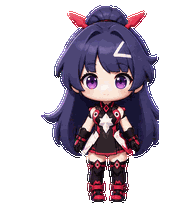</td>
  </tr>
  <tr>
    <td align="center">
      <a href="honkai-impact-3rd/raiden-mei/raiden-mei-2d-codex-pet-v2.zip"><b>⬇️ Télécharger la 2D</b></a><br>
      <a href="honkai-impact-3rd/raiden-mei/qa/raiden-mei-2d-contact-sheet.png">Planche d’animations</a> ·
      <a href="honkai-impact-3rd/raiden-mei/qa/raiden-mei-2d-look-directions.png">16 directions</a>
    </td>
    <td align="center">
      <a href="honkai-impact-3rd/raiden-mei/raiden-mei-3d-codex-pet-v2.zip"><b>⬇️ Télécharger le style 3D</b></a><br>
      <a href="honkai-impact-3rd/raiden-mei/qa/raiden-mei-3d-contact-sheet.png">Planche d’animations</a> ·
      <a href="honkai-impact-3rd/raiden-mei/qa/raiden-mei-3d-look-directions.png">16 directions</a>
    </td>
  </tr>
</table>

L’édition 3D désigne son rendu visuel. Elle reste, comme les autres, une planche de sprites 2D légère.

</details>

<a id="character-06-obanai" name="character-06-obanai"></a>
<details>
<summary><b>🐍 DOSSIER 06 — Obanai</b>　<sub>Pilier du Serpent / édition 2D</sub></summary>

<br>

<table>
  <tr>
    <td align="center"></td>
    <td>
      <b>Style :</b> sticker anime 2D<br>
      <b>Détails emblématiques :</b> yeux vairons, haori rayé et Kaburamaru blotti contre lui<br>
      <b>Tempérament :</b> réservé, vigilant et d’une attention tranchante<br><br>
      <a href="others/obanai-iguro/obanai-2d-codex-pet-v2.zip"><b>⬇️ Télécharger l’édition 2D</b></a> ·
      <a href="others/obanai-iguro/qa/contact-sheet.png">Planche d’animations</a> ·
      <a href="others/obanai-iguro/qa/direction-qa.png">16 directions du regard</a>
    </td>
  </tr>
</table>

</details>

<a id="character-07-yae-miko" name="character-07-yae-miko"></a>
<details>
<summary><b>🌸 DOSSIER 07 — Yae Miko</b>　<sub>Guuji du sanctuaire de Narukami / édition 2D</sub></summary>

<br>

<table>
  <tr>
    <td align="center"></td>
    <td>
      <b>Style :</b> sticker anime 2D<br>
      <b>Détails emblématiques :</b> longue chevelure rose sakura, yeux violets, ornements dorés, boucles serties et tenue de prêtresse rouge, blanche, noire et violette<br>
      <b>Tempérament :</b> élégante, joueuse et discrètement malicieuse<br><br>
      <a href="genshin-impact/yae-miko/yae-miko-2d-codex-pet-v2.zip"><b>⬇️ Télécharger l’édition 2D</b></a> ·
      <a href="work/yae-miko/2d/qa/contact-sheet-extended.png">Planche d’animations</a> ·
      <a href="work/yae-miko/2d/qa/look-directions.png">16 directions</a>
    </td>
  </tr>
</table>

</details>

<a id="character-08-furina" name="character-08-furina"></a>
<details>
<summary><b>💧 DOSSIER 08 — Furina</b>　<sub>Étoile de Fontaine / édition 2D</sub></summary>

<br>

<table>
  <tr>
    <td align="center"></td>
    <td>
      <b>Style :</b> sticker anime 2D<br>
      <b>Détails emblématiques :</b> carré blanc aux reflets cyan, yeux bleus en forme de goutte, chapeau bleu nuit en forme de couronne, volants blancs, gemmes bleues et tenue de Fontaine rehaussée d'or<br>
      <b>Tempérament :</b> une présence gracieuse et théâtrale, toujours traversée d'une étincelle espiègle<br><br>
      <a href="genshin-impact/furina/furina-2d-codex-pet-v2.zip"><b>⬇️ Télécharger l'édition 2D</b></a> ·
      <a href="work/furina/2d/qa/contact-sheet-extended.png">Planche d'animations</a> ·
      <a href="work/furina/2d/qa/look-directions.png">16 directions</a>
    </td>
  </tr>
</table>

</details>

<a id="character-09-acheron" name="character-09-acheron"></a>
<details>
<summary><b>🌌 DOSSIER 09 — Acheron</b>　<sub>Ranger galactique / édition 2D</sub></summary>

<br>

<table>
  <tr>
    <td align="center"></td>
    <td>
      <b>Style :</b> sticker anime 2D<br>
      <b>Détails emblématiques :</b> chevelure indigo-violet profond, mèche asymétrique voilant un œil, regard violet-magenta, tenue blanche, lilas et noire aux motifs de flamme, et katana gardé près du corps<br>
      <b>Tempérament :</b> silencieuse et insaisissable, comme un orage encore lointain<br><br>
      <a href="honkai-star-rail/acheron/acheron-2d-codex-pet-v2.zip"><b>⬇️ Télécharger l'édition 2D</b></a> ·
      <a href="work/acheron/2d/qa/contact-sheet-extended.png">Planche d'animations</a> ·
      <a href="work/acheron/2d/qa/look-directions.png">16 directions</a>
    </td>
  </tr>
</table>

</details>

<a id="character-10-ellen-joe" name="character-10-ellen-joe"></a>
<details>
<summary><b>🦈 DOSSIER 10 — Ellen Joe</b>　<sub>Domestique thirène requin / édition 2D</sub></summary>

<br>

<table>
  <tr>
    <td align="center"></td>
    <td>
      <b>Style :</b> sticker anime 2D<br>
      <b>Détails emblématiques :</b> carré noir anthracite aux mèches intérieures rouges, regard rouge assoupi, coiffe de domestique ornée de pointes, uniforme industriel noir et blanc, et imposante queue de requin attachée au corps<br>
      <b>Tempérament :</b> détendue et imperturbable, avec une malice fulgurante dès que le travail s'anime<br><br>
      <a href="zenless-zone-zero/ellen-joe/ellen-joe-2d-codex-pet-v2.zip"><b>⬇️ Télécharger l'édition 2D</b></a> ·
      <a href="work/ellen-joe/2d/qa/contact-sheet-extended.png">Planche d'animations</a> ·
      <a href="work/ellen-joe/2d/qa/look-directions.png">16 directions</a>
    </td>
  </tr>
</table>

</details>

<a id="character-11-hu-tao" name="character-11-hu-tao"></a>
<details>
<summary><b>🔥 DOSSIER 11 — Hu Tao</b>　<sub>77e directrice / édition 2D</sub></summary>

<br>

<table>
  <tr>
    <td align="center"></td>
    <td>
      <b>Style :</b> sticker anime 2D<br>
      <b>Détails emblématiques :</b> yeux cramoisis en forme de fleur, grand chapeau sombre orné d'un talisman et d'une branche de prunier, longue chevelure brun foncé aux pointes rouge assourdi, et uniforme brun-noir, rouge et or<br>
      <b>Tempérament :</b> vive, taquine et intrépide, avec une étincelle malicieuse jusque dans les instants calmes<br><br>
      <a href="genshin-impact/hu-tao/hu-tao-2d-codex-pet-v2.zip"><b>⬇️ Télécharger l'édition 2D</b></a> ·
      <a href="work/hu-tao/2d/qa/contact-sheet-extended.png">Planche d'animations</a> ·
      <a href="work/hu-tao/2d/qa/look-directions.png">16 directions</a>
    </td>
  </tr>
</table>

</details>

<a id="character-12-robin" name="character-12-robin"></a>
<details>
<summary><b>🎶 DOSSIER 12 — Robin</b>　<sub>Chanteuse halovienne / édition 2D</sub></summary>

<br>

<table>
  <tr>
    <td align="center"></td>
    <td>
      <b>Style :</b> sticker anime 2D<br>
      <b>Détails emblématiques :</b> chevelure bleu argent et chignon en rosette, yeux turquoise dégradés de violet, auréole dorée aux pointes florales, petites ailes blanches aux oreilles, et robe de scène superposant blanc, indigo profond, lilas et or<br>
      <b>Tempérament :</b> sereine et gracieuse, avec la chaleur maîtrisée d'une chanteuse prête à illuminer la pièce<br><br>
      <a href="honkai-star-rail/robin/robin-2d-codex-pet-v2.zip"><b>⬇️ Télécharger l'édition 2D</b></a> ·
      <a href="work/robin/2d/qa/contact-sheet-extended.png">Planche d'animations</a> ·
      <a href="work/robin/2d/qa/look-directions.png">16 directions</a>
    </td>
  </tr>
</table>

</details>

<a id="character-13-kaeya" name="character-13-kaeya"></a>
<details>
<summary><b>❄️ DOSSIER 13 — Kaeya</b>　<sub>Capitaine de cavalerie / édition 2D</sub></summary>

<br>

<table>
  <tr>
    <td align="center"></td>
    <td>
      <b>Style :</b> sticker anime 2D<br>
      <b>Détails emblématiques :</b> chevelure bleu nuit balayée d'une mèche froide, peau hâlée, œil visible lilas pâle, cache-œil noir, mantelet de fourrure blanche, cape fendue bleu-violet et uniforme sombre rehaussé d'or<br>
      <b>Tempérament :</b> détendu et sûr de lui, avec une malice légère et un regard qui ne perd rien de ce qui l'entoure<br><br>
      <a href="genshin-impact/kaeya/kaeya-2d-codex-pet-v2.zip"><b>⬇️ Télécharger l'édition 2D</b></a> ·
      <a href="work/kaeya/2d/qa/contact-sheet-extended.png">Planche d'animations</a> ·
      <a href="work/kaeya/2d/qa/look-directions.png">16 directions</a>
    </td>
  </tr>
</table>

</details>

<a id="character-14-firefly" name="character-14-firefly"></a>
<details>
<summary><b>🌠 DOSSIER 14 — Firefly</b>　<sub>Chasseuse de Stellaron / édition 2D</sub></summary>

<br>

<table>
  <tr>
    <td align="center"></td>
    <td>
      <b>Style :</b> sticker anime 2D<br>
      <b>Détails emblématiques :</b> longue chevelure argent nacré aux pointes gris froid, yeux roses et turquoise, serre-tête noir, ornement en feuille menthe et nœud bleu nuit, courte cape charbon et or, nœud de poitrine orange doré, robe menthe à plusieurs pans et bottines blanches aux accents turquoise<br>
      <b>Tempérament :</b> douce et lumineuse, portée par un courage tranquille et l'espoir de tracer sa propre voie<br><br>
      <a href="honkai-star-rail/firefly/firefly-2d-codex-pet-v2.zip"><b>⬇️ Télécharger l'édition 2D</b></a> ·
      <a href="work/firefly/2d/qa/contact-sheet-extended.png">Planche d'animations</a> ·
      <a href="work/firefly/2d/qa/look-directions.png">16 directions</a>
    </td>
  </tr>
</table>

</details>

<a id="character-15-kevin-kaslana" name="character-15-kevin-kaslana"></a>
<details>
<summary><b>🧊 DOSSIER 15 — Kevin Kaslana</b>　<sub>Dirigeant du Serpent Mondial / édition 2D</sub></summary>

<br>

<table>
  <tr>
    <td align="center"></td>
    <td>
      <b>Style :</b> sticker anime 2D<br>
      <b>Détails emblématiques :</b> cheveux blancs ébouriffés, yeux bleu glace, long manteau de combat noir et blanc à col haut souligné d'or et de boucles, accents cyan au torse et à la ceinture, et manche blindée asymétrique<br>
      <b>Tempérament :</b> calme et redoutable, une puissance immense contenue dans une maîtrise presque immobile<br><br>
      <a href="honkai-impact-3rd/kevin-kaslana/kevin-kaslana-2d-codex-pet-v2.zip"><b>⬇️ Télécharger l'édition 2D</b></a> ·
      <a href="work/kevin-kaslana/2d-repair-v3/qa/contact-sheet-extended.png">Planche d'animations</a> ·
      <a href="work/kevin-kaslana/2d-repair-v3/qa/look-directions.png">16 directions</a>
    </td>
  </tr>
</table>

</details>

<a id="character-16-kamisato-ayaka" name="character-16-kamisato-ayaka"></a>
<details>
<summary><b>🌸 DOSSIER 16 — Kamisato Ayaka</b>　<sub>Princesse Shirasagi / édition 2D</sub></summary>

<br>

<table>
  <tr>
    <td align="center"></td>
    <td>
      <b>Style :</b> sticker anime 2D<br>
      <b>Détails emblématiques :</b> haute queue-de-cheval bleu glace et frange droite, ornement noir et or en forme de couronne, rubans roses, yeux bleu clair, robe-kimono bleu nuit aux pans bleu pâle, bordures dorées, motifs de sakura, cordon magenta, panneaux d'armure sur la jupe et éventail pliant élégant<br>
      <b>Tempérament :</b> digne et gracieuse, une élégance givrée adoucie par une chaleur discrète dans chaque geste<br><br>
      <a href="genshin-impact/kamisato-ayaka/kamisato-ayaka-2d-codex-pet-v2.zip"><b>⬇️ Télécharger l'édition 2D</b></a> ·
      <a href="work/kamisato-ayaka/2d/qa/contact-sheet-extended.png">Planche d'animations</a> ·
      <a href="work/kamisato-ayaka/2d/qa/look-directions.png">16 directions</a>
    </td>
  </tr>
</table>

</details>

<a id="character-17-blade" name="character-17-blade"></a>
<details>
<summary><b>🗡️ DOSSIER 17 — Blade</b>　<sub>Chasseur de Stellaron / édition 2D</sub></summary>

<br>

<table>
  <tr>
    <td align="center"></td>
    <td>
      <b>Style :</b> sticker anime 2D<br>
      <b>Détails emblématiques :</b> longue chevelure bleu nuit aux pointes violet-rouge, œil cramoisi sous la frange, manteau noir à attaches dorées et doublure rouge, accents d'armure argentés, mains bandées et lame sombre portée au côté<br>
      <b>Tempérament :</b> silencieux et dangereux, chaque geste contenu laissant deviner une volonté qui refuse de céder<br><br>
      <a href="honkai-star-rail/blade/blade-2d-codex-pet-v2.zip"><b>⬇️ Télécharger l'édition 2D</b></a> ·
      <a href="work/blade/2d/qa/contact-sheet-extended.png">Planche d'animations</a> ·
      <a href="work/blade/2d/qa/look-directions.png">16 directions</a>
    </td>
  </tr>
</table>

</details>

<a id="character-18-ruan-mei" name="character-18-ruan-mei"></a>
<details>
<summary><b>🌿 DOSSIER 18 — Ruan Mei</b>　<sub>Savante de la Société des Génies / édition 2D</sub></summary>

<br>

<table>
  <tr>
    <td align="center"></td>
    <td>
      <b>Style :</b> sticker anime 2D<br>
      <b>Détails emblématiques :</b> longue chevelure brun profond, yeux turquoise, ornement floral d'or et de perles, étole blanche, robe bleu sarcelle et bleu nuit aux fins motifs dorés, fleur rose à la taille, longs gants et ruan bleu richement décoré<br>
      <b>Tempérament :</b> sereine et attentive, avec l'assurance paisible d'une chercheuse et la grâce mesurée d'une musicienne<br><br>
      <a href="honkai-star-rail/ruan-mei/ruan-mei-2d-codex-pet-v2.zip"><b>⬇️ Télécharger l'édition 2D</b></a> ·
      <a href="work/ruan-mei/2d/qa/contact-sheet-extended.png">Planche d'animations</a> ·
      <a href="work/ruan-mei/2d/qa/look-directions.png">16 directions</a>
    </td>
  </tr>
</table>

</details>

<a id="character-19-kaedehara-kazuha" name="character-19-kaedehara-kazuha"></a>
<details>
<summary><b>🍁 DOSSIER 19 — Kaedehara Kazuha</b>　<sub>Samouraï errant / édition 2D</sub></summary>

<br>

<table>
  <tr>
    <td align="center"></td>
    <td>
      <b>Style :</b> sticker anime 2D<br>
      <b>Détails emblématiques :</b> chevelure blanc ivoire traversée d'une mèche rouge, yeux rouge-orangé, écharpe courte, tenue de samouraï asymétrique noire, rouge et crème, hakama court bordeaux, sandales et sabre rengainé solidement attaché au côté<br>
      <b>Tempérament :</b> calme et attentif, avec la légèreté d'un voyageur et la résolution tranquille d'un bretteur à l'écoute du vent<br><br>
      <a href="genshin-impact/kaedehara-kazuha/kazuha-chibi-2d-codex-pet-v2.zip"><b>⬇️ Télécharger l'édition 2D</b></a> ·
      <a href="work/kazuha-chibi/2d/qa/contact-sheet-extended.png">Planche d'animations</a> ·
      <a href="work/kazuha-chibi/2d/qa/look-directions.png">16 directions</a>
    </td>
  </tr>
</table>

</details>

<a id="character-20-hoshimi-miyabi" name="character-20-hoshimi-miyabi"></a>
<details>
<summary><b>🦊 DOSSIER 20 — Hoshimi Miyabi</b>　<sub>Bretteuse aux oreilles de renard / édition 2D</sub></summary>

<br>

<table>
  <tr>
    <td align="center"></td>
    <td>
      <b>Style :</b> autocollant anime 2D<br>
      <b>Détails emblématiques :</b> de hautes oreilles de renard sombres, des cheveux bleu nuit, des yeux rouges, un uniforme vert sarcelle, blanc et noir, un bras mécanique asymétrique entouré d'un cordon rouge et un katana rengainé près de la hanche<br>
      <b>Présence :</b> immobile et parfaitement attentive, avec l'assurance contenue d'une bretteuse qui n'a jamais besoin de se presser<br><br>
      <a href="zenless-zone-zero/hoshimi-miyabi/miyabi-2d-codex-pet-v2.zip"><b>⬇️ Télécharger l'édition 2D</b></a> ·
      <a href="work/miyabi/2d/qa/contact-sheet-extended.png">Planche d'animations</a> ·
      <a href="work/miyabi/2d/qa/look-directions.png">16 directions</a>
    </td>
  </tr>
</table>

</details>

<a id="character-21-aventurine" name="character-21-aventurine"></a>
<details>
<summary><b>💎 DOSSIER 21 — Aventurine</b>　<sub>Stratège doré / édition 2D</sub></summary>

<br>

<table>
  <tr>
    <td align="center"></td>
    <td>
      <b>Style :</b> autocollant anime 2D<br>
      <b>Détails emblématiques :</b> cheveux blond sable dégradés, yeux passant du magenta au cyan, boucle d'oreille turquoise en goutte, col de fourrure blanc, veste ajustée noire, turquoise et or, pantalon blanc, gants noirs, bracelet violet, ornements de taille et pompons bleus attachés au manteau<br>
      <b>Présence :</b> posée et malicieusement assurée, avec le calme de quelqu'un qui semble déjà connaître les probabilités avant de miser<br><br>
      <a href="honkai-star-rail/aventurine/aventurine-2d-codex-pet-v2.zip"><b>⬇️ Télécharger l'édition 2D</b></a> ·
      <a href="work/aventurine/2d/qa/contact-sheet-extended.png">Planche d'animations</a> ·
      <a href="work/aventurine/2d/qa/look-directions.png">16 directions</a>
    </td>
  </tr>
</table>

</details>

<a id="character-22-ganyu" name="character-22-ganyu"></a>
<details>
<summary><b>❄️ DOSSIER 22 — Ganyu</b>　<sub>Secrétaire qilin / édition 2D</sub></summary>

<br>

<table>
  <tr>
    <td align="center"></td>
    <td>
      <b>Style :</b> autocollant anime 2D<br>
      <b>Détails emblématiques :</b> longue chevelure bleu givre aux mèches superposées, houppe recourbée et longue queue-de-cheval, cornes de qilin noires et rouges, yeux violet rosé, clochette dorée au cou, corsage brun sombre, pan asymétrique blanc et or, manches dégradées du blanc au cobalt, pans arrière bleus et cordon rouge tressé terminé par deux pompons<br>
      <b>Présence :</b> douce et discrètement attentive, avec la patience posée d'une secrétaire adeptale qui remarque les moindres détails<br><br>
      <a href="genshin-impact/ganyu/ganyu-2d-codex-pet-v2.zip"><b>⬇️ Télécharger l'édition 2D</b></a> ·
      <a href="work/ganyu/2d/qa/contact-sheet-extended.png">Planche d'animations</a> ·
      <a href="work/ganyu/2d/qa/look-directions.png">16 directions</a>
    </td>
  </tr>
</table>

</details>

<a id="character-23-sunday" name="character-23-sunday"></a>
<details>
<summary><b>🎼 DOSSIER 23 — Sunday</b>　<sub>Maestro céleste / édition 2D</sub></summary>

<br>

<table>
  <tr>
    <td align="center"></td>
    <td>
      <b>Style :</b> autocollant anime 2D<br>
      <b>Détails emblématiques :</b> cheveux bleu-gris pâle en mèches superposées, yeux dorés lumineux, ornements en forme de plumes près des oreilles, halo doré rigide aux pointes losangées, long manteau asymétrique blanc, cobalt, bleu nuit et or, gants sombres, pantalon ajusté et hautes bottes<br>
      <b>Présence :</b> sereine et parfaitement maîtrisée, avec l'autorité feutrée d'un chef d'orchestre capable de guider toute une salle sans hausser la voix<br><br>
      <a href="honkai-star-rail/sunday/sunday-2d-codex-pet-v2.zip"><b>⬇️ Télécharger l'édition 2D</b></a> ·
      <a href="work/sunday/2d/qa/contact-sheet-extended.png">Planche d'animations</a> ·
      <a href="work/sunday/2d/qa/look-directions.png">16 directions</a>
    </td>
  </tr>
</table>

</details>

<a id="character-24-mitsuri-kanroji" name="character-24-mitsuri-kanroji"></a>
<details>
<summary><b>💗 DOSSIER 24 — Mitsuri Kanroji</b>　<sub>Pilier de l'Amour / édition 2D</sub></summary>

<br>

<table>
  <tr>
    <td align="center"></td>
    <td>
      <b>Style :</b> autocollant anime 2D<br>
      <b>Détails emblématiques :</b> deux épaisses tresses passant du rose au vert citron, des yeux vert vif, un haori blanc sur son uniforme sombre, des chaussettes rayées vertes et des sandales<br>
      <b>Présence :</b> chaleureuse, spontanée et pleine d'élan, avec une tendresse aussi franche et solide que sa détermination<br><br>
      <a href="others/mitsuri-kanroji/mitsuri-kanroji-2d-codex-pet-v2.zip"><b>⬇️ Télécharger l'édition 2D</b></a> ·
      <a href="others/mitsuri-kanroji/qa/contact-sheet.png">Planche d'animations</a> ·
      <a href="others/mitsuri-kanroji/qa/direction-qa.png">16 directions</a>
    </td>
  </tr>
</table>

</details>

<a id="character-25-kafka" name="character-25-kafka"></a>
<details>
<summary><b>🕸️ DOSSIER 25 — Kafka</b>　<sub>Chasseuse de Stellaron / édition 2D</sub></summary>

<br>

<table>
  <tr>
    <td align="center"></td>
    <td>
      <b>Style :</b> autocollant anime 2D<br>
      <b>Détails emblématiques :</b> cheveux lie-de-vin en mèches superposées avec de longues mèches latérales, lunettes posées sur le sommet du crâne, yeux rose mauve, blouse blanche à col montant, manteau asymétrique noir et violet orné de motifs de toile, collants sombres aux attaches magenta, gants lie-de-vin et bottines noires<br>
      <b>Présence :</b> élégante et énigmatique, avec le calme de celle qui semble déjà connaître la fin de la scène<br><br>
      <a href="honkai-star-rail/Kafka/kafka-2d-codex-pet-v2.zip"><b>⬇️ Télécharger l'édition 2D</b></a> ·
      <a href="honkai-star-rail/Kafka/qa/contact-sheet.png">Planche d'animations</a> ·
      <a href="honkai-star-rail/Kafka/qa/direction-qa.png">16 directions</a>
    </td>
  </tr>
</table>

</details>

<a id="character-26-otto-apocalypse" name="character-26-otto-apocalypse"></a>
<details>
<summary><b>♟️ DOSSIER 26 — Otto Apocalypse</b>　<sub>Grand évêque de Schicksal / édition 2D</sub></summary>

<br>

<table>
  <tr>
    <td align="center"></td>
    <td>
      <b>Style :</b> autocollant anime 2D<br>
      <b>Détails emblématiques :</b> cheveux blond pâle en mèches superposées noués en queue-de-cheval basse sur le côté, yeux verts, long manteau bleu-violet à liserés dorés et capelet d'épaule, chemise blanche à jabot, cravate rose, gilet lavande, gants blancs, pantalon anthracite et hautes bottes brunes<br>
      <b>Présence :</b> raffinée et maîtresse d'elle-même, avec l'autorité tranquille de celui qui réfléchit déjà aux prochains coups<br><br>
      <a href="honkai-impact-3rd/Otto-Apocalypse/otto-apocalypse-2d-codex-pet-v2.zip"><b>⬇️ Télécharger l'édition 2D</b></a> ·
      <a href="honkai-impact-3rd/Otto-Apocalypse/qa/contact-sheet.png">Planche d'animations</a> ·
      <a href="honkai-impact-3rd/Otto-Apocalypse/qa/direction-qa.png">16 directions</a>
    </td>
  </tr>
</table>

</details>

<div align="center">
  
</div>

<p align="center">
  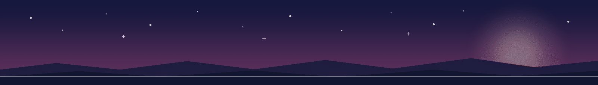
</p>

## 📦 Téléchargements

| Personnage | Édition | Pet ID | Archive |
| --- | --- | --- | --- |
| Xiao | 2D | `xiao` | [Télécharger](genshin-impact/xiao/xiao-2d.zip) |
| Dan Heng · Imbibitor Lunae | 2D | `dan-heng-imbibitor-lunae` | [Télécharger](honkai-star-rail/dan-heng-imbibitor-lunae/dan-heng-imbibitor-lunae-2d-codex-pet-v2.zip) |
| Jing Yuan | 2D | `jing-yuan` | [Télécharger](honkai-star-rail/jing-yuan/jing-yuan-2d-codex-pet-v2.zip) |
| Zhongli | 2D | `zhongli` | [Télécharger](genshin-impact/zhongli/zhongli-2d-codex-pet-v2.zip) |
| Raiden Mei | 2D | `raiden-mei` | [Télécharger](honkai-impact-3rd/raiden-mei/raiden-mei-2d-codex-pet-v2.zip) |
| Raiden Mei | rendu 3D | `raiden-mei-3d` | [Télécharger](honkai-impact-3rd/raiden-mei/raiden-mei-3d-codex-pet-v2.zip) |
| Obanai | 2D | `obanai` | [Télécharger](others/obanai-iguro/obanai-2d-codex-pet-v2.zip) |
| Yae Miko | 2D | `yae-miko` | [Télécharger](genshin-impact/yae-miko/yae-miko-2d-codex-pet-v2.zip) |
| Furina | 2D | `furina` | [Télécharger](genshin-impact/furina/furina-2d-codex-pet-v2.zip) |
| Acheron | 2D | `acheron` | [Télécharger](honkai-star-rail/acheron/acheron-2d-codex-pet-v2.zip) |
| Ellen Joe | 2D | `ellen-joe` | [Télécharger](zenless-zone-zero/ellen-joe/ellen-joe-2d-codex-pet-v2.zip) |
| Hu Tao | 2D | `hu-tao` | [Télécharger](genshin-impact/hu-tao/hu-tao-2d-codex-pet-v2.zip) |
| Robin | 2D | `robin` | [Télécharger](honkai-star-rail/robin/robin-2d-codex-pet-v2.zip) |
| Kaeya | 2D | `kaeya` | [Télécharger](genshin-impact/kaeya/kaeya-2d-codex-pet-v2.zip) |
| Firefly | 2D | `firefly` | [Télécharger](honkai-star-rail/firefly/firefly-2d-codex-pet-v2.zip) |
| Kevin Kaslana | 2D | `kevin-kaslana` | [Télécharger](honkai-impact-3rd/kevin-kaslana/kevin-kaslana-2d-codex-pet-v2.zip) |
| Kamisato Ayaka | 2D | `kamisato-ayaka` | [Télécharger](genshin-impact/kamisato-ayaka/kamisato-ayaka-2d-codex-pet-v2.zip) |
| Blade | 2D | `blade` | [Télécharger](honkai-star-rail/blade/blade-2d-codex-pet-v2.zip) |
| Ruan Mei | 2D | `ruan-mei` | [Télécharger](honkai-star-rail/ruan-mei/ruan-mei-2d-codex-pet-v2.zip) |
| Kaedehara Kazuha | 2D | `kazuha-chibi` | [Télécharger](genshin-impact/kaedehara-kazuha/kazuha-chibi-2d-codex-pet-v2.zip) |
| Hoshimi Miyabi | 2D | `miyabi` | [Télécharger](zenless-zone-zero/hoshimi-miyabi/miyabi-2d-codex-pet-v2.zip) |
| Aventurine | 2D | `aventurine` | [Télécharger](honkai-star-rail/aventurine/aventurine-2d-codex-pet-v2.zip) |
| Ganyu | 2D | `ganyu` | [Télécharger](genshin-impact/ganyu/ganyu-2d-codex-pet-v2.zip) |
| Sunday | 2D | `sunday` | [Télécharger](honkai-star-rail/sunday/sunday-2d-codex-pet-v2.zip) |
| Mitsuri Kanroji | 2D | `mitsuri-kanroji` | [Télécharger](others/mitsuri-kanroji/mitsuri-kanroji-2d-codex-pet-v2.zip) |
| Kafka | 2D | `kafka` | [Télécharger](honkai-star-rail/Kafka/kafka-2d-codex-pet-v2.zip) |
| Otto Apocalypse | 2D | `otto-apocalypse` | [Télécharger](honkai-impact-3rd/Otto-Apocalypse/otto-apocalypse-2d-codex-pet-v2.zip) |

Chaque archive est prête à être décompressée :

```text
pet.json
spritesheet.webp
README.md
```

<div align="center">
  
</div>

## ⚡ Installer un compagnon

Avec Xiao, par exemple :

```bash
mkdir -p ~/.codex/pets/xiao
unzip genshin-impact/xiao/xiao-2d.zip -d ~/.codex/pets/xiao
```

Vous obtiendrez :

```text
~/.codex/pets/xiao/
├── pet.json
├── spritesheet.webp
└── README.md
```

Pour conserver les deux éditions de Raiden Mei, installez-les dans `raiden-mei/` et `raiden-mei-3d/`. Leurs identifiants sont distincts.

<div align="center">
  
</div>

## 🧪 Ce qui donne vie à un compagnon

Un bon compagnon de bureau reste lisible au premier coup d’œil, bouge avec fluidité et garde toute la personnalité du personnage d’une animation à l’autre.

| Élément | Format Codex v2 |
| --- | --- |
| Atlas | 8 colonnes × 11 lignes, `1536×2288` |
| Cellule | `192×208` |
| Animations | repos, déplacement à droite, déplacement à gauche, salut, saut, échec, attente, travail, vérification |
| Regard | boucle de 16 directions avec des repères clairs en haut, à droite, en bas et à gauche |
| Transparence | WebP RGBA avec des cellules inutilisées propres |
| Version | `spriteVersionNumber: 2` |
| Vérification | inspection des images, lecture des GIF, contrôle des bords, cohérence du regard et examen visuel final |

La technique reste au service d’une idée simple : chaque mouvement doit encore ressembler au même personnage.

<div align="center">
  
</div>

## 🎨 Partir d’une illustration

La collection suit un processus réutilisable :

```text
Références du personnage
          ↓
Étude de l’identité et du style
          ↓
Neuf animations de caractère
          ↓
Quatre repères et une boucle de regard à 16 directions
          ↓
Assemblage et examen visuel
          ↓
Un compagnon Codex v2 à télécharger
```

Pour créer votre propre collection, consultez le [guide de production Codex Pet Dual Style](codex-pet-dual-style/SKILL.md). Il aborde les styles 2D/3D associés, la cohérence visuelle, la conception du mouvement, l’examen des directions, le packaging et la production en série.

<div align="center">
  
</div>

<a id="contribute-a-character"></a>

## 🤝 Contribuer

Les nouveaux compagnons, corrections d’animation, améliorations de présentation et perfectionnements du processus sont les bienvenus. Une édition distribuable commence par :

```text
<pet-id>/
├── pet.json
└── spritesheet.webp
```

Pour faire apparaître un personnage dans la galerie animée, ajoutez une planche de contact ou quelques aperçus GIF en `192×208`.

<div align="center">
  
</div>

## ⭐ Un peu plus de vie à côté du code

Codex habite peut-être dans une zone de texte, mais son compagnon peut respirer, attendre et réagir à vos côtés. Même les instants calmes entre deux tâches ont alors un peu plus de présence.

<div align="center">

**Offrez à votre Codex un personnage que vous aurez plaisir à retrouver.**

Si cette collection vous a plu, laissez une Star, créez un Fork ou proposez le prochain personnage.

</div>

<div align="center">
  
</div>

<sub>Les droits sur les personnages appartiennent à leurs détenteurs respectifs. Ce dépôt est une présentation technique et animée non officielle ; vérifiez les licences des personnages et des sources avant toute diffusion publique ou utilisation commerciale.</sub>
