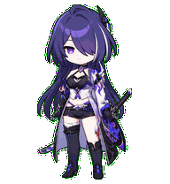
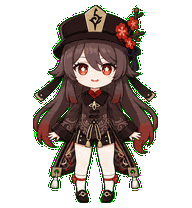

<div align="center">


<p>
  <a href="README.md"><kbd>English</kbd></a>
  <a href="README.fr.md"><kbd><b>Français</b></kbd></a>
  <a href="README.zh-CN.md"><kbd>中文</kbd></a>
</p>

<p><b>Vos personnages préférés deviennent de petits compagnons animés pour Codex.</b></p>

<p>
  <code>✦ 11 PERSONNAGES</code>
  <code>✦ 12 ÉDITIONS</code>
  <code>✦ 9 ANIMATIONS</code>
  <code>✦ 16 DIRECTIONS</code>
</p>

<sub>🌙 Choisissez un personnage · Décompressez l’archive · Laissez-le vous accompagner</sub>

</div>

<div align="center">

## ✦ Choisissez votre compagnon ✦

<sub>Chaque portrait est déjà animé. Prenez un instant, regardez et choisissez votre favori.</sub>

</div>

<table align="center">
  <tr>
    <td align="center" width="33%">
      <sub>✦ PERSONNAGE 01 · ADEPTE ✦</sub><br>
      <br>
      <b>「 Xiao · 魈 」</b><br>
      <sub>◇ Vigilant · Discret · Adepte ◇</sub>
    </td>
    <td align="center" width="33%">
      <sub>✦ PERSONNAGE 02 · VIDYADHARA ✦</sub><br>
      <br>
      <b>「 Dan Heng · Imbibitor Lunae 」</b><br>
      <sub>◇ Élégance froide · Présence paisible ◇</sub>
    </td>
    <td align="center" width="33%">
      <sub>✦ PERSONNAGE 03 · GÉNÉRAL ✦</sub><br>
      <br>
      <b>「 Jing Yuan · 景元 」</b><br>
      <sub>◇ Assurance tranquille · Regard attentif ◇</sub>
    </td>
  </tr>
  <tr>
    <td align="center" width="33%">
      <sub>✦ PERSONNAGE 04 · CONSEILLER ✦</sub><br>
      <br>
      <b>「 Zhongli · 钟离 」</b><br>
      <sub>◇ Calme · Fiable · Digne ◇</sub>
    </td>
    <td align="center" width="33%">
      <sub>✦ PERSONNAGE 05 · PILIER DU SERPENT ✦</sub><br>
      <br>
      <b>「 Obanai · 伊黑小芭内 」</b><br>
      <sub>◇ Réservé · Alerte · Avec Kaburamaru ◇</sub>
    </td>
    <td align="center" width="33%">
      <sub>✦ PERSONNAGE 06 · VALKYRIE ✦</sub><br>
      <br>
      <b>「 Raiden Mei · 雷电芽衣 」</b><br>
      <sub>◇ Posée · Curieuse · Prête ◇</sub>
    </td>
  </tr>
</table>

<table align="center">
  <tr>
    <td align="center" width="25%">
      <sub>✦ PERSONNAGE 07 · GUUJI ✦</sub><br>
      <br>
      <b>「 Yae Miko · 八重神子 」</b><br>
      <sub>◇ Grâce malicieuse · Élégance du sanctuaire ◇</sub>
    </td>
    <td align="center" width="25%">
      <sub>✦ PERSONNAGE 08 · ÉTOILE DE FONTAINE ✦</sub><br>
      <br>
      <b>「 Furina · 芙宁娜 」</b><br>
      <sub>◇ Charme théâtral · Élégance aquatique · Malice lumineuse ◇</sub>
    </td>
    <td align="center" width="25%">
      <sub>✦ PERSONNAGE 09 · RANGER GALACTIQUE ✦</sub><br>
      <br>
      <b>「 Acheron · 黄泉 」</b><br>
      <sub>◇ Calme insondable · Orage violet · Regard lointain ◇</sub>
    </td>
    <td align="center" width="25%">
      <sub>✦ PERSONNAGE 10 · THIRÈNE REQUIN ✦</sub><br>
      <br>
      <b>「 Ellen Joe · 艾莲·乔 」</b><br>
      <sub>◇ Sang-froid · Regard somnolent · Répartie vive ◇</sub>
    </td>
  </tr>
</table>

<table align="center">
  <tr>
    <td align="center" width="100%">
      <sub>✦ NOUVELLE ARRIVÉE · PERSONNAGE 11 · 77E DIRECTRICE ✦</sub><br>
      <br>
      <b>「 Hu Tao · 胡桃 」</b><br>
      <sub>◇ Malice solaire · Charme des fleurs de prunier · Courage sans détour ◇</sub>
    </td>
  </tr>
</table>

<div align="center">
  
</div>

<div align="center">

## ✦ Instants animés ✦

<sub>Respirer, bondir, saluer, réfléchir — de petits gestes qui donnent une vraie présence au personnage.</sub>

</div>

<table>
  <tr>
    <td align="center">
      <br>
      <b>Saut</b><br>
      <sub>Une ascension légère avec un instant suspendu</sub>
    </td>
    <td align="center">
      <br>
      <b>Vérification</b><br>
      <sub>Un regard posé sur le travail terminé</sub>
    </td>
    <td align="center">
      <br>
      <b>Salut</b><br>
      <sub>Un geste discret, fidèle à son tempérament</sub>
    </td>
    <td align="center">
      <br>
      <b>Travail</b><br>
      <sub>Une concentration calme pendant l’exécution</sub>
    </td>
    <td align="center">
      <br>
      <b>Attente</b><br>
      <sub>Une pause attentive avant votre prochaine décision</sub>
    </td>
    <td align="center">
      <br>
      <b>En plein travail</b><br>
      <sub>Le regard ensommeillé, les gestes vifs et la queue toujours en mouvement</sub>
    </td>
  </tr>
</table>

<div align="center">
  
</div>

<div align="center">

## ✦ Archives des personnages ✦

<sub>Ouvrez une fiche pour découvrir le personnage, sa planche d’animations et son téléchargement.</sub>

</div>

<details open>
<summary><b>🌙 DOSSIER 01 — Xiao · 魈</b>　<sub>Yaksha gardien / édition 2D</sub></summary>

<br>

<table>
  <tr>
    <td align="center"></td>
    <td>
      <b>Style :</b> sticker anime 2D<br>
      <b>Détails emblématiques :</b> yeux dorés, marque violette sur le front, cheveux aux pointes turquoise, tatouage d’adepte, ornements de jade et masque Yaksha<br>
      <b>Tempérament :</b> vigilant et contenu, avec une présence plus douce à l’échelle du bureau<br><br>
      <a href="xiao/xiao-2d.zip"><b>⬇️ Télécharger l’édition 2D</b></a> ·
      <a href="work/xiao/2d/qa/contact-sheet-extended.png">Planche d’animations</a> ·
      <a href="work/xiao/2d/qa/look-directions.png">16 directions du regard</a>
    </td>
  </tr>
</table>

</details>

<details>
<summary><b>🐉 DOSSIER 02 — Dan Heng · Imbibitor Lunae · 丹恒·饮月</b>　<sub>Vidyadhara / édition 2D</sub></summary>

<br>

<table>
  <tr>
    <td align="center"></td>
    <td>
      <b>Style :</b> sticker anime 2D<br>
      <b>Détails emblématiques :</b> cornes de dragon cyan, oreilles pointues, longue chevelure sombre, manches blanches et ornements de jade et d’or<br>
      <b>Tempérament :</b> froid, posé et d’une élégance discrète<br><br>
      <a href="hongkai/dan-heng-imbibitor-lunae-2d-codex-pet-v2.zip"><b>⬇️ Télécharger l’édition 2D</b></a> ·
      <a href="work/dan-heng-imbibitor-lunae/2d/qa/contact-sheet-extended.png">Planche d’animations</a> ·
      <a href="work/dan-heng-imbibitor-lunae/2d/qa/look-directions.png">16 directions du regard</a>
    </td>
  </tr>
</table>

</details>

<details>
<summary><b>🦁 DOSSIER 03 — Jing Yuan · 景元</b>　<sub>Général des Chevaliers des Nuages / édition 2D</sub></summary>

<br>

<table>
  <tr>
    <td align="center"></td>
    <td>
      <b>Style :</b> sticker anime 2D<br>
      <b>Détails emblématiques :</b> longue chevelure argentée, yeux dorés, ruban rouge et uniforme noir, blanc, rouge et or<br>
      <b>Tempérament :</b> détendu, observateur et sûr de lui<br><br>
      <a href="jingyuan/jing-yuan-2d-codex-pet-v2.zip"><b>⬇️ Télécharger l’édition 2D</b></a> ·
      <a href="work/jing-yuan/2d/qa/contact-sheet-extended.png">Planche d’animations</a> ·
      <a href="work/jing-yuan/2d/qa/look-directions.png">16 directions du regard</a>
    </td>
  </tr>
</table>

</details>

<details>
<summary><b>🔶 DOSSIER 04 — Zhongli · 钟离</b>　<sub>Conseiller / édition 2D</sub></summary>

<br>

<table>
  <tr>
    <td align="center"></td>
    <td>
      <b>Style :</b> sticker anime 2D<br>
      <b>Détails emblématiques :</b> yeux ambrés, long manteau raffiné et palette chaleureuse de brun et d’or<br>
      <b>Tempérament :</b> stable, rassurant et naturellement digne<br><br>
      <a href="zhongli/zhongli-2d-codex-pet-v2.zip"><b>⬇️ Télécharger l’édition 2D</b></a> ·
      <a href="work/zhongli/2d/qa/contact-sheet-extended.png">Planche d’animations</a> ·
      <a href="work/zhongli/2d/qa/look-directions.png">16 directions du regard</a>
    </td>
  </tr>
</table>

</details>

<details>
<summary><b>🐍 DOSSIER 05 — Obanai · 伊黑小芭内</b>　<sub>Pilier du Serpent / édition 2D</sub></summary>

<br>

<table>
  <tr>
    <td align="center"></td>
    <td>
      <b>Style :</b> sticker anime 2D<br>
      <b>Détails emblématiques :</b> yeux vairons, haori rayé et Kaburamaru blotti contre lui<br>
      <b>Tempérament :</b> réservé, vigilant et d’une attention tranchante<br><br>
      <a href="obanai/obanai-2d-codex-pet-v2.zip"><b>⬇️ Télécharger l’édition 2D</b></a> ·
      <a href="obanai/qa/contact-sheet.png">Planche d’animations</a> ·
      <a href="obanai/qa/direction-qa.png">16 directions du regard</a>
    </td>
  </tr>
</table>

</details>

<details>
<summary><b>⚡ DOSSIER 06 — Raiden Mei · 雷电芽衣</b>　<sub>Valkyrie / deux éditions visuelles</sub></summary>

<br>

Un même personnage, deux interprétations visuelles :

<table>
  <tr>
    <th align="center">Sticker anime 2D</th>
    <th align="center">Figurine chibi au rendu 3D</th>
  </tr>
  <tr>
    <td align="center"></td>
    <td align="center"></td>
  </tr>
  <tr>
    <td align="center">
      <a href="Raiden-Mei雷电芽衣/raiden-mei-2d-codex-pet-v2.zip"><b>⬇️ Télécharger la 2D</b></a><br>
      <a href="Raiden-Mei雷电芽衣/qa/raiden-mei-2d-contact-sheet.png">Planche d’animations</a> ·
      <a href="Raiden-Mei雷电芽衣/qa/raiden-mei-2d-look-directions.png">16 directions</a>
    </td>
    <td align="center">
      <a href="Raiden-Mei雷电芽衣/raiden-mei-3d-codex-pet-v2.zip"><b>⬇️ Télécharger le style 3D</b></a><br>
      <a href="Raiden-Mei雷电芽衣/qa/raiden-mei-3d-contact-sheet.png">Planche d’animations</a> ·
      <a href="Raiden-Mei雷电芽衣/qa/raiden-mei-3d-look-directions.png">16 directions</a>
    </td>
  </tr>
</table>

L’édition 3D désigne son rendu visuel. Elle reste, comme les autres, une planche de sprites 2D légère.

</details>

<details>
<summary><b>🌸 DOSSIER 07 — Yae Miko · 八重神子</b>　<sub>Guuji du sanctuaire de Narukami / édition 2D</sub></summary>

<br>

<table>
  <tr>
    <td align="center"></td>
    <td>
      <b>Style :</b> sticker anime 2D<br>
      <b>Détails emblématiques :</b> longue chevelure rose sakura, yeux violets, ornements dorés, boucles serties et tenue de prêtresse rouge, blanche, noire et violette<br>
      <b>Tempérament :</b> élégante, joueuse et discrètement malicieuse<br><br>
      <a href="yae%20miko/yae-miko-2d-codex-pet-v2.zip"><b>⬇️ Télécharger l’édition 2D</b></a> ·
      <a href="work/yae-miko/2d/qa/contact-sheet-extended.png">Planche d’animations</a> ·
      <a href="work/yae-miko/2d/qa/look-directions.png">16 directions</a>
    </td>
  </tr>
</table>

</details>

<details>
<summary><b>💧 DOSSIER 08 — Furina · 芙宁娜</b>　<sub>Étoile de Fontaine / édition 2D</sub></summary>

<br>

<table>
  <tr>
    <td align="center"></td>
    <td>
      <b>Style :</b> sticker anime 2D<br>
      <b>Détails emblématiques :</b> carré blanc aux reflets cyan, yeux bleus en forme de goutte, chapeau bleu nuit en forme de couronne, volants blancs, gemmes bleues et tenue de Fontaine rehaussée d'or<br>
      <b>Tempérament :</b> une présence gracieuse et théâtrale, toujours traversée d'une étincelle espiègle<br><br>
      <a href="furina/furina-2d-codex-pet-v2.zip"><b>⬇️ Télécharger l'édition 2D</b></a> ·
      <a href="work/furina/2d/qa/contact-sheet-extended.png">Planche d'animations</a> ·
      <a href="work/furina/2d/qa/look-directions.png">16 directions</a>
    </td>
  </tr>
</table>

</details>

<details>
<summary><b>🌌 DOSSIER 09 — Acheron · 黄泉</b>　<sub>Ranger galactique / édition 2D</sub></summary>

<br>

<table>
  <tr>
    <td align="center"></td>
    <td>
      <b>Style :</b> sticker anime 2D<br>
      <b>Détails emblématiques :</b> chevelure indigo-violet profond, mèche asymétrique voilant un œil, regard violet-magenta, tenue blanche, lilas et noire aux motifs de flamme, et katana gardé près du corps<br>
      <b>Tempérament :</b> silencieuse et insaisissable, comme un orage encore lointain<br><br>
      <a href="acheron/acheron-2d-codex-pet-v2.zip"><b>⬇️ Télécharger l'édition 2D</b></a> ·
      <a href="work/acheron/2d/qa/contact-sheet-extended.png">Planche d'animations</a> ·
      <a href="work/acheron/2d/qa/look-directions.png">16 directions</a>
    </td>
  </tr>
</table>

</details>

<details>
<summary><b>🦈 DOSSIER 10 — Ellen Joe · 艾莲·乔</b>　<sub>Domestique thirène requin / édition 2D</sub></summary>

<br>

<table>
  <tr>
    <td align="center"></td>
    <td>
      <b>Style :</b> sticker anime 2D<br>
      <b>Détails emblématiques :</b> carré noir anthracite aux mèches intérieures rouges, regard rouge assoupi, coiffe de domestique ornée de pointes, uniforme industriel noir et blanc, et imposante queue de requin attachée au corps<br>
      <b>Tempérament :</b> détendue et imperturbable, avec une malice fulgurante dès que le travail s'anime<br><br>
      <a href="ellen%20joe/ellen-joe-2d-codex-pet-v2.zip"><b>⬇️ Télécharger l'édition 2D</b></a> ·
      <a href="work/ellen-joe/2d/qa/contact-sheet-extended.png">Planche d'animations</a> ·
      <a href="work/ellen-joe/2d/qa/look-directions.png">16 directions</a>
    </td>
  </tr>
</table>

</details>

<details>
<summary><b>🔥 DOSSIER 11 — Hu Tao · 胡桃</b>　<sub>77e directrice / édition 2D</sub></summary>

<br>

<table>
  <tr>
    <td align="center"></td>
    <td>
      <b>Style :</b> sticker anime 2D<br>
      <b>Détails emblématiques :</b> yeux cramoisis en forme de fleur, grand chapeau sombre orné d'un talisman et d'une branche de prunier, longue chevelure brun foncé aux pointes rouge assourdi, et uniforme brun-noir, rouge et or<br>
      <b>Tempérament :</b> vive, taquine et intrépide, avec une étincelle malicieuse jusque dans les instants calmes<br><br>
      <a href="hutao/hu-tao-2d-codex-pet-v2.zip"><b>⬇️ Télécharger l'édition 2D</b></a> ·
      <a href="work/hu-tao/2d/qa/contact-sheet-extended.png">Planche d'animations</a> ·
      <a href="work/hu-tao/2d/qa/look-directions.png">16 directions</a>
    </td>
  </tr>
</table>

</details>

<div align="center">
  
</div>

## 📦 Téléchargements

| Personnage | Édition | Pet ID | Archive |
| --- | --- | --- | --- |
| Xiao · 魈 | 2D | `xiao` | [Télécharger](xiao/xiao-2d.zip) |
| Dan Heng · Imbibitor Lunae · 丹恒·饮月 | 2D | `dan-heng-imbibitor-lunae` | [Télécharger](hongkai/dan-heng-imbibitor-lunae-2d-codex-pet-v2.zip) |
| Jing Yuan · 景元 | 2D | `jing-yuan` | [Télécharger](jingyuan/jing-yuan-2d-codex-pet-v2.zip) |
| Zhongli · 钟离 | 2D | `zhongli` | [Télécharger](zhongli/zhongli-2d-codex-pet-v2.zip) |
| Obanai · 伊黑小芭内 | 2D | `obanai` | [Télécharger](obanai/obanai-2d-codex-pet-v2.zip) |
| Raiden Mei · 雷电芽衣 | 2D | `raiden-mei` | [Télécharger](Raiden-Mei雷电芽衣/raiden-mei-2d-codex-pet-v2.zip) |
| Raiden Mei · 雷电芽衣 | rendu 3D | `raiden-mei-3d` | [Télécharger](Raiden-Mei雷电芽衣/raiden-mei-3d-codex-pet-v2.zip) |
| Yae Miko · 八重神子 | 2D | `yae-miko` | [Télécharger](yae%20miko/yae-miko-2d-codex-pet-v2.zip) |
| Furina · 芙宁娜 | 2D | `furina` | [Télécharger](furina/furina-2d-codex-pet-v2.zip) |
| Acheron · 黄泉 | 2D | `acheron` | [Télécharger](acheron/acheron-2d-codex-pet-v2.zip) |
| Ellen Joe · 艾莲·乔 | 2D | `ellen-joe` | [Télécharger](ellen%20joe/ellen-joe-2d-codex-pet-v2.zip) |
| Hu Tao · 胡桃 | 2D | `hu-tao` | [Télécharger](hutao/hu-tao-2d-codex-pet-v2.zip) |

Chaque archive est prête à être décompressée :

```text
pet.json
spritesheet.webp
README.md
```

<div align="center">
  
</div>

## ⚡ Installer un compagnon

Avec Xiao, par exemple :

```bash
mkdir -p ~/.codex/pets/xiao
unzip xiao/xiao-2d.zip -d ~/.codex/pets/xiao
```

Vous obtiendrez :

```text
~/.codex/pets/xiao/
├── pet.json
├── spritesheet.webp
└── README.md
```

Pour conserver les deux éditions de Raiden Mei, installez-les dans `raiden-mei/` et `raiden-mei-3d/`. Leurs identifiants sont distincts.

<div align="center">
  
</div>

## 🧪 Ce qui donne vie à un compagnon

Un bon compagnon de bureau reste lisible au premier coup d’œil, bouge avec fluidité et garde toute la personnalité du personnage d’une animation à l’autre.

| Élément | Format Codex v2 |
| --- | --- |
| Atlas | 8 colonnes × 11 lignes, `1536×2288` |
| Cellule | `192×208` |
| Animations | repos, déplacement à droite, déplacement à gauche, salut, saut, échec, attente, travail, vérification |
| Regard | boucle de 16 directions avec des repères clairs en haut, à droite, en bas et à gauche |
| Transparence | WebP RGBA avec des cellules inutilisées propres |
| Version | `spriteVersionNumber: 2` |
| Vérification | inspection des images, lecture des GIF, contrôle des bords, cohérence du regard et examen visuel final |

La technique reste au service d’une idée simple : chaque mouvement doit encore ressembler au même personnage.

<div align="center">
  
</div>

## 🎨 Partir d’une illustration

La collection suit un processus réutilisable :

```text
Références du personnage
          ↓
Étude de l’identité et du style
          ↓
Neuf animations de caractère
          ↓
Quatre repères et une boucle de regard à 16 directions
          ↓
Assemblage et examen visuel
          ↓
Un compagnon Codex v2 à télécharger
```

Pour créer votre propre collection, consultez le [guide de production Codex Pet Dual Style](codex-pet-dual-style/SKILL.md). Il aborde les styles 2D/3D associés, la cohérence visuelle, la conception du mouvement, l’examen des directions, le packaging et la production en série.

<div align="center">
  
</div>

## 🤝 Contribuer

Les nouveaux compagnons, corrections d’animation, améliorations de présentation et perfectionnements du processus sont les bienvenus. Une édition distribuable commence par :

```text
<pet-id>/
├── pet.json
└── spritesheet.webp
```

Pour faire apparaître un personnage dans la galerie animée, ajoutez une planche de contact ou quelques aperçus GIF en `192×208`.

<div align="center">
  
</div>

## ⭐ Un peu plus de vie à côté du code

Codex habite peut-être dans une zone de texte, mais son compagnon peut respirer, attendre et réagir à vos côtés. Même les instants calmes entre deux tâches ont alors un peu plus de présence.

<div align="center">

**Offrez à votre Codex un personnage que vous aurez plaisir à retrouver.**

Si cette collection vous a plu, laissez une Star, créez un Fork ou proposez le prochain personnage.

</div>

<div align="center">
  
</div>

<sub>Les droits sur les personnages appartiennent à leurs détenteurs respectifs. Ce dépôt est une présentation technique et animée non officielle ; vérifiez les licences des personnages et des sources avant toute diffusion publique ou utilisation commerciale.</sub>
