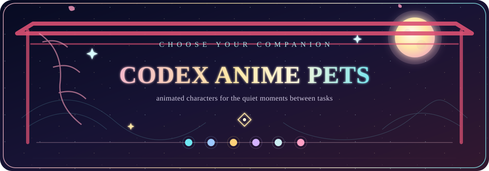
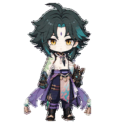
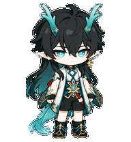
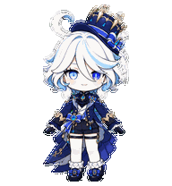
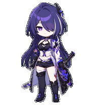
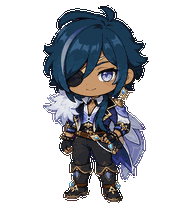
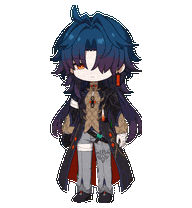
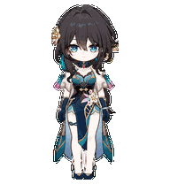
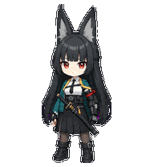

<div align="center">



<p>
  <a href="README.md"><kbd>English</kbd></a>
  <a href="README.fr.md"><kbd>Français</kbd></a>
  <a href="README.zh-CN.md"><kbd>中文</kbd></a>
  <a href="README.ja.md"><kbd><b>日本語</b></kbd></a>
</p>

<p><b>お気に入りのキャラクターを、Codex と一緒に過ごす動くペットに。</b></p>

<p>
  <code>✦ 21 キャラクター</code>
  <code>✦ 22 エディション</code>
  <code>✦ 9 アニメーション</code>
  <code>✦ 16 視線方向</code>
</p>

<sub>🌙 キャラクターを選ぶ · パッケージを展開する · コーディングのお供にする</sub>

</div>

## ✦ Codex Anime Pets について ✦

Codex Anime Pets は、キャラクターを Codex v2 形式のデスクトップペットとして楽しむための非公式コレクションです。待機、移動、手振り、ジャンプ、失敗、入力待ち、作業中、レビューなどの状態に対応し、キャラクターらしさを小さな動きで表現しています。

<div align="center">
  
</div>

## ✦ キャラクターを選ぶ ✦

<table align="center">
  <tr>
    <td align="center" width="33%"><br><b>「 魈 · Xiao 」</b><br><sub>◇ 凛とした静けさ · 仙人の気配 ◇</sub></td>
    <td align="center" width="33%"><br><b>「 丹恒・飲月 · Imbibitor Lunae 」</b><br><sub>◇ 冷静 · 優雅 · 静かな存在感 ◇</sub></td>
    <td align="center" width="33%"><br><b>「 景元 · Jing Yuan 」</b><br><sub>◇ 余裕 · 自信 · 鋭い眼差し ◇</sub></td>
  </tr>
  <tr>
    <td align="center"><br><b>「 鍾離 · Zhongli 」</b></td>
    <td align="center"><br><b>「 伊黒小芭内 · Obanai 」</b></td>
    <td align="center"><br><b>「 雷電芽衣 · Raiden Mei 」</b></td>
  </tr>
  <tr>
    <td align="center"><br><b>「 八重神子 · Yae Miko 」</b></td>
    <td align="center"><br><b>「 フリーナ · Furina 」</b></td>
    <td align="center"><br><b>「 黄泉 · Acheron 」</b></td>
  </tr>
  <tr>
    <td align="center"><br><b>「 エレン・ジョー · Ellen Joe 」</b></td>
    <td align="center"><br><b>「 胡桃 · Hu Tao 」</b></td>
    <td align="center"><br><b>「 ロビン · Robin 」</b></td>
  </tr>
  <tr>
    <td align="center"><br><b>「 ガイア · Kaeya 」</b></td>
    <td align="center"><br><b>「 ホタル · Firefly 」</b></td>
    <td align="center"><br><b>「 ケビン・カスラナ · Kevin Kaslana 」</b><br><sub>◇ 冷徹な決意 · 静かな力 · 揺るがぬ意志 ◇</sub></td>
  </tr>
  <tr>
    <td align="center" width="33%"><br><b>「 神里綾華 · Kamisato Ayaka 」</b><br><sub>◇ 凛とした気品 · 霜色の優雅さ · 静かな温もり ◇</sub></td>
    <td align="center" width="33%"><br><b>「 刃 · Blade 」</b><br><sub>◇ 秘めた激情 · 緋色の剣気 · 不滅の執念 ◇</sub></td>
    <td align="center" width="33%"><br><b>「 ルアン・メェイ · Ruan Mei 」</b><br><sub>◇ 静かな知性 · 花の気品 · 穏やかな旋律 ◇</sub></td>
  </tr>
  <tr>
    <td align="center" width="33%"><br><b>「 楓原万葉 · Kaedehara Kazuha 」</b><br><sub>◇ 楓の静けさ · 旅の風雅 · 風に宿る決意 ◇</sub></td>
    <td align="center" width="33%"><br><b>「 星見雅 · Hoshimi Miyabi 」</b><br><sub>◇ 静かな集中 · 緋色の眼差し · 凛とした剣意 ◇</sub></td>
    <td align="center" width="33%"><br><b>「 アベンチュリン · Aventurine 」</b><br><sub>◇ 余裕の駆け引き · 黄金の輝き · 勝機を見据える眼差し ◇</sub></td>
  </tr>
</table>

<div align="center">
  <a href="#character-list"></a><br>
  <sub>✦ 次の召喚 · あなたの選択 ✦</sub><br>
  <b>「 次は誰？ 」</b>　<sub>参考画像から、新しい仲間を孵化させよう</sub>
</div>

<div align="center">
  
</div>

<a id="character-list"></a>

## 📦 キャラクター一覧とダウンロード

| キャラクター | 形式 | ID | ダウンロード |
| --- | --- | --- | --- |
| 魈 · Xiao | 2D | `xiao` | [ZIP](xiao/xiao-2d.zip) |
| 丹恒・飲月 · Dan Heng Imbibitor Lunae | 2D | `dan-heng-imbibitor-lunae` | [ZIP](danheng/dan-heng-imbibitor-lunae-2d-codex-pet-v2.zip) |
| 景元 · Jing Yuan | 2D | `jing-yuan` | [ZIP](jingyuan/jing-yuan-2d-codex-pet-v2.zip) |
| 鍾離 · Zhongli | 2D | `zhongli` | [ZIP](zhongli/zhongli-2d-codex-pet-v2.zip) |
| 伊黒小芭内 · Obanai | 2D | `obanai` | [ZIP](obanai/obanai-2d-codex-pet-v2.zip) |
| 雷電芽衣 · Raiden Mei | 2D | `raiden-mei` | [ZIP](Raiden-Mei雷电芽衣/raiden-mei-2d-codex-pet-v2.zip) |
| 八重神子 · Yae Miko | 2D | `yae-miko` | [ZIP](yae%20miko/yae-miko-2d-codex-pet-v2.zip) |
| フリーナ · Furina | 2D | `furina` | [ZIP](furina/furina-2d-codex-pet-v2.zip) |
| 黄泉 · Acheron | 2D | `acheron` | [ZIP](acheron/acheron-2d-codex-pet-v2.zip) |
| エレン・ジョー · Ellen Joe | 2D | `ellen-joe` | [ZIP](ellen%20joe/ellen-joe-2d-codex-pet-v2.zip) |
| 胡桃 · Hu Tao | 2D | `hu-tao` | [ZIP](hutao/hu-tao-2d-codex-pet-v2.zip) |
| ロビン · Robin | 2D | `robin` | [ZIP](robin/robin-2d-codex-pet-v2.zip) |
| ガイア · Kaeya | 2D | `kaeya` | [ZIP](kaeya/kaeya-2d-codex-pet-v2.zip) |
| ホタル · Firefly | 2D | `firefly` | [ZIP](Firefly%20honkai%20/firefly-2d-codex-pet-v2.zip) |
| ケビン・カスラナ · Kevin Kaslana | 2D | `kevin-kaslana` | [ZIP](kevin%20kaslana/kevin-kaslana-2d-codex-pet-v2.zip) |
| 神里綾華 · Kamisato Ayaka | 2D | `kamisato-ayaka` | [ZIP](Kamisato%20Ayaka/kamisato-ayaka-2d-codex-pet-v2.zip) |
| 刃 · Blade | 2D | `blade` | [ZIP](blade/blade-2d-codex-pet-v2.zip) |
| ルアン・メェイ · Ruan Mei | 2D | `ruan-mei` | [ZIP](Ruan%20Mei/ruan-mei-2d-codex-pet-v2.zip) |
| 楓原万葉 · Kaedehara Kazuha | 2D | `kazuha-chibi` | [ZIP](Kazuha%20chibi/kazuha-chibi-2d-codex-pet-v2.zip) |
| 星見雅 · Hoshimi Miyabi | 2D | `miyabi` | [ZIP](Miyabi/miyabi-2d-codex-pet-v2.zip) |
| アベンチュリン · Aventurine | 2D | `aventurine` | [ZIP](Aventurine/aventurine-2d-codex-pet-v2.zip) |

各アーカイブには、次のファイルが含まれています。

```text
pet.json
spritesheet.webp
README.md
```

<div align="center">
  
</div>

## ⚡ インストール

魈を例にすると、次のコマンドでインストールできます。

```bash
mkdir -p ~/.codex/pets/xiao
unzip xiao/xiao-2d.zip -d ~/.codex/pets/xiao
```

展開後のディレクトリ構成：

```text
~/.codex/pets/xiao/
├── pet.json
├── spritesheet.webp
└── README.md
```

<div align="center">
  
</div>

## 🧪 Codex v2 仕様

| 項目 | 内容 |
| --- | --- |
| アトラス | 8 列 × 11 行、`1536×2288` |
| セル | `192×208` |
| 状態 | 待機、右移動、左移動、手振り、ジャンプ、失敗、入力待ち、作業中、レビュー |
| 視線 | 時計回りの 16 方向 |
| 透過 | 未使用セルを整理した RGBA WebP |
| バージョン | `spriteVersionNumber: 2` |

制作方法の詳細は [Codex Pet Dual Style 制作ガイド](codex-pet-dual-style/SKILL.md) を参照してください。

<div align="center">
  
</div>

## 🤝 コントリビューション

新しいペット、アニメーションの修正、表示の改善、制作フローの改良を歓迎します。配布可能なペットには、少なくとも次のファイルが必要です。

```text
<pet-id>/
├── pet.json
└── spritesheet.webp
```

<div align="center">

**Codex に、また会いたくなるキャラクターを。**

気に入ったら、Star、Fork、または新しいキャラクターの追加で応援してください。

</div>

<div align="center">
  
</div>

<sub>本プロジェクトで使用しているmiHoYoキャラクターおよび関連する原素材の原著作権は、miHoYoに帰属します。その他の作品のキャラクターに関する権利は、それぞれの権利者に帰属します。本リポジトリは非公式の技術・アニメーション展示であり、公開配布または商用利用の前に、適用されるライセンス範囲をご確認ください。</sub>
