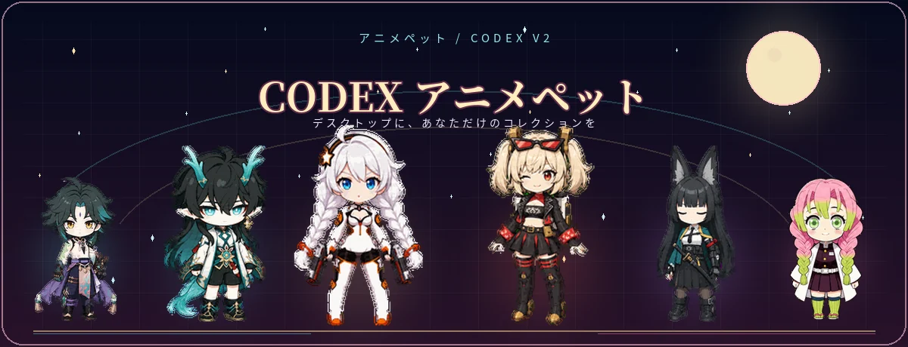
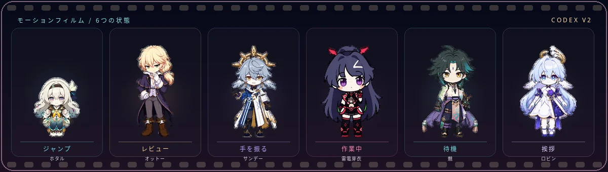
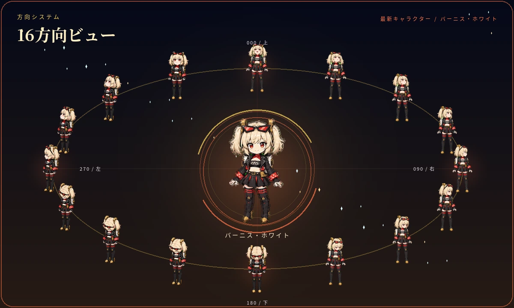
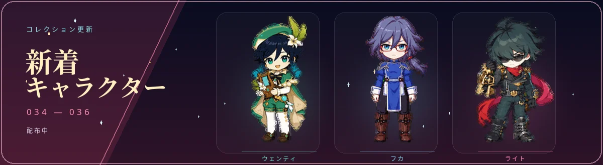
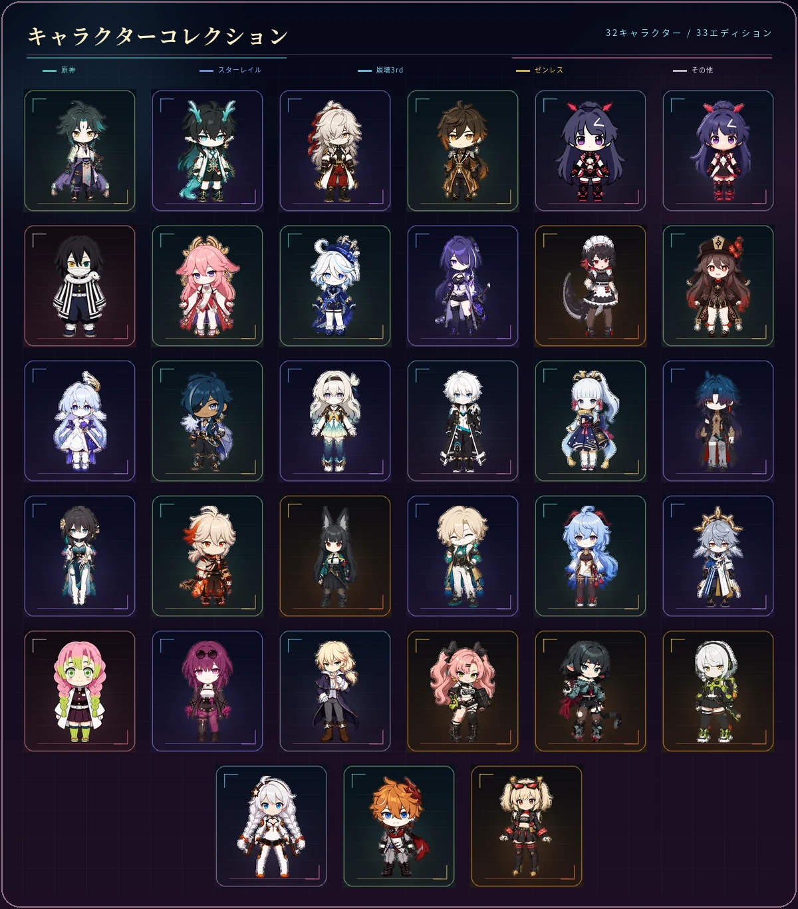
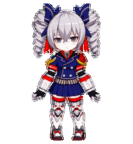
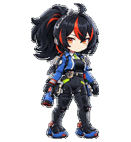
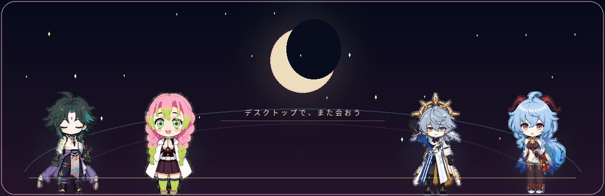

<div align="center">



<p>
  <a href="README.md"><kbd>English</kbd></a>
  <a href="README.fr.md"><kbd>Français</kbd></a>
  <a href="README.zh-CN.md"><kbd>中文</kbd></a>
  <a href="README.ja.md"><kbd><b>日本語</b></kbd></a>
</p>

<p><b>お気に入りのキャラクターを、Codex と一緒に過ごす動くペットに。</b></p>

<p>
  <code>39 キャラクター</code>
  <code>40 エディション</code>
  <code>9 アニメーション</code>
  <code>16 視線方向</code>
</p>

<sub>キャラクターを選ぶ · パッケージを入手する · Codex に追加する</sub>

</div>

> **デスクトップ版のみ：** カスタムペットパッケージは、現在 Codex デスクトップアプリでのみ利用できます。Codex モバイルアプリではペットを表示できず、モバイルへのインストールやデバイス間でのペット同期にも対応していません。

<p align="center">
  
</p>

<p align="center">
  
</p>

<p align="center">
  <a href="work/burnice-white/2d/qa/look-directions.png"></a>
</p>

<p align="center">
  <a href="work/burnice-white/2d/qa/look-directions.png"><kbd>方向チェックを開く</kbd></a>
</p>

<p align="center">
  
</p>

<p align="center">
  <a href="#downloads-genshin-impact"><kbd>雷電将軍</kbd></a>
  <a href="honkai-impact-3rd/Bronya%20Zaychik/bronya-zaychik-2d-codex-pet-v2.zip"><kbd>ブローニャ</kbd></a>
  <a href="zenless-zone-zero/Zhu%20Yuan/zhu-yuan-2d-codex-pet-v2.zip"><kbd>朱鳶</kbd></a>
</p>

<div align="center">

## キャラクターを選ぶ

<sub>一覧からキャラクターを選び、ダウンロード先へ進めます。</sub>

</div>

<p align="center">
  <a href="#character-list"></a>
</p>

<table align="center" width="100%">
  <tr>
    <td align="center" valign="middle" width="24%">
      <a href="https://github.com/liu-weida/elysia_codex_pet"></a>
    </td>
    <td valign="middle" width="76%">
      <sub>コミュニティコレクション</sub><br>
      <b>エリシア特集</b><br>
      <sub>liu-weida によるエリシアの Codex ペット作品集。複数の衣装、スキン、ビジュアルエディションを収録しています。</sub><br><br>
      <code>エリシア</code> <code>2D + 3D</code> <code>複数の衣装</code><br><br>
      <a href="https://github.com/liu-weida/elysia_codex_pet"><kbd>エリシア特集を見る ↗</kbd></a>
    </td>
  </tr>
</table>

<p align="center">
  <a href="#downloads-genshin-impact"><kbd>原神 · 12</kbd></a>
  <a href="#downloads-honkai-star-rail"><kbd>崩壊：スターレイル · 11</kbd></a>
  <a href="#downloads-honkai-impact-3rd"><kbd>崩壊3rd · 6</kbd></a>
  <a href="#downloads-zenless-zone-zero"><kbd>ゼンレスゾーンゼロ · 8</kbd></a>
  <a href="#downloads-others"><kbd>その他 · 2</kbd></a>
</p>

<details>
<summary><b>全コレクション · 39キャラクター</b>　<kbd>ギャラリーを開く</kbd></summary>

<br>

<table align="center">
  <tr>
    <td align="center" valign="top" width="33%"><sub>01</sub><br><br><b>「 魈 」</b></td>
    <td align="center" valign="top" width="33%"><sub>02</sub><br><br><b>「 丹恒 」</b></td>
    <td align="center" valign="top" width="33%"><sub>03</sub><br><br><b>「 景元 」</b></td>
  </tr>
  <tr>
    <td align="center" valign="top"><sub>04</sub><br><br><b>「 鍾離 」</b></td>
    <td align="center" valign="top"><sub>05</sub><br><br><b>「 雷電芽衣 」</b></td>
    <td align="center" valign="top"><sub>06</sub><br><br><b>「 伊黒小芭内 」</b></td>
  </tr>
  <tr>
    <td align="center" valign="top"><sub>07</sub><br><br><b>「 八重神子 」</b></td>
    <td align="center" valign="top"><sub>08</sub><br><br><b>「 フリーナ 」</b></td>
    <td align="center" valign="top"><sub>09</sub><br><br><b>「 黄泉 」</b></td>
  </tr>
  <tr>
    <td align="center" valign="top"><sub>10</sub><br><br><b>「 エレン・ジョー 」</b></td>
    <td align="center" valign="top"><sub>11</sub><br><br><b>「 胡桃 」</b></td>
    <td align="center" valign="top"><sub>12</sub><br><br><b>「 ロビン 」</b></td>
  </tr>
  <tr>
    <td align="center" valign="top"><sub>13</sub><br><br><b>「 ガイア 」</b></td>
    <td align="center" valign="top"><sub>14</sub><br><br><b>「 ホタル 」</b></td>
    <td align="center" valign="top"><sub>15</sub><br><br><b>「 ケビン 」</b></td>
  </tr>
  <tr>
    <td align="center" valign="top" width="33%"><sub>16</sub><br><br><b>「 綾華 」</b></td>
    <td align="center" valign="top" width="33%"><sub>17</sub><br><br><b>「 刃 」</b></td>
    <td align="center" valign="top" width="33%"><sub>18</sub><br><br><b>「 ルアン・メェイ 」</b></td>
  </tr>
  <tr>
    <td align="center" valign="top" width="33%"><sub>19</sub><br><br><b>「 万葉 」</b></td>
    <td align="center" valign="top" width="33%"><sub>20</sub><br><br><b>「 雅 」</b></td>
    <td align="center" valign="top" width="33%"><sub>21</sub><br><br><b>「 アベンチュリン 」</b></td>
  </tr>
  <tr>
    <td align="center" valign="top" width="33%"><sub>22</sub><br><br><b>「 甘雨 」</b></td>
    <td align="center" valign="top" width="33%"><sub>23</sub><br><br><b>「 サンデー 」</b></td>
    <td align="center" valign="top" width="33%"><sub>24</sub><br><br><b>「 蜜璃 」</b></td>
  </tr>
  <tr>
    <td align="center" valign="top" width="33%"><sub>25</sub><br><br><b>「 カフカ 」</b></td>
    <td align="center" valign="top" width="33%"><sub>26</sub><br><br><b>「 オットー 」</b></td>
    <td align="center" valign="top" width="33%"><sub>27</sub><br><br><b>「 ニコ 」</b></td>
  </tr>
  <tr>
    <td align="center" valign="top" width="33%"><sub>28</sub><br><br><b>「 ジェーン 」</b></td>
    <td align="center" valign="top" width="33%"><sub>29</sub><br><br><b>「 アンビー 」</b></td>
    <td align="center" valign="top" width="33%"><sub>30</sub><br><br><b>「 キアナ 」</b></td>
  </tr>
  <tr>
    <td align="center" valign="top" width="33%"><sub>31</sub><br><br><b>「 タルタリヤ 」</b></td>
    <td align="center" valign="top" width="33%"><sub>32</sub><br><a href="zenless-zone-zero/Burnice%20White/burnice-white-2d-codex-pet-v2.zip"></a><br><b>「 バーニス 」</b></td>
    <td align="center" valign="top" width="33%"><sub>33</sub><br><a href="honkai-star-rail/Sparkle/sparkle-2d-codex-pet-v2.zip"></a><br><b>「 花火 」</b></td>
  </tr>
  <tr>
    <td align="center" valign="top" width="33%"><sub>34</sub><br><a href="genshin-impact/Venti/venti-2d-codex-pet-v2.zip"></a><br><b>「 ウェンティ 」</b></td>
    <td align="center" valign="top" width="33%"><sub>35</sub><br><a href="honkai-impact-3rd/Fu%20Hua/fu-hua-2d-codex-pet-v2.zip"></a><br><b>「 フカ 」</b></td>
    <td align="center" valign="top" width="33%"><sub>36</sub><br><a href="zenless-zone-zero/Lighter/lighter-2d-codex-pet-v2.zip"></a><br><b>「 ライト 」</b></td>
  </tr>
</table>

<table align="center" width="100%">
  <tr>
    <td align="center" valign="top" width="33%"><sub>37</sub><br><a href="genshin-impact/raiden-shogun/raiden-shogun-2d-codex-pet-v2.zip"></a><br><b>「 雷電将軍 」</b></td>
    <td align="center" valign="top" width="33%"><sub>38</sub><br><a href="honkai-impact-3rd/Bronya%20Zaychik/bronya-zaychik-2d-codex-pet-v2.zip"></a><br><b>「 ブローニャ 」</b></td>
    <td align="center" valign="top" width="33%"><sub>39</sub><br><a href="zenless-zone-zero/Zhu%20Yuan/zhu-yuan-2d-codex-pet-v2.zip"></a><br><b>「 朱鳶 」</b></td>
  </tr>
</table>

<p align="center">
  <a href="#contribute-a-character"></a><br>
  <b>次は誰？</b><br>
  <sub>参考画像から、新しい仲間を孵化させよう</sub>
</p>

</details>

<p align="center">
  
</p>

<a id="character-list"></a>

## キャラクター一覧とダウンロード

パッケージは作品別にまとめています。各グループを開くと、キャラクターとダウンロード先を確認できます。

<a id="downloads-genshin-impact"></a>
<details>
<summary><b>原神</b> · 12キャラクター　<kbd>開く</kbd></summary>

| キャラクター | 形式 | ID | ダウンロード |
| --- | --- | --- | --- |
| 魈 | 2D | `xiao` | [ZIP](genshin-impact/xiao/xiao-2d.zip) |
| 鍾離 | 2D | `zhongli` | [ZIP](genshin-impact/zhongli/zhongli-2d-codex-pet-v2.zip) |
| 八重神子 | 2D | `yae-miko` | [ZIP](genshin-impact/yae-miko/yae-miko-2d-codex-pet-v2.zip) |
| フリーナ | 2D | `furina` | [ZIP](genshin-impact/furina/furina-2d-codex-pet-v2.zip) |
| 胡桃 | 2D | `hu-tao` | [ZIP](genshin-impact/hu-tao/hu-tao-2d-codex-pet-v2.zip) |
| ガイア | 2D | `kaeya` | [ZIP](genshin-impact/kaeya/kaeya-2d-codex-pet-v2.zip) |
| 神里綾華 | 2D | `kamisato-ayaka` | [ZIP](genshin-impact/kamisato-ayaka/kamisato-ayaka-2d-codex-pet-v2.zip) |
| 楓原万葉 | 2D | `kazuha-chibi` | [ZIP](genshin-impact/kaedehara-kazuha/kazuha-chibi-2d-codex-pet-v2.zip) |
| 甘雨 | 2D | `ganyu` | [ZIP](genshin-impact/ganyu/ganyu-2d-codex-pet-v2.zip) |
| タルタリヤ | 2D | `tartaglia` | [ZIP](genshin-impact/Tartaglia/tartaglia-2d-codex-pet-v2.zip) |
| ウェンティ | 2D | `venti` | [ZIP](genshin-impact/Venti/venti-2d-codex-pet-v2.zip) |
| 雷電将軍 | 2D | `raiden-shogun` | [ZIP](genshin-impact/raiden-shogun/raiden-shogun-2d-codex-pet-v2.zip) |

</details>

<a id="downloads-honkai-star-rail"></a>
<details>
<summary><b>崩壊：スターレイル</b> · 11キャラクター　<kbd>開く</kbd></summary>

| キャラクター | 形式 | ID | ダウンロード |
| --- | --- | --- | --- |
| 丹恒・飲月 | 2D | `dan-heng-imbibitor-lunae` | [ZIP](honkai-star-rail/dan-heng-imbibitor-lunae/dan-heng-imbibitor-lunae-2d-codex-pet-v2.zip) |
| 景元 | 2D | `jing-yuan` | [ZIP](honkai-star-rail/jing-yuan/jing-yuan-2d-codex-pet-v2.zip) |
| 黄泉 | 2D | `acheron` | [ZIP](honkai-star-rail/acheron/acheron-2d-codex-pet-v2.zip) |
| ロビン | 2D | `robin` | [ZIP](honkai-star-rail/robin/robin-2d-codex-pet-v2.zip) |
| ホタル | 2D | `firefly` | [ZIP](honkai-star-rail/firefly/firefly-2d-codex-pet-v2.zip) |
| 刃 | 2D | `blade` | [ZIP](honkai-star-rail/blade/blade-2d-codex-pet-v2.zip) |
| ルアン・メェイ | 2D | `ruan-mei` | [ZIP](honkai-star-rail/ruan-mei/ruan-mei-2d-codex-pet-v2.zip) |
| アベンチュリン | 2D | `aventurine` | [ZIP](honkai-star-rail/aventurine/aventurine-2d-codex-pet-v2.zip) |
| サンデー | 2D | `sunday` | [ZIP](honkai-star-rail/sunday/sunday-2d-codex-pet-v2.zip) |
| カフカ | 2D | `kafka` | [ZIP](honkai-star-rail/Kafka/kafka-2d-codex-pet-v2.zip) |
| 花火 | 2D | `sparkle` | [ZIP](honkai-star-rail/Sparkle/sparkle-2d-codex-pet-v2.zip) |

</details>

<a id="downloads-honkai-impact-3rd"></a>
<details>
<summary><b>崩壊3rd</b> · 6キャラクター / 7エディション　<kbd>開く</kbd></summary>

| キャラクター | 形式 | ID | ダウンロード |
| --- | --- | --- | --- |
| 雷電芽衣 | 2D | `raiden-mei` | [ZIP](honkai-impact-3rd/raiden-mei/raiden-mei-2d-codex-pet-v2.zip) |
| 雷電芽衣 | 3Dレンダー | `raiden-mei-3d` | [ZIP](honkai-impact-3rd/raiden-mei/raiden-mei-3d-codex-pet-v2.zip) |
| ケビン・カスラナ | 2D | `kevin-kaslana` | [ZIP](honkai-impact-3rd/kevin-kaslana/kevin-kaslana-2d-codex-pet-v2.zip) |
| オットー・アポカリプス | 2D | `otto-apocalypse` | [ZIP](honkai-impact-3rd/Otto-Apocalypse/otto-apocalypse-2d-codex-pet-v2.zip) |
| キアナ・カスラナ | 2D | `kiana-kaslana` | [ZIP](honkai-impact-3rd/Kiana%20Kaslana/kiana-kaslana-2d-codex-pet-v2.zip) |
| フカ | 2D | `fu-hua` | [ZIP](honkai-impact-3rd/Fu%20Hua/fu-hua-2d-codex-pet-v2.zip) |
| ブローニャ | 2D | `bronya-zaychik` | [ZIP](honkai-impact-3rd/Bronya%20Zaychik/bronya-zaychik-2d-codex-pet-v2.zip) |

</details>

<a id="downloads-zenless-zone-zero"></a>
<details>
<summary><b>ゼンレスゾーンゼロ</b> · 8キャラクター　<kbd>開く</kbd></summary>

| キャラクター | 形式 | ID | ダウンロード |
| --- | --- | --- | --- |
| エレン・ジョー | 2D | `ellen-joe` | [ZIP](zenless-zone-zero/ellen-joe/ellen-joe-2d-codex-pet-v2.zip) |
| 星見雅 | 2D | `miyabi` | [ZIP](zenless-zone-zero/hoshimi-miyabi/miyabi-2d-codex-pet-v2.zip) |
| ニコ・デマラ | 2D | `nicole-demara` | [ZIP](zenless-zone-zero/nicole-demara/nicole-demara-2d-codex-pet-v2.zip) |
| ジェーン・ドゥ | 2D | `jane-doe` | [ZIP](zenless-zone-zero/jane-doe/jane-doe-2d-codex-pet-v2.zip) |
| アンビー・デマラ | 2D | `anby-demara` | [ZIP](zenless-zone-zero/anby-demara/anby-demara-2d-codex-pet-v2.zip) |
| バーニス | 2D | `burnice-white` | [ZIP](zenless-zone-zero/Burnice%20White/burnice-white-2d-codex-pet-v2.zip) |
| ライト | 2D | `lighter` | [ZIP](zenless-zone-zero/Lighter/lighter-2d-codex-pet-v2.zip) |
| 朱鳶 | 2D | `zhu-yuan` | [ZIP](zenless-zone-zero/Zhu%20Yuan/zhu-yuan-2d-codex-pet-v2.zip) |

</details>

<a id="downloads-others"></a>
<details>
<summary><b>その他</b> · 2キャラクター　<kbd>開く</kbd></summary>

| キャラクター | 形式 | ID | ダウンロード |
| --- | --- | --- | --- |
| 伊黒小芭内 | 2D | `obanai` | [ZIP](others/obanai-iguro/obanai-2d-codex-pet-v2.zip) |
| 甘露寺蜜璃 | 2D | `mitsuri-kanroji` | [ZIP](others/mitsuri-kanroji/mitsuri-kanroji-2d-codex-pet-v2.zip) |

</details>

各アーカイブには、次のファイルが含まれています。

```text
pet.json
spritesheet.webp
README.md
```

## インストール

魈を例にすると、次のコマンドでインストールできます。

```bash
mkdir -p ~/.codex/pets/xiao
unzip genshin-impact/xiao/xiao-2d.zip -d ~/.codex/pets/xiao
```

展開後のディレクトリ構成：

```text
~/.codex/pets/xiao/
├── pet.json
├── spritesheet.webp
└── README.md
```

## Codex v2 仕様

| 項目 | 内容 |
| --- | --- |
| アトラス | 8 列 × 11 行、`1536×2288` |
| セル | `192×208` |
| 状態 | 待機、右移動、左移動、手振り、ジャンプ、失敗、入力待ち、作業中、レビュー |
| 視線 | 時計回りの 16 方向 |
| 透過 | 未使用セルを整理した RGBA WebP |
| バージョン | `spriteVersionNumber: 2` |

制作方法の詳細は [Codex Pet Dual Style 制作ガイド](codex-pet-dual-style/SKILL.md) を参照してください。

<a id="contribute-a-character"></a>

## コントリビューション

新しいペット、アニメーションの修正、表示の改善、制作フローの改良を歓迎します。配布可能なペットには、少なくとも次のファイルが必要です。

```text
<pet-id>/
├── pet.json
└── spritesheet.webp
```

<div align="center">

**Codex に、また会いたくなるキャラクターを。**

気に入ったら、Star、Fork、または新しいキャラクターの追加で応援してください。

</div>

<p align="center">
  
</p>

<p align="center">
  <a href="#contribute-a-character"><kbd>キャラクターを提案する</kbd></a>
  <a href="codex-pet-dual-style/SKILL.md"><kbd>自分のペットを作る</kbd></a>
</p>

<sub>本プロジェクトで使用しているmiHoYoキャラクターおよび関連する原素材の原著作権は、miHoYoに帰属します。その他の作品のキャラクターに関する権利は、それぞれの権利者に帰属します。本リポジトリは非公式の技術・アニメーション展示であり、公開配布または商用利用の前に、適用されるライセンス範囲をご確認ください。</sub>
