<div align="center">

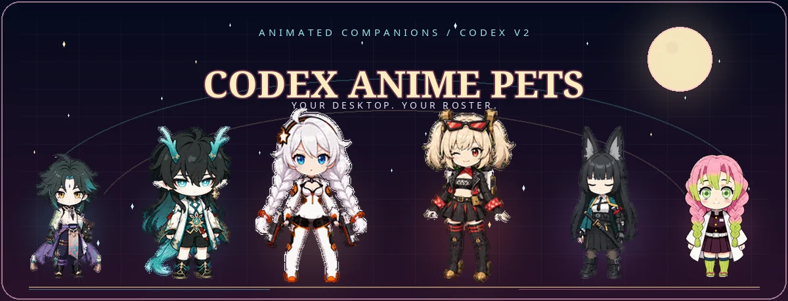

<p>
  <a href="README.md"><kbd><b>English</b></kbd></a>
  <a href="README.fr.md"><kbd>Français</kbd></a>
  <a href="README.zh-CN.md"><kbd>中文</kbd></a>
  <a href="README.ja.md"><kbd>日本語</kbd></a>
</p>

<p><b>Your favorite characters, reimagined as lively companions for Codex.</b></p>

<p>
  <code>36 CHARACTERS</code>
  <code>37 EDITIONS</code>
  <code>9 ANIMATIONS</code>
  <code>16 LOOK DIRECTIONS</code>
</p>

<sub>Choose a character · Download the package · Add it to Codex</sub>

</div>

> **Desktop only:** Custom pet packages currently work only in the Codex desktop app. The Codex mobile app cannot display pets; mobile installation and cross-device pet syncing are not supported.

<p align="center">
  
</p>

<a id="motion-reel"></a>
<p align="center">
  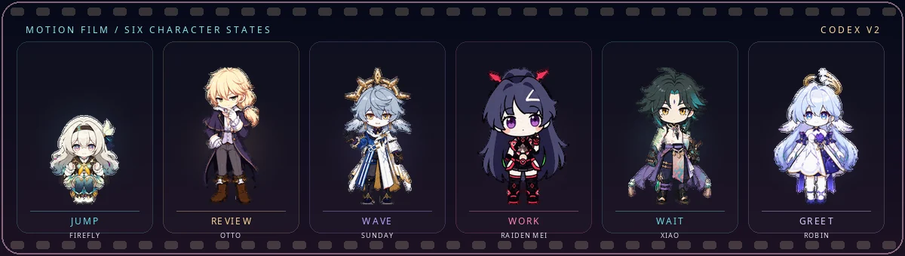
</p>

<p align="center">
  <a href="zenless-zone-zero/Burnice%20White/qa/direction-qa.png">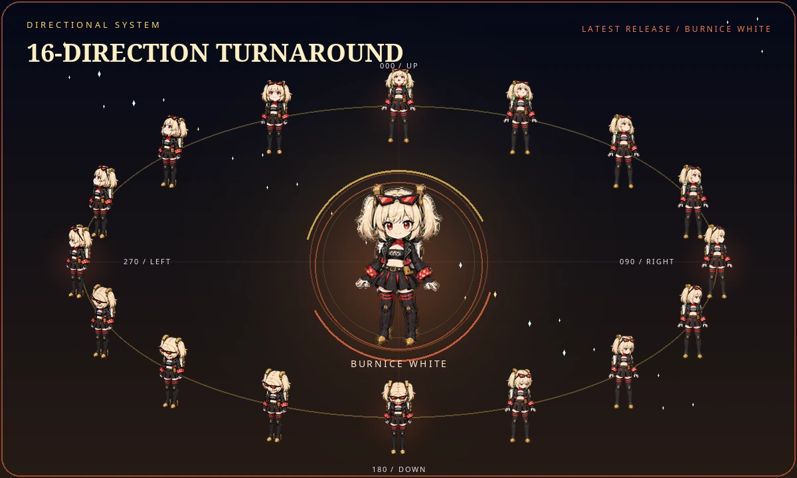</a>
</p>

<p align="center">
  <a href="zenless-zone-zero/Burnice%20White/qa/direction-qa.png"><kbd>Open the full direction QA</kbd></a>
</p>

<a id="new-arrivals"></a>
<p align="center">
  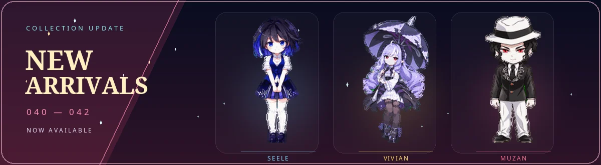
</p>

<p align="center">
  <a href="#character-34-venti"><kbd>Venti</kbd></a>
  <a href="#character-35-fu-hua"><kbd>Fu Hua</kbd></a>
  <a href="#character-36-lighter"><kbd>Lighter</kbd></a>
</p>

<div align="center">

## Choose a companion

<sub>Select a portrait to open its character archive.</sub>

</div>

<p align="center">
  <a href="#character-archive">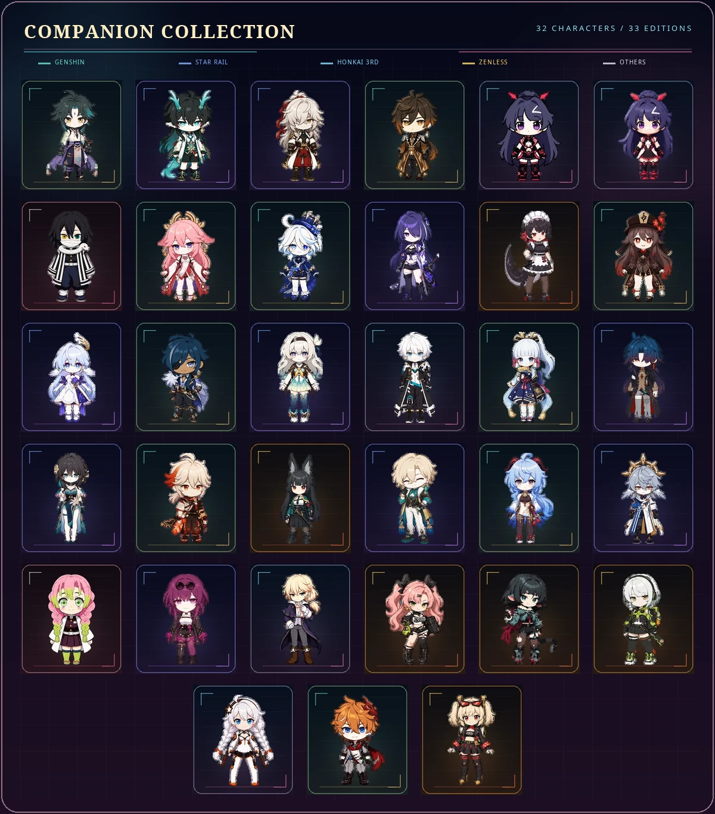</a>
</p>

<table align="center" width="100%">
  <tr>
    <td align="center" valign="middle" width="24%">
      <a href="https://github.com/liu-weida/elysia_codex_pet"></a>
    </td>
    <td valign="middle" width="76%">
      <sub>COMMUNITY COLLECTION</sub><br>
      <b>Elysia Collection</b><br>
      <sub>A standalone collection of Elysia Codex pets by liu-weida, featuring multiple outfits, skins, and visual editions.</sub><br><br>
      <code>ELYSIA</code> <code>2D + 3D</code> <code>MULTIPLE OUTFITS</code><br><br>
      <a href="https://github.com/liu-weida/elysia_codex_pet"><kbd>Browse the Elysia collection ↗</kbd></a>
    </td>
  </tr>
</table>

<p align="center">
  <a href="#downloads-genshin-impact"><kbd>Genshin Impact · 11</kbd></a>
  <a href="#downloads-honkai-star-rail"><kbd>Honkai: Star Rail · 11</kbd></a>
  <a href="#downloads-honkai-impact-3rd"><kbd>Honkai Impact 3rd · 5</kbd></a>
  <a href="#downloads-zenless-zone-zero"><kbd>Zenless Zone Zero · 7</kbd></a>
  <a href="#downloads-others"><kbd>Others · 2</kbd></a>
</p>

<details>
<summary><b>Full roster · 36 characters</b>　<kbd>Open character gallery</kbd></summary>

<br>

<table align="center">
  <tr>
    <td align="center" valign="top" width="33%">
      <sub>01</sub><br>
      <a href="#character-01-xiao"></a><br>
      <b>「 Xiao 」</b><br>
    </td>
    <td align="center" valign="top" width="33%">
      <sub>02</sub><br>
      <a href="#character-02-dan-heng-imbibitor-lunae"></a><br>
      <b>「 Dan&nbsp;Heng 」</b><br>
    </td>
    <td align="center" valign="top" width="33%">
      <sub>03</sub><br>
      <a href="#character-03-jing-yuan"></a><br>
      <b>「 Jing&nbsp;Yuan 」</b><br>
    </td>
  </tr>
  <tr>
    <td align="center" valign="top" width="33%">
      <sub>04</sub><br>
      <a href="#character-04-zhongli"></a><br>
      <b>「 Zhongli 」</b><br>
    </td>
    <td align="center" valign="top" width="33%">
      <sub>05</sub><br>
      <a href="#character-05-raiden-mei"></a><br>
      <b>「 Raiden&nbsp;Mei 」</b><br>
    </td>
    <td align="center" valign="top" width="33%">
      <sub>06</sub><br>
      <a href="#character-06-obanai"></a><br>
      <b>「 Obanai 」</b><br>
    </td>
  </tr>
  <tr>
    <td align="center" valign="top" width="33%">
      <sub>07</sub><br>
      <a href="#character-07-yae-miko"></a><br>
      <b>「 Yae&nbsp;Miko 」</b><br>
    </td>
    <td align="center" valign="top" width="33%">
      <sub>08</sub><br>
      <a href="#character-08-furina"></a><br>
      <b>「 Furina 」</b><br>
    </td>
    <td align="center" valign="top" width="33%">
      <sub>09</sub><br>
      <a href="#character-09-acheron"></a><br>
      <b>「 Acheron 」</b><br>
    </td>
  </tr>
  <tr>
    <td align="center" valign="top" width="33%">
      <sub>10</sub><br>
      <a href="#character-10-ellen-joe"></a><br>
      <b>「 Ellen&nbsp;Joe 」</b><br>
    </td>
    <td align="center" valign="top" width="33%">
      <sub>11</sub><br>
      <a href="#character-11-hu-tao"></a><br>
      <b>「 Hu&nbsp;Tao 」</b><br>
    </td>
    <td align="center" valign="top" width="33%">
      <sub>12</sub><br>
      <a href="#character-12-robin"></a><br>
      <b>「 Robin 」</b><br>
    </td>
  </tr>
  <tr>
    <td align="center" valign="top" width="33%">
      <sub>13</sub><br>
      <a href="#character-13-kaeya"></a><br>
      <b>「 Kaeya 」</b><br>
    </td>
    <td align="center" valign="top" width="33%">
      <sub>14</sub><br>
      <a href="#character-14-firefly"></a><br>
      <b>「 Firefly 」</b><br>
    </td>
    <td align="center" valign="top" width="33%">
      <sub>15</sub><br>
      <a href="#character-15-kevin-kaslana"></a><br>
      <b>「 Kevin 」</b><br>
    </td>
  </tr>
  <tr>
    <td align="center" valign="top" width="33%">
      <sub>16</sub><br>
      <a href="#character-16-kamisato-ayaka"></a><br>
      <b>「 Ayaka 」</b><br>
    </td>
    <td align="center" valign="top" width="33%">
      <sub>17</sub><br>
      <a href="#character-17-blade"></a><br>
      <b>「 Blade 」</b><br>
    </td>
    <td align="center" valign="top" width="33%">
      <sub>18</sub><br>
      <a href="#character-18-ruan-mei"></a><br>
      <b>「 Ruan&nbsp;Mei 」</b><br>
    </td>
  </tr>
  <tr>
    <td align="center" valign="top" width="33%">
      <sub>19</sub><br>
      <a href="#character-19-kaedehara-kazuha"></a><br>
      <b>「 Kazuha 」</b><br>
    </td>
    <td align="center" valign="top" width="33%">
      <sub>20</sub><br>
      <a href="#character-20-hoshimi-miyabi"></a><br>
      <b>「 Miyabi 」</b><br>
    </td>
    <td align="center" valign="top" width="33%">
      <sub>21</sub><br>
      <a href="#character-21-aventurine"></a><br>
      <b>「 Aventurine 」</b><br>
    </td>
  </tr>
  <tr>
    <td align="center" valign="top" width="33%">
      <sub>22</sub><br>
      <a href="#character-22-ganyu"></a><br>
      <b>「 Ganyu 」</b><br>
    </td>
    <td align="center" valign="top" width="33%">
      <sub>23</sub><br>
      <a href="#character-23-sunday"></a><br>
      <b>「 Sunday 」</b><br>
    </td>
    <td align="center" valign="top" width="33%">
      <sub>24</sub><br>
      <a href="#character-24-mitsuri-kanroji"></a><br>
      <b>「 Mitsuri 」</b><br>
    </td>
  </tr>
  <tr>
    <td align="center" valign="top" width="33%">
      <sub>25</sub><br>
      <a href="#character-25-kafka"></a><br>
      <b>「 Kafka 」</b><br>
    </td>
    <td align="center" valign="top" width="33%">
      <sub>26</sub><br>
      <a href="#character-26-otto-apocalypse"></a><br>
      <b>「 Otto 」</b><br>
    </td>
    <td align="center" valign="top" width="33%">
      <sub>27</sub><br>
      <a href="#character-27-nicole-demara"></a><br>
      <b>「 Nicole 」</b><br>
    </td>
  </tr>
  <tr>
    <td align="center" valign="top" width="33%">
      <sub>28</sub><br>
      <a href="#character-28-jane-doe"></a><br>
      <b>「 Jane&nbsp;Doe 」</b><br>
    </td>
    <td align="center" valign="top" width="33%">
      <sub>29</sub><br>
      <a href="#character-29-anby-demara"></a><br>
      <b>「 Anby 」</b><br>
    </td>
    <td align="center" valign="top" width="33%">
      <sub>30</sub><br>
      <a href="#character-30-kiana-kaslana"></a><br>
      <b>「 Kiana 」</b><br>
    </td>
  </tr>
  <tr>
    <td align="center" valign="top" width="33%">
      <sub>31</sub><br>
      <a href="#character-31-tartaglia">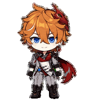</a><br>
      <b>「 Tartaglia 」</b><br>
    </td>
    <td align="center" valign="top" width="33%">
      <sub>32</sub><br>
      <a href="#character-32-burnice-white"></a><br>
      <b>「 Burnice 」</b><br>
    </td>
    <td align="center" valign="top" width="33%">
      <sub>33</sub><br>
      <a href="#character-33-sparkle">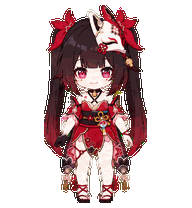</a><br>
      <b>「 Sparkle 」</b><br>
    </td>
  </tr>
  <tr>
    <td align="center" valign="top" width="33%">
      <sub>34</sub><br>
      <a href="#character-34-venti">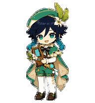</a><br>
      <b>「 Venti 」</b><br>
    </td>
    <td align="center" valign="top" width="33%">
      <sub>35</sub><br>
      <a href="#character-35-fu-hua"></a><br>
      <b>「 Fu&nbsp;Hua 」</b><br>
    </td>
    <td align="center" valign="top" width="33%">
      <sub>36</sub><br>
      <a href="#character-36-lighter">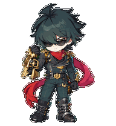</a><br>
      <b>「 Lighter 」</b><br>
    </td>
  </tr>
</table>

<p align="center">
  <a href="#contribute-a-character"></a><br>
  <b>Who joins next?</b><br>
  <sub>Bring a reference · Hatch a companion</sub>
</p>

</details>

<a id="character-archive" name="character-archive"></a>
<div align="center">

## Character archive

<sub>Open a file to see the character details, animation sheet, and download.</sub>

</div>

<a id="character-01-xiao" name="character-01-xiao"></a>
<details open>
<summary><b>01 · Xiao</b></summary>

<br>

<table>
  <tr>
    <td align="center" width="220">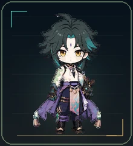</td>
    <td>
      <b>Style:</b> 2D anime sticker<br>
      <b>Signature details:</b> golden eyes, purple forehead mark, teal-tipped hair, adeptal tattoo, jade ornaments, and Yaksha mask<br>
      <b>Mood:</b> vigilant and restrained, with a softer presence at desktop scale<br><br>
      <a href="genshin-impact/xiao/xiao-2d.zip"><b>⬇️ Download 2D edition</b></a> ·
      <a href="work/xiao/2d/qa/contact-sheet-extended.png">Animation sheet</a> ·
      <a href="work/xiao/2d/qa/look-directions.png">16 look directions</a>
    </td>
  </tr>
</table>

</details>

<a id="character-02-dan-heng-imbibitor-lunae" name="character-02-dan-heng-imbibitor-lunae"></a>
<details>
<summary><b>02 · Dan Heng · Imbibitor Lunae</b></summary>

<br>

<table>
  <tr>
    <td align="center" width="220">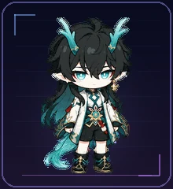</td>
    <td>
      <b>Style:</b> 2D anime sticker<br>
      <b>Signature details:</b> cyan dragon horns, pointed ears, long dark hair, white draped sleeves, and jade-gold ornaments<br>
      <b>Mood:</b> cool, composed, and quietly elegant<br><br>
      <a href="honkai-star-rail/dan-heng-imbibitor-lunae/dan-heng-imbibitor-lunae-2d-codex-pet-v2.zip"><b>⬇️ Download 2D edition</b></a> ·
      <a href="work/dan-heng-imbibitor-lunae/2d/qa/contact-sheet-extended.png">Animation sheet</a> ·
      <a href="work/dan-heng-imbibitor-lunae/2d/qa/look-directions.png">16 look directions</a>
    </td>
  </tr>
</table>

</details>

<a id="character-03-jing-yuan" name="character-03-jing-yuan"></a>
<details>
<summary><b>03 · Jing Yuan</b></summary>

<br>

<table>
  <tr>
    <td align="center" width="220">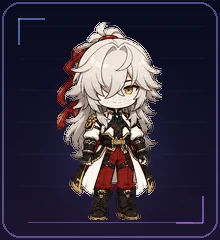</td>
    <td>
      <b>Style:</b> 2D anime sticker<br>
      <b>Signature details:</b> long silver hair, golden eyes, red ribbon, and a black-white-red-gold uniform<br>
      <b>Mood:</b> unhurried, observant, and confidently at ease<br><br>
      <a href="honkai-star-rail/jing-yuan/jing-yuan-2d-codex-pet-v2.zip"><b>⬇️ Download 2D edition</b></a> ·
      <a href="work/jing-yuan/2d/qa/contact-sheet-extended.png">Animation sheet</a> ·
      <a href="work/jing-yuan/2d/qa/look-directions.png">16 look directions</a>
    </td>
  </tr>
</table>

</details>

<a id="character-04-zhongli" name="character-04-zhongli"></a>
<details>
<summary><b>04 · Zhongli</b></summary>

<br>

<table>
  <tr>
    <td align="center" width="220">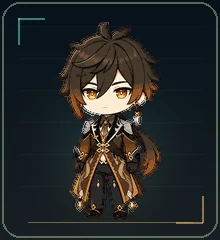</td>
    <td>
      <b>Style:</b> 2D anime sticker<br>
      <b>Signature details:</b> amber eyes, formal long coat, and a warm brown-and-gold palette<br>
      <b>Mood:</b> steady, reassuring, and effortlessly dignified<br><br>
      <a href="genshin-impact/zhongli/zhongli-2d-codex-pet-v2.zip"><b>⬇️ Download 2D edition</b></a> ·
      <a href="work/zhongli/2d/qa/contact-sheet-extended.png">Animation sheet</a> ·
      <a href="work/zhongli/2d/qa/look-directions.png">16 look directions</a>
    </td>
  </tr>
</table>

</details>

<a id="character-05-raiden-mei" name="character-05-raiden-mei"></a>
<details>
<summary><b>05 · Raiden Mei</b></summary>

<br>

One character, two distinct visual editions:

<table>
  <tr>
    <th align="center">2D anime sticker</th>
    <th align="center">3D-rendered chibi figure</th>
  </tr>
  <tr>
    <td align="center" width="220">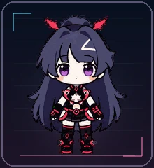</td>
    <td align="center" width="220">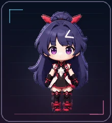</td>
  </tr>
  <tr>
    <td align="center">
      <a href="honkai-impact-3rd/raiden-mei/raiden-mei-2d-codex-pet-v2.zip"><b>⬇️ Download 2D</b></a><br>
      <a href="honkai-impact-3rd/raiden-mei/qa/raiden-mei-2d-contact-sheet.png">Animation sheet</a> ·
      <a href="honkai-impact-3rd/raiden-mei/qa/raiden-mei-2d-look-directions.png">16 look directions</a>
    </td>
    <td align="center">
      <a href="honkai-impact-3rd/raiden-mei/raiden-mei-3d-codex-pet-v2.zip"><b>⬇️ Download 3D style</b></a><br>
      <a href="honkai-impact-3rd/raiden-mei/qa/raiden-mei-3d-contact-sheet.png">Animation sheet</a> ·
      <a href="honkai-impact-3rd/raiden-mei/qa/raiden-mei-3d-look-directions.png">16 look directions</a>
    </td>
  </tr>
</table>

The 3D edition describes the rendered look. Like every pet here, it is delivered as a lightweight 2D spritesheet.

</details>

<a id="character-06-obanai" name="character-06-obanai"></a>
<details>
<summary><b>06 · Obanai</b></summary>

<br>

<table>
  <tr>
    <td align="center" width="220">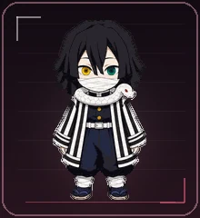</td>
    <td>
      <b>Style:</b> 2D anime sticker<br>
      <b>Signature details:</b> heterochromia, striped haori, and Kaburamaru curled close by<br>
      <b>Mood:</b> reserved, watchful, and sharply attentive<br><br>
      <a href="others/obanai-iguro/obanai-2d-codex-pet-v2.zip"><b>⬇️ Download 2D edition</b></a> ·
      <a href="others/obanai-iguro/qa/contact-sheet.png">Animation sheet</a> ·
      <a href="others/obanai-iguro/qa/direction-qa.png">16 look directions</a>
    </td>
  </tr>
</table>

</details>

<a id="character-07-yae-miko" name="character-07-yae-miko"></a>
<details>
<summary><b>07 · Yae Miko</b></summary>

<br>

<table>
  <tr>
    <td align="center" width="220">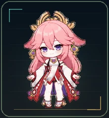</td>
    <td>
      <b>Style:</b> 2D anime sticker<br>
      <b>Signature details:</b> flowing sakura-pink hair, violet eyes, golden crown ornaments, gemstone earrings, and a red-white-black-purple shrine-maiden outfit<br>
      <b>Mood:</b> poised, playful, and quietly mischievous<br><br>
      <a href="genshin-impact/yae-miko/yae-miko-2d-codex-pet-v2.zip"><b>⬇️ Download 2D edition</b></a> ·
      <a href="work/yae-miko/2d/qa/contact-sheet-extended.png">Animation sheet</a> ·
      <a href="work/yae-miko/2d/qa/look-directions.png">16 look directions</a>
    </td>
  </tr>
</table>

</details>

<a id="character-08-furina" name="character-08-furina"></a>
<details>
<summary><b>08 · Furina</b></summary>

<br>

<table>
  <tr>
    <td align="center" width="220">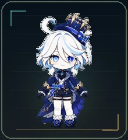</td>
    <td>
      <b>Style:</b> 2D anime sticker<br>
      <b>Signature details:</b> white bob with pale-cyan accents, teardrop-blue eyes, a crown-like navy hat, white ruffles, blue gems, and gold-trimmed Fontaine attire<br>
      <b>Mood:</b> poised and theatrical, with an irrepressibly playful spark<br><br>
      <a href="genshin-impact/furina/furina-2d-codex-pet-v2.zip"><b>⬇️ Download 2D edition</b></a> ·
      <a href="work/furina/2d/qa/contact-sheet-extended.png">Animation sheet</a> ·
      <a href="work/furina/2d/qa/look-directions.png">16 look directions</a>
    </td>
  </tr>
</table>

</details>

<a id="character-09-acheron" name="character-09-acheron"></a>
<details>
<summary><b>09 · Acheron</b></summary>

<br>

<table>
  <tr>
    <td align="center" width="220">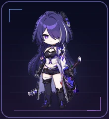</td>
    <td>
      <b>Style:</b> 2D anime sticker<br>
      <b>Signature details:</b> deep indigo-violet hair, an asymmetrical fringe veiling one eye, a violet-magenta gaze, a white-lilac-black outfit with flame motifs, and a katana kept close at her side<br>
      <b>Mood:</b> quiet and enigmatic, carrying the stillness of a distant storm<br><br>
      <a href="honkai-star-rail/acheron/acheron-2d-codex-pet-v2.zip"><b>⬇️ Download 2D edition</b></a> ·
      <a href="work/acheron/2d/qa/contact-sheet-extended.png">Animation sheet</a> ·
      <a href="work/acheron/2d/qa/look-directions.png">16 look directions</a>
    </td>
  </tr>
</table>

</details>

<a id="character-10-ellen-joe" name="character-10-ellen-joe"></a>
<details>
<summary><b>10 · Ellen Joe</b></summary>

<br>

<table>
  <tr>
    <td align="center" width="220">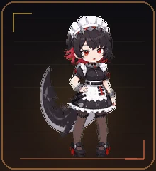</td>
    <td>
      <b>Style:</b> 2D anime sticker<br>
      <b>Signature details:</b> charcoal-black bob with red inner layers, sleepy red eyes, a spiked maid headdress, monochrome industrial maidwear, and her unmistakable attached shark tail<br>
      <b>Mood:</b> laid-back and cool, with a quick, mischievous edge when the work starts moving<br><br>
      <a href="zenless-zone-zero/ellen-joe/ellen-joe-2d-codex-pet-v2.zip"><b>⬇️ Download 2D edition</b></a> ·
      <a href="work/ellen-joe/2d/qa/contact-sheet-extended.png">Animation sheet</a> ·
      <a href="work/ellen-joe/2d/qa/look-directions.png">16 look directions</a>
    </td>
  </tr>
</table>

</details>

<a id="character-11-hu-tao" name="character-11-hu-tao"></a>
<details>
<summary><b>11 · Hu Tao</b></summary>

<br>

<table>
  <tr>
    <td align="center" width="220">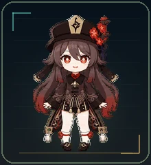</td>
    <td>
      <b>Style:</b> 2D anime sticker<br>
      <b>Signature details:</b> flower-shaped crimson eyes, a tall dark hat with its talisman plaque and plum-blossom branch, long dark-brown hair fading toward muted red, and a deep brown-black-red-gold uniform<br>
      <b>Mood:</b> bright, teasing, and fearless, with a playful spark even in the quietest moments<br><br>
      <a href="genshin-impact/hu-tao/hu-tao-2d-codex-pet-v2.zip"><b>⬇️ Download 2D edition</b></a> ·
      <a href="work/hu-tao/2d/qa/contact-sheet-extended.png">Animation sheet</a> ·
      <a href="work/hu-tao/2d/qa/look-directions.png">16 look directions</a>
    </td>
  </tr>
</table>

</details>

<a id="character-12-robin" name="character-12-robin"></a>
<details>
<summary><b>12 · Robin</b></summary>

<br>

<table>
  <tr>
    <td align="center" width="220">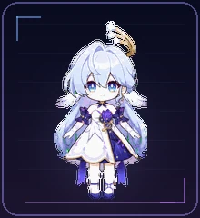</td>
    <td>
      <b>Style:</b> 2D anime sticker<br>
      <b>Signature details:</b> silver-blue hair and a rear rosette bun, turquoise-to-violet eyes, a gold flower-tip halo, white feathered ear-wings, and a layered white, deep-indigo, lilac, and gold stage dress<br>
      <b>Mood:</b> serene and graceful, with the poised warmth of a singer ready to brighten the room<br><br>
      <a href="honkai-star-rail/robin/robin-2d-codex-pet-v2.zip"><b>⬇️ Download 2D edition</b></a> ·
      <a href="work/robin/2d/qa/contact-sheet-extended.png">Animation sheet</a> ·
      <a href="work/robin/2d/qa/look-directions.png">16 look directions</a>
    </td>
  </tr>
</table>

</details>

<a id="character-13-kaeya" name="character-13-kaeya"></a>
<details>
<summary><b>13 · Kaeya</b></summary>

<br>

<table>
  <tr>
    <td align="center" width="220">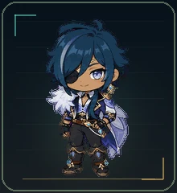</td>
    <td>
      <b>Style:</b> 2D anime sticker<br>
      <b>Signature details:</b> swept navy hair with a cool blue streak, warm tan skin, a pale-lilac visible eye, black eyepatch, white fur mantle, blue-violet split cape, and a dark cavalry uniform finished with gold details<br>
      <b>Mood:</b> relaxed and self-assured, with a playful edge that never loses sight of the room<br><br>
      <a href="genshin-impact/kaeya/kaeya-2d-codex-pet-v2.zip"><b>⬇️ Download 2D edition</b></a> ·
      <a href="work/kaeya/2d/qa/contact-sheet-extended.png">Animation sheet</a> ·
      <a href="work/kaeya/2d/qa/look-directions.png">16 look directions</a>
    </td>
  </tr>
</table>

</details>

<a id="character-14-firefly" name="character-14-firefly"></a>
<details>
<summary><b>14 · Firefly</b></summary>

<br>

<table>
  <tr>
    <td align="center" width="220">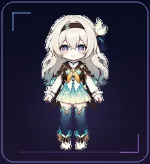</td>
    <td>
      <b>Style:</b> 2D anime sticker<br>
      <b>Signature details:</b> long pearly-silver hair with cool gray ends, pink-to-aqua eyes, a black headband, pale mint leaf ornament and navy bow, charcoal-and-gold cropped cape, orange-gold chest bow, mint layered dress, and white boots with teal accents<br>
      <b>Mood:</b> gentle and hopeful, with quiet courage beneath every small gesture<br><br>
      <a href="honkai-star-rail/firefly/firefly-2d-codex-pet-v2.zip"><b>⬇️ Download 2D edition</b></a> ·
      <a href="work/firefly/2d/qa/contact-sheet-extended.png">Animation sheet</a> ·
      <a href="work/firefly/2d/qa/look-directions.png">16 look directions</a>
    </td>
  </tr>
</table>

</details>

<a id="character-15-kevin-kaslana" name="character-15-kevin-kaslana"></a>
<details>
<summary><b>15 · Kevin Kaslana</b></summary>

<br>

<table>
  <tr>
    <td align="center" width="220">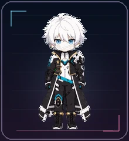</td>
    <td>
      <b>Style:</b> 2D anime sticker<br>
      <b>Signature details:</b> tousled white hair, icy-blue eyes, a high-collar black-and-white combat coat with gold piping and buckles, cyan chest and belt accents, and an asymmetric armored sleeve<br>
      <b>Mood:</b> calm and formidable, carrying immense strength with an almost motionless sense of control<br><br>
      <a href="honkai-impact-3rd/kevin-kaslana/kevin-kaslana-2d-codex-pet-v2.zip"><b>⬇️ Download 2D edition</b></a> ·
      <a href="work/kevin-kaslana/2d-repair-v3/qa/contact-sheet-extended.png">Animation sheet</a> ·
      <a href="work/kevin-kaslana/2d-repair-v3/qa/look-directions.png">16 look directions</a>
    </td>
  </tr>
</table>

</details>

<a id="character-16-kamisato-ayaka" name="character-16-kamisato-ayaka"></a>
<details>
<summary><b>16 · Kamisato Ayaka</b></summary>

<br>

<table>
  <tr>
    <td align="center" width="220">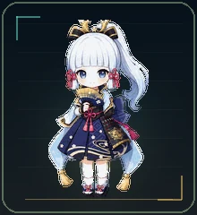</td>
    <td>
      <b>Style:</b> 2D anime sticker<br>
      <b>Signature details:</b> pale icy-blue high ponytail and straight bangs, black-and-gold crown ornament, pink side ribbons, clear blue eyes, navy kimono dress with pale-blue layers, gold trim, sakura motifs, magenta waist cord, armored skirt panels, and an elegant folding fan<br>
      <b>Mood:</b> poised and gracious, carrying frost-blue refinement with a gentle warmth in every small gesture<br><br>
      <a href="genshin-impact/kamisato-ayaka/kamisato-ayaka-2d-codex-pet-v2.zip"><b>⬇️ Download 2D edition</b></a> ·
      <a href="work/kamisato-ayaka/2d/qa/contact-sheet-extended.png">Animation sheet</a> ·
      <a href="work/kamisato-ayaka/2d/qa/look-directions.png">16 look directions</a>
    </td>
  </tr>
</table>

</details>

<a id="character-17-blade" name="character-17-blade"></a>
<details>
<summary><b>17 · Blade</b></summary>

<br>

<table>
  <tr>
    <td align="center" width="220">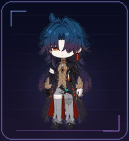</td>
    <td>
      <b>Style:</b> 2D anime sticker<br>
      <b>Signature details:</b> deep navy hair fading into violet-red tips, a single crimson eye beneath the fringe, a long black coat with gold fastenings and red lining, silver armor accents, bandaged hands, and a dark sword carried at his side<br>
      <b>Mood:</b> quiet and dangerous, with every restrained movement hinting at a will that refuses to break<br><br>
      <a href="honkai-star-rail/blade/blade-2d-codex-pet-v2.zip"><b>⬇️ Download 2D edition</b></a> ·
      <a href="work/blade/2d/qa/contact-sheet-extended.png">Animation sheet</a> ·
      <a href="work/blade/2d/qa/look-directions.png">16 look directions</a>
    </td>
  </tr>
</table>

</details>

<a id="character-18-ruan-mei" name="character-18-ruan-mei"></a>
<details>
<summary><b>18 · Ruan Mei</b></summary>

<br>

<table>
  <tr>
    <td align="center" width="220">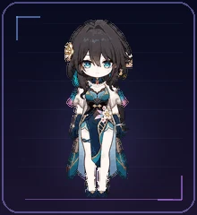</td>
    <td>
      <b>Style:</b> 2D anime sticker<br>
      <b>Signature details:</b> deep brown hair, turquoise eyes, a gold-and-pearl floral ornament, white shoulder drape, teal-and-navy dress with fine gold filigree, pink waist flower, long gloves, and an ornate blue ruan lute<br>
      <b>Mood:</b> serene and observant, carrying the quiet confidence of a scholar and the measured grace of a musician<br><br>
      <a href="honkai-star-rail/ruan-mei/ruan-mei-2d-codex-pet-v2.zip"><b>⬇️ Download 2D edition</b></a> ·
      <a href="work/ruan-mei/2d/qa/contact-sheet-extended.png">Animation sheet</a> ·
      <a href="work/ruan-mei/2d/qa/look-directions.png">16 look directions</a>
    </td>
  </tr>
</table>

</details>

<a id="character-19-kaedehara-kazuha" name="character-19-kaedehara-kazuha"></a>
<details>
<summary><b>19 · Kaedehara Kazuha</b></summary>

<br>

<table>
  <tr>
    <td align="center" width="220">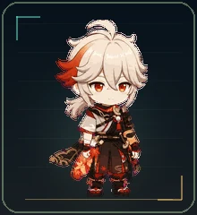</td>
    <td>
      <b>Style:</b> 2D anime sticker<br>
      <b>Signature details:</b> ivory-white hair with a vivid red streak, red-orange eyes, a compact scarf, an asymmetric black-red-cream samurai outfit, dark red hakama shorts, sandals, and a sheathed sword secured at his side<br>
      <b>Mood:</b> calm and attentive, carrying the quiet ease of a traveler and the steady resolve of a swordsman who listens to the wind<br><br>
      <a href="genshin-impact/kaedehara-kazuha/kazuha-chibi-2d-codex-pet-v2.zip"><b>⬇️ Download 2D edition</b></a> ·
      <a href="work/kazuha-chibi/2d/qa/contact-sheet-extended.png">Animation sheet</a> ·
      <a href="work/kazuha-chibi/2d/qa/look-directions.png">16 look directions</a>
    </td>
  </tr>
</table>

</details>

<a id="character-20-hoshimi-miyabi" name="character-20-hoshimi-miyabi"></a>
<details>
<summary><b>20 · Hoshimi Miyabi</b></summary>

<br>

<table>
  <tr>
    <td align="center" width="220">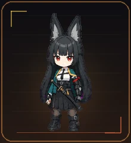</td>
    <td>
      <b>Style:</b> 2D anime sticker<br>
      <b>Signature details:</b> tall dark fox ears, navy-black hair, red eyes, a teal-white-black uniform, an asymmetric mechanical arm wrapped with a red cord, and a sheathed katana kept close at the hip<br>
      <b>Mood:</b> still and sharply attentive, with the contained presence of a swordmaster who never needs to hurry<br><br>
      <a href="zenless-zone-zero/hoshimi-miyabi/miyabi-2d-codex-pet-v2.zip"><b>⬇️ Download 2D edition</b></a> ·
      <a href="work/miyabi/2d/qa/contact-sheet-extended.png">Animation sheet</a> ·
      <a href="work/miyabi/2d/qa/look-directions.png">16 look directions</a>
    </td>
  </tr>
</table>

</details>

<a id="character-21-aventurine" name="character-21-aventurine"></a>
<details>
<summary><b>21 · Aventurine</b></summary>

<br>

<table>
  <tr>
    <td align="center" width="220">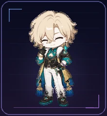</td>
    <td>
      <b>Style:</b> 2D anime sticker<br>
      <b>Signature details:</b> sandy-blond layered hair, magenta-to-cyan eyes, a teal teardrop earring, white fur collar, black-teal-gold tailored coat, white trousers, black gloves, violet bracelet, waist ornament, and attached blue tassels<br>
      <b>Mood:</b> poised and playfully self-assured, watching every turn with the calm of someone who already knows the odds<br><br>
      <a href="honkai-star-rail/aventurine/aventurine-2d-codex-pet-v2.zip"><b>⬇️ Download 2D edition</b></a> ·
      <a href="work/aventurine/2d/qa/contact-sheet-extended.png">Animation sheet</a> ·
      <a href="work/aventurine/2d/qa/look-directions.png">16 look directions</a>
    </td>
  </tr>
</table>

</details>

<a id="character-22-ganyu" name="character-22-ganyu"></a>
<details>
<summary><b>22 · Ganyu</b></summary>

<br>

<table>
  <tr>
    <td align="center" width="220">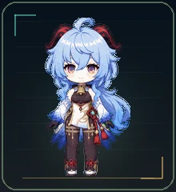</td>
    <td>
      <b>Style:</b> 2D anime sticker<br>
      <b>Signature details:</b> pale icy-blue layered hair with a curled forelock and long ponytail, black-red qilin horns, violet-pink eyes, a gold throat bell, dark-brown bodice, asymmetrical white-and-gold front panel, white-to-cobalt sleeves, blue back panels, and a red braided waist cord with twin tassels<br>
      <b>Mood:</b> gentle and quietly attentive, with the composed patience of an adeptal secretary who notices every small detail<br><br>
      <a href="genshin-impact/ganyu/ganyu-2d-codex-pet-v2.zip"><b>⬇️ Download 2D edition</b></a> ·
      <a href="work/ganyu/2d/qa/contact-sheet-extended.png">Animation sheet</a> ·
      <a href="work/ganyu/2d/qa/look-directions.png">16 look directions</a>
    </td>
  </tr>
</table>

</details>

<a id="character-23-sunday" name="character-23-sunday"></a>
<details>
<summary><b>23 · Sunday</b></summary>

<br>

<table>
  <tr>
    <td align="center" width="220">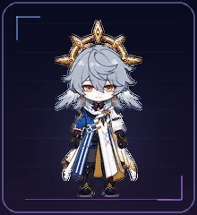</td>
    <td>
      <b>Style:</b> 2D anime sticker<br>
      <b>Signature details:</b> layered pale blue-gray hair, luminous golden eyes, feather-like ornaments beside the head, a rigid gold halo with diamond-shaped points, an asymmetric white, cobalt, navy, and gold long coat, dark gloves, fitted trousers, and tall boots<br>
      <b>Mood:</b> serene and impeccably composed, carrying the quiet presence of a conductor who can guide a room without ever raising his voice<br><br>
      <a href="honkai-star-rail/sunday/sunday-2d-codex-pet-v2.zip"><b>⬇️ Download 2D edition</b></a> ·
      <a href="work/sunday/2d/qa/contact-sheet-extended.png">Animation sheet</a> ·
      <a href="work/sunday/2d/qa/look-directions.png">16 look directions</a>
    </td>
  </tr>
</table>

</details>

<a id="character-24-mitsuri-kanroji" name="character-24-mitsuri-kanroji"></a>
<details>
<summary><b>24 · Mitsuri Kanroji</b></summary>

<br>

<table>
  <tr>
    <td align="center" width="220">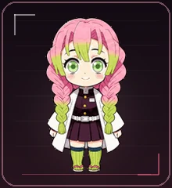</td>
    <td>
      <b>Style:</b> 2D anime sticker<br>
      <b>Signature details:</b> thick twin braids fading from pink to lime green, vivid green eyes, a white haori over her dark uniform, green striped socks, and sandals<br>
      <b>Mood:</b> warm, candid, and full of bright energy, with an affection that feels every bit as strong as her resolve<br><br>
      <a href="others/mitsuri-kanroji/mitsuri-kanroji-2d-codex-pet-v2.zip"><b>⬇️ Download 2D edition</b></a> ·
      <a href="others/mitsuri-kanroji/qa/contact-sheet.png">Animation sheet</a> ·
      <a href="others/mitsuri-kanroji/qa/direction-qa.png">16 look directions</a>
    </td>
  </tr>
</table>

</details>

<a id="character-25-kafka" name="character-25-kafka"></a>
<details>
<summary><b>25 · Kafka</b></summary>

<br>

<table>
  <tr>
    <td align="center" width="220">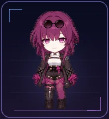</td>
    <td>
      <b>Style:</b> 2D anime sticker<br>
      <b>Signature details:</b> layered wine-purple hair with long side locks, sunglasses resting on her crown, mauve-pink eyes, a white high-collar blouse, an asymmetric black-violet coat with web accents, dark tights with magenta thigh straps, wine-purple gloves, and black ankle boots<br>
      <b>Mood:</b> poised and enigmatic, with the unhurried confidence of someone who already knows how the scene will end<br><br>
      <a href="honkai-star-rail/Kafka/kafka-2d-codex-pet-v2.zip"><b>⬇️ Download 2D edition</b></a> ·
      <a href="honkai-star-rail/Kafka/qa/contact-sheet.png">Animation sheet</a> ·
      <a href="honkai-star-rail/Kafka/qa/direction-qa.png">16 look directions</a>
    </td>
  </tr>
</table>

</details>

<a id="character-26-otto-apocalypse" name="character-26-otto-apocalypse"></a>
<details>
<summary><b>26 · Otto Apocalypse</b></summary>

<br>

<table>
  <tr>
    <td align="center" width="220">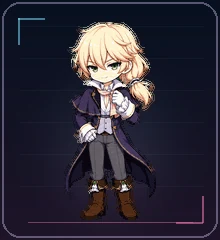</td>
    <td>
      <b>Style:</b> 2D anime sticker<br>
      <b>Signature details:</b> layered pale-gold hair tied into a low side ponytail, green eyes, a navy-violet long coat with gold piping and shoulder capelet, a white ruffled shirt, rose cravat, lavender waistcoat, white gloves, charcoal trousers, and brown knee-high boots<br>
      <b>Mood:</b> polished and composed, with the quiet authority of someone already considering the next several moves<br><br>
      <a href="honkai-impact-3rd/Otto-Apocalypse/otto-apocalypse-2d-codex-pet-v2.zip"><b>⬇️ Download 2D edition</b></a> ·
      <a href="honkai-impact-3rd/Otto-Apocalypse/qa/contact-sheet.png">Animation sheet</a> ·
      <a href="honkai-impact-3rd/Otto-Apocalypse/qa/direction-qa.png">16 look directions</a>
    </td>
  </tr>
</table>

</details>

<a id="character-27-nicole-demara" name="character-27-nicole-demara"></a>
<details>
<summary><b>27 · Nicole Demara</b></summary>

<br>

<table>
  <tr>
    <td align="center" width="220">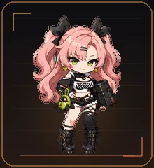</td>
    <td>
      <b>Style:</b> 2D anime sticker<br>
      <b>Signature details:</b> pink twin-tails, black bow roots, lime-green eyes, cropped black-and-white streetwear, orange accents, mismatched stockings, heavy boots, a green Bangboo pouch, and an attached black case<br>
      <b>Mood:</b> sharp, charismatic, and streetwise, with the easy confidence of someone who can turn chaos into a deal<br><br>
      <a href="zenless-zone-zero/nicole-demara/nicole-demara-2d-codex-pet-v2.zip"><b>⬇️ Download 2D edition</b></a> ·
      <a href="work/nicole-demara/2d/qa/contact-sheet-extended.png">Animation sheet</a> ·
      <a href="work/nicole-demara/2d/qa/look-directions.png">16 look directions</a>
    </td>
  </tr>
</table>

</details>

<a id="character-28-jane-doe" name="character-28-jane-doe"></a>
<details>
<summary><b>28 · Jane Doe</b></summary>

<br>

<table>
  <tr>
    <td align="center" width="220">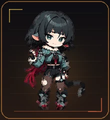</td>
    <td>
      <b>Style:</b> 2D anime sticker<br>
      <b>Signature details:</b> short black bob with wine-red rear hair, pink rat ears, narrow green eyes, cream fur collar, blue-gray cropped jacket, tactical shorts, asymmetrical stockings and boots, red accents, and one long attached charcoal tail<br>
      <b>Mood:</b> poised, observant, and quietly dangerous, with a knowing expression that always seems one step ahead<br><br>
      <a href="zenless-zone-zero/jane-doe/jane-doe-2d-codex-pet-v2.zip"><b>⬇️ Download 2D edition</b></a> ·
      <a href="work/jane-doe/2d/qa/contact-sheet-extended.png">Animation sheet</a> ·
      <a href="work/jane-doe/2d/qa/look-directions.png">16 look directions</a>
    </td>
  </tr>
</table>

</details>

<a id="character-29-anby-demara" name="character-29-anby-demara"></a>
<details>
<summary><b>29 · Anby Demara</b></summary>

<br>

<table>
  <tr>
    <td align="center" width="220">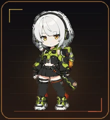</td>
    <td>
      <b>Style:</b> 2D anime sticker<br>
      <b>Signature details:</b> short silver bob, black headband, amber eyes, lime-and-black tactical jacket, pleated skirt, asymmetrical stockings, sneakers, mechanical backpack rig, and an attached sheathed sword<br>
      <b>Mood:</b> calm, disciplined, and focused, with understated warmth behind her reserved expression<br><br>
      <a href="zenless-zone-zero/anby-demara/anby-demara-2d-codex-pet-v2.zip"><b>⬇️ Download 2D edition</b></a> ·
      <a href="work/anby-demara/2d/qa/contact-sheet-extended.png">Animation sheet</a> ·
      <a href="work/anby-demara/2d/qa/look-directions.png">16 look directions</a>
    </td>
  </tr>
</table>

</details>

<a id="character-30-kiana-kaslana" name="character-30-kiana-kaslana"></a>
<details>
<summary><b>30 · Kiana Kaslana</b></summary>

<br>

<table>
  <tr>
    <td align="center" width="220">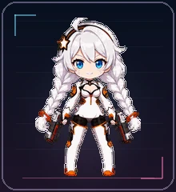</td>
    <td>
      <b>Style:</b> 2D anime sticker<br>
      <b>Signature details:</b> bright blue eyes, long white twin braids, star hair clip, white-and-black Valkyrie combat suit with orange accents, and a matched pair of compact pistols<br>
      <b>Mood:</b> bright, brave, and full of forward momentum, with the unmistakable confidence of a Valkyrie who never stops reaching for tomorrow<br><br>
      <a href="honkai-impact-3rd/Kiana%20Kaslana/kiana-kaslana-2d-codex-pet-v2.zip"><b>⬇️ Download 2D edition</b></a> ·
      <a href="work/kiana-kaslana/2d/qa/contact-sheet-extended.png">Animation sheet</a> ·
      <a href="work/kiana-kaslana/2d/qa/look-directions.png">16 look directions</a>
    </td>
  </tr>
</table>

</details>

<a id="character-31-tartaglia" name="character-31-tartaglia"></a>
<details>
<summary><b>31 · Tartaglia</b></summary>

<br>

<table>
  <tr>
    <td align="center" width="220">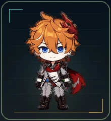</td>
    <td>
      <b>Style:</b> 2D anime sticker<br>
      <b>Signature details:</b> orange hair, vivid blue eyes, red hair ornament and earring, gray-and-white uniform, red scarf, asymmetric shoulder armor, dark gloves and boots, and Hydro Vision<br>
      <b>Mood:</b> confident, playful, and always ready for the next challenge, with a calm smile that keeps his competitive edge close at hand<br><br>
      <a href="genshin-impact/Tartaglia/tartaglia-2d-codex-pet-v2.zip"><b>⬇️ Download 2D edition</b></a> ·
      <a href="work/tartaglia/2d/qa/contact-sheet-extended.png">Animation sheet</a> ·
      <a href="work/tartaglia/2d/qa/look-directions.png">16 look directions</a>
    </td>
  </tr>
</table>

</details>

<a id="character-32-burnice-white" name="character-32-burnice-white"></a>
<details>
<summary><b>32 · Burnice White</b></summary>

<br>

<table>
  <tr>
    <td align="center" width="220">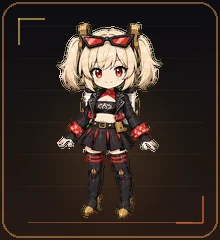</td>
    <td>
      <b>Style:</b> 2D anime sticker<br>
      <b>Signature details:</b> blonde twin ponytails, red-orange eyes, red-and-black goggles, flame-accented cropped biker jacket, red scarf, pleated skirt, asymmetric boots, gold fittings, and an attached compact fuel backpack<br>
      <b>Mood:</b> lively, fearless, and warmly exuberant, with an irrepressible grin and the energy to turn every quiet moment into a celebration<br><br>
      <a href="zenless-zone-zero/Burnice%20White/burnice-white-2d-codex-pet-v2.zip"><b>⬇️ Download 2D edition</b></a> ·
      <a href="zenless-zone-zero/Burnice%20White/qa/contact-sheet.png">Animation sheet</a> ·
      <a href="zenless-zone-zero/Burnice%20White/qa/direction-qa.png">16 look directions</a>
    </td>
  </tr>
</table>

</details>

<a id="character-33-sparkle" name="character-33-sparkle"></a>
<details>
<summary><b>33 · Sparkle</b></summary>

<br>

<table>
  <tr>
    <td align="center" width="220">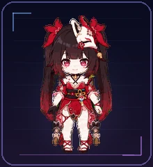</td>
    <td>
      <b>Style:</b> 2D anime sticker<br>
      <b>Signature details:</b> dark twin tails, crimson bows, vivid magenta eyes, cheek beauty marks, a tilted fox mask, bell choker, and an ornate red-black-white stage outfit with gold cords and patterned sash ends<br>
      <b>Mood:</b> playful and theatrical, with a sly smile that makes every desktop moment feel like part of the performance<br><br>
      <a href="honkai-star-rail/Sparkle/sparkle-2d-codex-pet-v2.zip"><b>⬇️ Download 2D edition</b></a> ·
      <a href="honkai-star-rail/Sparkle/qa/contact-sheet.png">Animation sheet</a> ·
      <a href="honkai-star-rail/Sparkle/qa/direction-qa.png">16 look directions</a>
    </td>
  </tr>
</table>

</details>

<a id="character-34-venti" name="character-34-venti"></a>
<details>
<summary><b>34 · Venti</b></summary>

<br>

<table>
  <tr>
    <td align="center" width="220">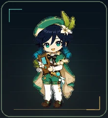</td>
    <td>
      <b>Style:</b> 2D anime sticker<br>
      <b>Signature details:</b> teal eyes, navy hair with teal-tipped braids, green bard cap with cream flower and feather, green-and-cream cape, white ruffled shirt, green shorts, white tights, brown shoes, and an attached wooden lyre<br>
      <b>Mood:</b> bright and easygoing, with the playful charm of a bard who always seems to bring a little breeze with him<br><br>
      <a href="genshin-impact/Venti/venti-2d-codex-pet-v2.zip"><b>⬇️ Download 2D edition</b></a> ·
      <a href="genshin-impact/Venti/qa/contact-sheet.png">Animation sheet</a> ·
      <a href="genshin-impact/Venti/qa/direction-qa.png">16 look directions</a>
    </td>
  </tr>
</table>

</details>

<a id="character-35-fu-hua" name="character-35-fu-hua"></a>
<details>
<summary><b>35 · Fu Hua</b></summary>

<br>

<table>
  <tr>
    <td align="center" width="220">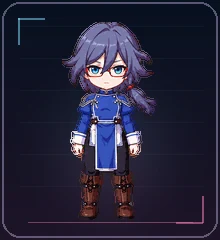</td>
    <td>
      <b>Style:</b> 2D anime sticker<br>
      <b>Signature details:</b> cyan eyes, red rectangular glasses, slate blue-violet hair, a low side ponytail with a red bead, blue-and-white Accipiter combat tunic, dark fitted trousers, and brown lace-up boots<br>
      <b>Mood:</b> calm and disciplined, with the measured confidence of a martial artist who never wastes a movement<br><br>
      <a href="honkai-impact-3rd/Fu%20Hua/fu-hua-2d-codex-pet-v2.zip"><b>⬇️ Download 2D edition</b></a> ·
      <a href="honkai-impact-3rd/Fu%20Hua/qa/contact-sheet.png">Animation sheet</a> ·
      <a href="honkai-impact-3rd/Fu%20Hua/qa/direction-qa.png">16 look directions</a>
    </td>
  </tr>
</table>

</details>

<a id="character-36-lighter" name="character-36-lighter"></a>
<details>
<summary><b>36 · Lighter</b></summary>

<br>

<table>
  <tr>
    <td align="center" width="220">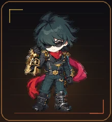</td>
    <td>
      <b>Style:</b> 2D anime sticker<br>
      <b>Signature details:</b> tousled dark teal hair, dark sunglasses, a long red scarf, charcoal biker jacket, dark green trousers, gold hardware, armored boots, and an oversized gold mechanical gauntlet<br>
      <b>Mood:</b> coolheaded, self-assured, and quietly competitive<br><br>
      <a href="zenless-zone-zero/Lighter/lighter-2d-codex-pet-v2.zip"><b>⬇️ Download 2D edition</b></a> ·
      <a href="work/lighter/2d/qa/contact-sheet-extended.png">Animation sheet</a> ·
      <a href="work/lighter/2d/qa/look-directions.png">16 look directions</a>
    </td>
  </tr>
</table>

</details>

<p align="center">
  
</p>

## Downloads

The packages are grouped by series. Open a group to see its characters and download links.

<a id="downloads-genshin-impact"></a>
<details>
<summary><b>Genshin Impact</b> · 11 companions　<kbd>Open</kbd></summary>

| Character | Edition | Pet ID | Package |
| --- | --- | --- | --- |
| Xiao | 2D | `xiao` | [Download ZIP](genshin-impact/xiao/xiao-2d.zip) |
| Zhongli | 2D | `zhongli` | [Download ZIP](genshin-impact/zhongli/zhongli-2d-codex-pet-v2.zip) |
| Yae Miko | 2D | `yae-miko` | [Download ZIP](genshin-impact/yae-miko/yae-miko-2d-codex-pet-v2.zip) |
| Furina | 2D | `furina` | [Download ZIP](genshin-impact/furina/furina-2d-codex-pet-v2.zip) |
| Hu Tao | 2D | `hu-tao` | [Download ZIP](genshin-impact/hu-tao/hu-tao-2d-codex-pet-v2.zip) |
| Kaeya | 2D | `kaeya` | [Download ZIP](genshin-impact/kaeya/kaeya-2d-codex-pet-v2.zip) |
| Kamisato Ayaka | 2D | `kamisato-ayaka` | [Download ZIP](genshin-impact/kamisato-ayaka/kamisato-ayaka-2d-codex-pet-v2.zip) |
| Kaedehara Kazuha | 2D | `kazuha-chibi` | [Download ZIP](genshin-impact/kaedehara-kazuha/kazuha-chibi-2d-codex-pet-v2.zip) |
| Ganyu | 2D | `ganyu` | [Download ZIP](genshin-impact/ganyu/ganyu-2d-codex-pet-v2.zip) |
| Tartaglia | 2D | `tartaglia` | [Download ZIP](genshin-impact/Tartaglia/tartaglia-2d-codex-pet-v2.zip) |
| Venti | 2D | `venti` | [Download ZIP](genshin-impact/Venti/venti-2d-codex-pet-v2.zip) |

</details>

<a id="downloads-honkai-star-rail"></a>
<details>
<summary><b>Honkai: Star Rail</b> · 11 companions　<kbd>Open</kbd></summary>

| Character | Edition | Pet ID | Package |
| --- | --- | --- | --- |
| Dan Heng · Imbibitor Lunae | 2D | `dan-heng-imbibitor-lunae` | [Download ZIP](honkai-star-rail/dan-heng-imbibitor-lunae/dan-heng-imbibitor-lunae-2d-codex-pet-v2.zip) |
| Jing Yuan | 2D | `jing-yuan` | [Download ZIP](honkai-star-rail/jing-yuan/jing-yuan-2d-codex-pet-v2.zip) |
| Acheron | 2D | `acheron` | [Download ZIP](honkai-star-rail/acheron/acheron-2d-codex-pet-v2.zip) |
| Robin | 2D | `robin` | [Download ZIP](honkai-star-rail/robin/robin-2d-codex-pet-v2.zip) |
| Firefly | 2D | `firefly` | [Download ZIP](honkai-star-rail/firefly/firefly-2d-codex-pet-v2.zip) |
| Blade | 2D | `blade` | [Download ZIP](honkai-star-rail/blade/blade-2d-codex-pet-v2.zip) |
| Ruan Mei | 2D | `ruan-mei` | [Download ZIP](honkai-star-rail/ruan-mei/ruan-mei-2d-codex-pet-v2.zip) |
| Aventurine | 2D | `aventurine` | [Download ZIP](honkai-star-rail/aventurine/aventurine-2d-codex-pet-v2.zip) |
| Sunday | 2D | `sunday` | [Download ZIP](honkai-star-rail/sunday/sunday-2d-codex-pet-v2.zip) |
| Kafka | 2D | `kafka` | [Download ZIP](honkai-star-rail/Kafka/kafka-2d-codex-pet-v2.zip) |
| Sparkle | 2D | `sparkle` | [Download ZIP](honkai-star-rail/Sparkle/sparkle-2d-codex-pet-v2.zip) |

</details>

<a id="downloads-honkai-impact-3rd"></a>
<details>
<summary><b>Honkai Impact 3rd</b> · 5 characters / 6 editions　<kbd>Open</kbd></summary>

| Character | Edition | Pet ID | Package |
| --- | --- | --- | --- |
| Raiden Mei | 2D | `raiden-mei` | [Download ZIP](honkai-impact-3rd/raiden-mei/raiden-mei-2d-codex-pet-v2.zip) |
| Raiden Mei | 3D-rendered | `raiden-mei-3d` | [Download ZIP](honkai-impact-3rd/raiden-mei/raiden-mei-3d-codex-pet-v2.zip) |
| Kevin Kaslana | 2D | `kevin-kaslana` | [Download ZIP](honkai-impact-3rd/kevin-kaslana/kevin-kaslana-2d-codex-pet-v2.zip) |
| Otto Apocalypse | 2D | `otto-apocalypse` | [Download ZIP](honkai-impact-3rd/Otto-Apocalypse/otto-apocalypse-2d-codex-pet-v2.zip) |
| Kiana Kaslana | 2D | `kiana-kaslana` | [Download ZIP](honkai-impact-3rd/Kiana%20Kaslana/kiana-kaslana-2d-codex-pet-v2.zip) |
| Fu Hua | 2D | `fu-hua` | [Download ZIP](honkai-impact-3rd/Fu%20Hua/fu-hua-2d-codex-pet-v2.zip) |

</details>

<a id="downloads-zenless-zone-zero"></a>
<details>
<summary><b>Zenless Zone Zero</b> · 7 companions　<kbd>Open</kbd></summary>

| Character | Edition | Pet ID | Package |
| --- | --- | --- | --- |
| Ellen Joe | 2D | `ellen-joe` | [Download ZIP](zenless-zone-zero/ellen-joe/ellen-joe-2d-codex-pet-v2.zip) |
| Hoshimi Miyabi | 2D | `miyabi` | [Download ZIP](zenless-zone-zero/hoshimi-miyabi/miyabi-2d-codex-pet-v2.zip) |
| Nicole Demara | 2D | `nicole-demara` | [Download ZIP](zenless-zone-zero/nicole-demara/nicole-demara-2d-codex-pet-v2.zip) |
| Jane Doe | 2D | `jane-doe` | [Download ZIP](zenless-zone-zero/jane-doe/jane-doe-2d-codex-pet-v2.zip) |
| Anby Demara | 2D | `anby-demara` | [Download ZIP](zenless-zone-zero/anby-demara/anby-demara-2d-codex-pet-v2.zip) |
| Burnice White | 2D | `burnice-white` | [Download ZIP](zenless-zone-zero/Burnice%20White/burnice-white-2d-codex-pet-v2.zip) |
| Lighter | 2D | `lighter` | [Download ZIP](zenless-zone-zero/Lighter/lighter-2d-codex-pet-v2.zip) |

</details>

<a id="downloads-others"></a>
<details>
<summary><b>Others</b> · 2 companions　<kbd>Open</kbd></summary>

| Character | Edition | Pet ID | Package |
| --- | --- | --- | --- |
| Obanai | 2D | `obanai` | [Download ZIP](others/obanai-iguro/obanai-2d-codex-pet-v2.zip) |
| Mitsuri Kanroji | 2D | `mitsuri-kanroji` | [Download ZIP](others/mitsuri-kanroji/mitsuri-kanroji-2d-codex-pet-v2.zip) |

</details>

Each archive is ready to unpack:

```text
pet.json
spritesheet.webp
README.md
```

## Install

Using Xiao as an example:

```bash
mkdir -p ~/.codex/pets/xiao
unzip genshin-impact/xiao/xiao-2d.zip -d ~/.codex/pets/xiao
```

The resulting folder should look like this:

```text
~/.codex/pets/xiao/
├── pet.json
├── spritesheet.webp
└── README.md
```

To keep both Raiden Mei editions, install them in `raiden-mei/` and `raiden-mei-3d/`. Their IDs are separate.

## Animation system

A good desktop companion reads clearly at a glance, moves smoothly, and carries the character's personality from one state to the next.

| Detail | Codex v2 format |
| --- | --- |
| Atlas | 8 columns × 11 rows, `1536×2288` |
| Cell | `192×208` |
| Character states | idle, move right, move left, wave, jump, failed, waiting, working, review |
| Look loop | 16 clockwise directions with clear up, right, down, and left anchors |
| Transparency | RGBA WebP with clean unused cells |
| Version | `spriteVersionNumber: 2` |
| Review | frame inspection, GIF playback, edge checks, direction semantics, continuity review, blind direction checks, and a final visual pass |

The technical checks support the part that matters most: every animation should still feel like the same character.

## Production

The collection follows a reusable production flow:

```text
Character references
        ↓
Identity and style study
        ↓
Nine character animation states
        ↓
Four anchors and a 16-direction look loop
        ↓
Assembly and visual review
        ↓
A downloadable Codex v2 pet
```

To build your own collection, begin with the [Codex Pet Dual Style production guide](codex-pet-dual-style/SKILL.md). It covers paired 2D/3D styles, identity consistency, motion design, direction review, packaging, and batch production.

<a id="contribute-a-character"></a>

## Contributing

New pets, animation repairs, presentation improvements, and workflow refinements are welcome. A distributable pet begins with:

```text
<pet-id>/
├── pet.json
└── spritesheet.webp
```

If you would like a character featured in the animated gallery, include a contact sheet or a few `192×208` GIF previews.

## About this collection

Codex may live in a text box, but its companion does not have to. These pets wait with you, react with you, and make the quiet moments between tasks feel a little less empty.

<div align="center">

**Give your Codex a character worth coming back to.**

If this collection made you smile, leave a Star, make a Fork, or bring the next character.

</div>

<p align="center">
  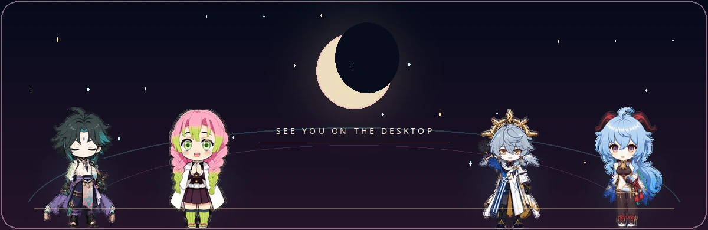
</p>

<p align="center">
  <a href="#contribute-a-character"><kbd>Request a character</kbd></a>
  <a href="codex-pet-dual-style/SKILL.md"><kbd>Build your own pet</kbd></a>
</p>

<sub>The original copyrights of miHoYo characters and related source material belong to miHoYo. Rights to characters from other works remain with their respective owners. This repository is an unofficial technical and animation showcase; please confirm the applicable licensing scope before public distribution or commercial use.</sub>
