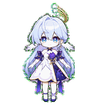
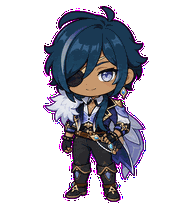
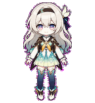
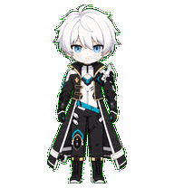
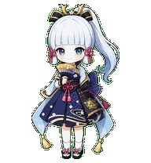
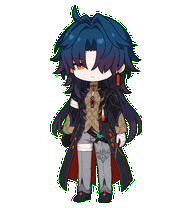
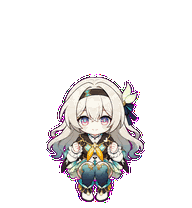
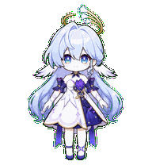

<div align="center">


<p>
  <a href="README.md"><kbd><b>English</b></kbd></a>
  <a href="README.fr.md"><kbd>Français</kbd></a>
  <a href="README.zh-CN.md"><kbd>中文</kbd></a>
  <a href="README.ja.md"><kbd>日本語</kbd></a>
</p>

<p><b>Your favorite characters, reimagined as lively companions for Codex.</b></p>

<p>
  <code>✦ 17 CHARACTERS</code>
  <code>✦ 18 EDITIONS</code>
  <code>✦ 9 ANIMATIONS</code>
  <code>✦ 16 LOOK DIRECTIONS</code>
</p>

<sub>🌙 Pick a character · Unzip the package · Let them keep you company</sub>

</div>

<div align="center">

## ✦ Select Your Companion ✦

<sub>Each portrait is already moving. Take your time, watch the little gestures, and see who feels at home beside your code.</sub>

</div>

<table align="center">
  <tr>
    <td align="center" width="33%">
      <sub>✦ CHARACTER 01 · ADEPTUS ✦</sub><br>
      <br>
      <b>「 Xiao · 魈 」</b><br>
      <sub>◇ Watchful · Restrained · Adeptal ◇</sub>
    </td>
    <td align="center" width="33%">
      <sub>✦ CHARACTER 02 · VIDYADHARA ✦</sub><br>
      <br>
      <b>「 Dan Heng · Imbibitor Lunae 」</b><br>
      <sub>◇ Cool elegance · Quiet presence ◇</sub>
    </td>
    <td align="center" width="33%">
      <sub>✦ CHARACTER 03 · GENERAL ✦</sub><br>
      <br>
      <b>「 Jing Yuan · 景元 」</b><br>
      <sub>◇ Relaxed confidence · Keen eye ◇</sub>
    </td>
  </tr>
  <tr>
    <td align="center" width="33%">
      <sub>✦ CHARACTER 04 · CONSULTANT ✦</sub><br>
      <br>
      <b>「 Zhongli · 钟离 」</b><br>
      <sub>◇ Measured · Dependable · Dignified ◇</sub>
    </td>
    <td align="center" width="33%">
      <sub>✦ CHARACTER 05 · SERPENT HASHIRA ✦</sub><br>
      <br>
      <b>「 Obanai · 伊黑小芭内 」</b><br>
      <sub>◇ Reserved · Alert · With Kaburamaru ◇</sub>
    </td>
    <td align="center" width="33%">
      <sub>✦ CHARACTER 06 · VALKYRIE ✦</sub><br>
      <br>
      <b>「 Raiden Mei · 雷电芽衣 」</b><br>
      <sub>◇ Composed · Curious · Ready ◇</sub>
    </td>
  </tr>
  <tr>
    <td align="center" width="33%">
      <sub>✦ CHARACTER 07 · GUUJI ✦</sub><br>
      <br>
      <b>「 Yae Miko · 八重神子 」</b><br>
      <sub>◇ Playful poise · Shrine elegance · Quiet mischief ◇</sub>
    </td>
    <td align="center" width="33%">
      <sub>✦ CHARACTER 08 · STAR OF FONTAINE ✦</sub><br>
      <br>
      <b>「 Furina · 芙宁娜 」</b><br>
      <sub>◇ Theatrical charm · Aquatic elegance · Bright mischief ◇</sub>
    </td>
    <td align="center" width="33%">
      <sub>✦ CHARACTER 09 · GALAXY RANGER ✦</sub><br>
      <br>
      <b>「 Acheron · 黄泉 」</b><br>
      <sub>◇ Quiet resolve · Violet storm · Distant gaze ◇</sub>
    </td>
  </tr>
  <tr>
    <td align="center" width="33%">
      <sub>✦ CHARACTER 10 · SHARK THIREN ✦</sub><br>
      <br>
      <b>「 Ellen Joe · 艾莲·乔 」</b><br>
      <sub>◇ Cool composure · Sleepy gaze · Razor-sharp wit ◇</sub>
    </td>
    <td align="center" width="33%">
      <sub>✦ CHARACTER 11 · 77TH DIRECTOR ✦</sub><br>
      <br>
      <b>「 Hu Tao · 胡桃 」</b><br>
      <sub>◇ Bright mischief · Plum-blossom charm · Fearless warmth ◇</sub>
    </td>
    <td align="center" width="33%">
      <sub>✦ CHARACTER 12 · HALOVIAN SINGER ✦</sub><br>
      <br>
      <b>「 Robin · 知更鸟 」</b><br>
      <sub>◇ Serene grace · Celestial voice · Feather-light poise ◇</sub>
    </td>
  </tr>
  <tr>
    <td align="center" width="33%">
      <sub>✦ CHARACTER 13 · CAVALRY CAPTAIN ✦</sub><br>
      <br>
      <b>「 Kaeya · 凯亚 」</b><br>
      <sub>◇ Cool confidence · Playful charm · A watchful eye ◇</sub>
    </td>
    <td align="center" width="33%">
      <sub>✦ CHARACTER 14 · STELLARON HUNTER ✦</sub><br>
      <br>
      <b>「 Firefly · 流萤 」</b><br>
      <sub>◇ Gentle hope · Quiet courage · A life of her own ◇</sub>
    </td>
    <td align="center" width="33%">
      <sub>✦ NEW ARRIVAL · CHARACTER 15 · WORLD SERPENT ✦</sub><br>
      <br>
      <b>「 Kevin Kaslana · 凯文·卡斯兰娜 」</b><br>
      <sub>◇ Icy resolve · Quiet power · Unshaken will ◇</sub>
    </td>
  </tr>
  <tr>
    <td align="center" width="33%">
      <sub>✦ NEW ARRIVAL · CHARACTER 16 · SHIRASAGI HIMEGIMI ✦</sub><br>
      <br>
      <b>「 Kamisato Ayaka · 神里绫华 」</b><br>
      <sub>◇ Poised grace · Frost-blue elegance · Quiet warmth ◇</sub>
    </td>
    <td align="center" width="33%">
      <sub>✦ NEW ARRIVAL · CHARACTER 17 · STELLARON HUNTER ✦</sub><br>
      <br>
      <b>「 Blade · 刃 」</b><br>
      <sub>◇ Restrained fury · Crimson edge · Deathless resolve ◇</sub>
    </td>
    <td align="center" width="33%">
      <sub>✦ NEXT SUMMON · YOUR PICK ✦</sub><br>
      <a href="#contribute-a-character"></a><br>
      <b>「 Who joins next? 」</b><br>
      <sub>◇ Bring a reference · Hatch a companion ◇</sub>
    </td>
  </tr>
</table>

<div align="center">
  
</div>

<div align="center">

## ✦ Motion Reel ✦

<sub>Breathing, leaping, greeting, thinking — small moments that make the character feel present.</sub>

</div>

<table align="center">
  <tr>
    <td align="center" width="33%">
      <br>
      <b>Jumping</b><br>
      <sub>A hopeful little leap, with silver hair lifting at the apex</sub>
    </td>
    <td align="center" width="33%">
      <br>
      <b>Reviewing</b><br>
      <sub>A thoughtful look at the finished work</sub>
    </td>
    <td align="center" width="33%">
      <br>
      <b>Waving</b><br>
      <sub>A small greeting that suits his reserved nature</sub>
    </td>
  </tr>
  <tr>
    <td align="center" width="33%">
      <br>
      <b>Working</b><br>
      <sub>Quiet concentration while a task is underway</sub>
    </td>
    <td align="center" width="33%">
      <br>
      <b>Waiting</b><br>
      <sub>An attentive pause for your next decision</sub>
    </td>
    <td align="center" width="33%">
      <br>
      <b>Greeting</b><br>
      <sub>A gentle, stage-ready welcome with feather-light poise</sub>
    </td>
  </tr>
</table>

<div align="center">
  
</div>

<div align="center">

## ✦ Character Archives ✦

<sub>Open a file to see the character details, animation sheet, and download.</sub>

</div>

<details>
<summary><b>🌙 FILE 01 — Xiao · 魈</b>　<sub>Guardian Yaksha / 2D edition</sub></summary>

<br>

<table>
  <tr>
    <td align="center"></td>
    <td>
      <b>Style:</b> 2D anime sticker<br>
      <b>Signature details:</b> golden eyes, purple forehead mark, teal-tipped hair, adeptal tattoo, jade ornaments, and Yaksha mask<br>
      <b>Mood:</b> vigilant and restrained, with a softer presence at desktop scale<br><br>
      <a href="xiao/xiao-2d.zip"><b>⬇️ Download 2D edition</b></a> ·
      <a href="work/xiao/2d/qa/contact-sheet-extended.png">Animation sheet</a> ·
      <a href="work/xiao/2d/qa/look-directions.png">16 look directions</a>
    </td>
  </tr>
</table>

</details>

<details>
<summary><b>🐉 FILE 02 — Dan Heng · Imbibitor Lunae · 丹恒·饮月</b>　<sub>Vidyadhara / 2D edition</sub></summary>

<br>

<table>
  <tr>
    <td align="center"></td>
    <td>
      <b>Style:</b> 2D anime sticker<br>
      <b>Signature details:</b> cyan dragon horns, pointed ears, long dark hair, white draped sleeves, and jade-gold ornaments<br>
      <b>Mood:</b> cool, composed, and quietly elegant<br><br>
      <a href="hongkai/dan-heng-imbibitor-lunae-2d-codex-pet-v2.zip"><b>⬇️ Download 2D edition</b></a> ·
      <a href="work/dan-heng-imbibitor-lunae/2d/qa/contact-sheet-extended.png">Animation sheet</a> ·
      <a href="work/dan-heng-imbibitor-lunae/2d/qa/look-directions.png">16 look directions</a>
    </td>
  </tr>
</table>

</details>

<details>
<summary><b>🦁 FILE 03 — Jing Yuan · 景元</b>　<sub>Cloud Knight General / 2D edition</sub></summary>

<br>

<table>
  <tr>
    <td align="center"></td>
    <td>
      <b>Style:</b> 2D anime sticker<br>
      <b>Signature details:</b> long silver hair, golden eyes, red ribbon, and a black-white-red-gold uniform<br>
      <b>Mood:</b> unhurried, observant, and confidently at ease<br><br>
      <a href="jingyuan/jing-yuan-2d-codex-pet-v2.zip"><b>⬇️ Download 2D edition</b></a> ·
      <a href="work/jing-yuan/2d/qa/contact-sheet-extended.png">Animation sheet</a> ·
      <a href="work/jing-yuan/2d/qa/look-directions.png">16 look directions</a>
    </td>
  </tr>
</table>

</details>

<details>
<summary><b>🔶 FILE 04 — Zhongli · 钟离</b>　<sub>Consultant / 2D edition</sub></summary>

<br>

<table>
  <tr>
    <td align="center"></td>
    <td>
      <b>Style:</b> 2D anime sticker<br>
      <b>Signature details:</b> amber eyes, formal long coat, and a warm brown-and-gold palette<br>
      <b>Mood:</b> steady, reassuring, and effortlessly dignified<br><br>
      <a href="zhongli/zhongli-2d-codex-pet-v2.zip"><b>⬇️ Download 2D edition</b></a> ·
      <a href="work/zhongli/2d/qa/contact-sheet-extended.png">Animation sheet</a> ·
      <a href="work/zhongli/2d/qa/look-directions.png">16 look directions</a>
    </td>
  </tr>
</table>

</details>

<details>
<summary><b>🐍 FILE 05 — Obanai · 伊黑小芭内</b>　<sub>Serpent Hashira / 2D edition</sub></summary>

<br>

<table>
  <tr>
    <td align="center"></td>
    <td>
      <b>Style:</b> 2D anime sticker<br>
      <b>Signature details:</b> heterochromia, striped haori, and Kaburamaru curled close by<br>
      <b>Mood:</b> reserved, watchful, and sharply attentive<br><br>
      <a href="obanai/obanai-2d-codex-pet-v2.zip"><b>⬇️ Download 2D edition</b></a> ·
      <a href="obanai/qa/contact-sheet.png">Animation sheet</a> ·
      <a href="obanai/qa/direction-qa.png">16 look directions</a>
    </td>
  </tr>
</table>

</details>

<details>
<summary><b>⚡ FILE 06 — Raiden Mei · 雷电芽衣</b>　<sub>Valkyrie / two visual editions</sub></summary>

<br>

One character, two distinct visual editions:

<table>
  <tr>
    <th align="center">2D anime sticker</th>
    <th align="center">3D-rendered chibi figure</th>
  </tr>
  <tr>
    <td align="center"></td>
    <td align="center"></td>
  </tr>
  <tr>
    <td align="center">
      <a href="Raiden-Mei雷电芽衣/raiden-mei-2d-codex-pet-v2.zip"><b>⬇️ Download 2D</b></a><br>
      <a href="Raiden-Mei雷电芽衣/qa/raiden-mei-2d-contact-sheet.png">Animation sheet</a> ·
      <a href="Raiden-Mei雷电芽衣/qa/raiden-mei-2d-look-directions.png">16 look directions</a>
    </td>
    <td align="center">
      <a href="Raiden-Mei雷电芽衣/raiden-mei-3d-codex-pet-v2.zip"><b>⬇️ Download 3D style</b></a><br>
      <a href="Raiden-Mei雷电芽衣/qa/raiden-mei-3d-contact-sheet.png">Animation sheet</a> ·
      <a href="Raiden-Mei雷电芽衣/qa/raiden-mei-3d-look-directions.png">16 look directions</a>
    </td>
  </tr>
</table>

The 3D edition describes the rendered look. Like every pet here, it is delivered as a lightweight 2D spritesheet.

</details>

<details>
<summary><b>🌸 FILE 07 — Yae Miko · 八重神子</b>　<sub>Grand Narukami Shrine Guuji / 2D edition</sub></summary>

<br>

<table>
  <tr>
    <td align="center"></td>
    <td>
      <b>Style:</b> 2D anime sticker<br>
      <b>Signature details:</b> flowing sakura-pink hair, violet eyes, golden crown ornaments, gemstone earrings, and a red-white-black-purple shrine-maiden outfit<br>
      <b>Mood:</b> poised, playful, and quietly mischievous<br><br>
      <a href="yae%20miko/yae-miko-2d-codex-pet-v2.zip"><b>⬇️ Download 2D edition</b></a> ·
      <a href="work/yae-miko/2d/qa/contact-sheet-extended.png">Animation sheet</a> ·
      <a href="work/yae-miko/2d/qa/look-directions.png">16 look directions</a>
    </td>
  </tr>
</table>

</details>

<details>
<summary><b>💧 FILE 08 — Furina · 芙宁娜</b>　<sub>Star of Fontaine / 2D edition</sub></summary>

<br>

<table>
  <tr>
    <td align="center"></td>
    <td>
      <b>Style:</b> 2D anime sticker<br>
      <b>Signature details:</b> white bob with pale-cyan accents, teardrop-blue eyes, a crown-like navy hat, white ruffles, blue gems, and gold-trimmed Fontaine attire<br>
      <b>Mood:</b> poised and theatrical, with an irrepressibly playful spark<br><br>
      <a href="furina/furina-2d-codex-pet-v2.zip"><b>⬇️ Download 2D edition</b></a> ·
      <a href="work/furina/2d/qa/contact-sheet-extended.png">Animation sheet</a> ·
      <a href="work/furina/2d/qa/look-directions.png">16 look directions</a>
    </td>
  </tr>
</table>

</details>

<details>
<summary><b>🌌 FILE 09 — Acheron · 黄泉</b>　<sub>Galaxy Ranger / 2D edition</sub></summary>

<br>

<table>
  <tr>
    <td align="center"></td>
    <td>
      <b>Style:</b> 2D anime sticker<br>
      <b>Signature details:</b> deep indigo-violet hair, an asymmetrical fringe veiling one eye, a violet-magenta gaze, a white-lilac-black outfit with flame motifs, and a katana kept close at her side<br>
      <b>Mood:</b> quiet and enigmatic, carrying the stillness of a distant storm<br><br>
      <a href="acheron/acheron-2d-codex-pet-v2.zip"><b>⬇️ Download 2D edition</b></a> ·
      <a href="work/acheron/2d/qa/contact-sheet-extended.png">Animation sheet</a> ·
      <a href="work/acheron/2d/qa/look-directions.png">16 look directions</a>
    </td>
  </tr>
</table>

</details>

<details>
<summary><b>🦈 FILE 10 — Ellen Joe · 艾莲·乔</b>　<sub>Shark Thiren maid / 2D edition</sub></summary>

<br>

<table>
  <tr>
    <td align="center"></td>
    <td>
      <b>Style:</b> 2D anime sticker<br>
      <b>Signature details:</b> charcoal-black bob with red inner layers, sleepy red eyes, a spiked maid headdress, monochrome industrial maidwear, and her unmistakable attached shark tail<br>
      <b>Mood:</b> laid-back and cool, with a quick, mischievous edge when the work starts moving<br><br>
      <a href="ellen%20joe/ellen-joe-2d-codex-pet-v2.zip"><b>⬇️ Download 2D edition</b></a> ·
      <a href="work/ellen-joe/2d/qa/contact-sheet-extended.png">Animation sheet</a> ·
      <a href="work/ellen-joe/2d/qa/look-directions.png">16 look directions</a>
    </td>
  </tr>
</table>

</details>

<details>
<summary><b>🔥 FILE 11 — Hu Tao · 胡桃</b>　<sub>77th Director / 2D edition</sub></summary>

<br>

<table>
  <tr>
    <td align="center"></td>
    <td>
      <b>Style:</b> 2D anime sticker<br>
      <b>Signature details:</b> flower-shaped crimson eyes, a tall dark hat with its talisman plaque and plum-blossom branch, long dark-brown hair fading toward muted red, and a deep brown-black-red-gold uniform<br>
      <b>Mood:</b> bright, teasing, and fearless, with a playful spark even in the quietest moments<br><br>
      <a href="hutao/hu-tao-2d-codex-pet-v2.zip"><b>⬇️ Download 2D edition</b></a> ·
      <a href="work/hu-tao/2d/qa/contact-sheet-extended.png">Animation sheet</a> ·
      <a href="work/hu-tao/2d/qa/look-directions.png">16 look directions</a>
    </td>
  </tr>
</table>

</details>

<details open>
<summary><b>🎶 FILE 12 — Robin · 知更鸟</b>　<sub>Halovian singer / 2D edition</sub></summary>

<br>

<table>
  <tr>
    <td align="center"></td>
    <td>
      <b>Style:</b> 2D anime sticker<br>
      <b>Signature details:</b> silver-blue hair and a rear rosette bun, turquoise-to-violet eyes, a gold flower-tip halo, white feathered ear-wings, and a layered white, deep-indigo, lilac, and gold stage dress<br>
      <b>Mood:</b> serene and graceful, with the poised warmth of a singer ready to brighten the room<br><br>
      <a href="robin/robin-2d-codex-pet-v2.zip"><b>⬇️ Download 2D edition</b></a> ·
      <a href="work/robin/2d/qa/contact-sheet-extended.png">Animation sheet</a> ·
      <a href="work/robin/2d/qa/look-directions.png">16 look directions</a>
    </td>
  </tr>
</table>

</details>

<details open>
<summary><b>❄️ FILE 13 — Kaeya · 凯亚</b>　<sub>Cavalry Captain / 2D edition</sub></summary>

<br>

<table>
  <tr>
    <td align="center"></td>
    <td>
      <b>Style:</b> 2D anime sticker<br>
      <b>Signature details:</b> swept navy hair with a cool blue streak, warm tan skin, a pale-lilac visible eye, black eyepatch, white fur mantle, blue-violet split cape, and a dark cavalry uniform finished with gold details<br>
      <b>Mood:</b> relaxed and self-assured, with a playful edge that never loses sight of the room<br><br>
      <a href="kaeya/kaeya-2d-codex-pet-v2.zip"><b>⬇️ Download 2D edition</b></a> ·
      <a href="work/kaeya/2d/qa/contact-sheet-extended.png">Animation sheet</a> ·
      <a href="work/kaeya/2d/qa/look-directions.png">16 look directions</a>
    </td>
  </tr>
</table>

</details>

<details open>
<summary><b>🌠 FILE 14 — Firefly · 流萤</b>　<sub>Stellaron Hunter / 2D edition</sub></summary>

<br>

<table>
  <tr>
    <td align="center"></td>
    <td>
      <b>Style:</b> 2D anime sticker<br>
      <b>Signature details:</b> long pearly-silver hair with cool gray ends, pink-to-aqua eyes, a black headband, pale mint leaf ornament and navy bow, charcoal-and-gold cropped cape, orange-gold chest bow, mint layered dress, and white boots with teal accents<br>
      <b>Mood:</b> gentle and hopeful, with quiet courage beneath every small gesture<br><br>
      <a href="Firefly%20honkai%20/firefly-2d-codex-pet-v2.zip"><b>⬇️ Download 2D edition</b></a> ·
      <a href="work/firefly/2d/qa/contact-sheet-extended.png">Animation sheet</a> ·
      <a href="work/firefly/2d/qa/look-directions.png">16 look directions</a>
    </td>
  </tr>
</table>

</details>

<details open>
<summary><b>🧊 FILE 15 — Kevin Kaslana · 凯文·卡斯兰娜</b>　<sub>World Serpent leader / 2D edition</sub></summary>

<br>

<table>
  <tr>
    <td align="center"></td>
    <td>
      <b>Style:</b> 2D anime sticker<br>
      <b>Signature details:</b> tousled white hair, icy-blue eyes, a high-collar black-and-white combat coat with gold piping and buckles, cyan chest and belt accents, and an asymmetric armored sleeve<br>
      <b>Mood:</b> calm and formidable, carrying immense strength with an almost motionless sense of control<br><br>
      <a href="kevin%20kaslana/kevin-kaslana-2d-codex-pet-v2.zip"><b>⬇️ Download 2D edition</b></a> ·
      <a href="work/kevin-kaslana/2d-repair-v3/qa/contact-sheet-extended.png">Animation sheet</a> ·
      <a href="work/kevin-kaslana/2d-repair-v3/qa/look-directions.png">16 look directions</a>
    </td>
  </tr>
</table>

</details>

<details open>
<summary><b>🌸 FILE 16 — Kamisato Ayaka · 神里绫华</b>　<sub>Shirasagi Himegimi / 2D edition</sub></summary>

<br>

<table>
  <tr>
    <td align="center"></td>
    <td>
      <b>Style:</b> 2D anime sticker<br>
      <b>Signature details:</b> pale icy-blue high ponytail and straight bangs, black-and-gold crown ornament, pink side ribbons, clear blue eyes, navy kimono dress with pale-blue layers, gold trim, sakura motifs, magenta waist cord, armored skirt panels, and an elegant folding fan<br>
      <b>Mood:</b> poised and gracious, carrying frost-blue refinement with a gentle warmth in every small gesture<br><br>
      <a href="Kamisato%20Ayaka/kamisato-ayaka-2d-codex-pet-v2.zip"><b>⬇️ Download 2D edition</b></a> ·
      <a href="work/kamisato-ayaka/2d/qa/contact-sheet-extended.png">Animation sheet</a> ·
      <a href="work/kamisato-ayaka/2d/qa/look-directions.png">16 look directions</a>
    </td>
  </tr>
</table>

</details>

<details open>
<summary><b>🗡️ FILE 17 — Blade · 刃</b>　<sub>Stellaron Hunter / 2D edition</sub></summary>

<br>

<table>
  <tr>
    <td align="center"></td>
    <td>
      <b>Style:</b> 2D anime sticker<br>
      <b>Signature details:</b> deep navy hair fading into violet-red tips, a single crimson eye beneath the fringe, a long black coat with gold fastenings and red lining, silver armor accents, bandaged hands, and a dark sword carried at his side<br>
      <b>Mood:</b> quiet and dangerous, with every restrained movement hinting at a will that refuses to break<br><br>
      <a href="blade/blade-2d-codex-pet-v2.zip"><b>⬇️ Download 2D edition</b></a> ·
      <a href="work/blade/2d/qa/contact-sheet-extended.png">Animation sheet</a> ·
      <a href="work/blade/2d/qa/look-directions.png">16 look directions</a>
    </td>
  </tr>
</table>

</details>

<div align="center">
  
</div>

## 📦 Downloads

| Character | Edition | Pet ID | Package |
| --- | --- | --- | --- |
| Xiao · 魈 | 2D | `xiao` | [Download ZIP](xiao/xiao-2d.zip) |
| Dan Heng · Imbibitor Lunae · 丹恒·饮月 | 2D | `dan-heng-imbibitor-lunae` | [Download ZIP](hongkai/dan-heng-imbibitor-lunae-2d-codex-pet-v2.zip) |
| Jing Yuan · 景元 | 2D | `jing-yuan` | [Download ZIP](jingyuan/jing-yuan-2d-codex-pet-v2.zip) |
| Zhongli · 钟离 | 2D | `zhongli` | [Download ZIP](zhongli/zhongli-2d-codex-pet-v2.zip) |
| Obanai · 伊黑小芭内 | 2D | `obanai` | [Download ZIP](obanai/obanai-2d-codex-pet-v2.zip) |
| Raiden Mei · 雷电芽衣 | 2D | `raiden-mei` | [Download ZIP](Raiden-Mei雷电芽衣/raiden-mei-2d-codex-pet-v2.zip) |
| Raiden Mei · 雷电芽衣 | 3D-rendered | `raiden-mei-3d` | [Download ZIP](Raiden-Mei雷电芽衣/raiden-mei-3d-codex-pet-v2.zip) |
| Yae Miko · 八重神子 | 2D | `yae-miko` | [Download ZIP](yae%20miko/yae-miko-2d-codex-pet-v2.zip) |
| Furina · 芙宁娜 | 2D | `furina` | [Download ZIP](furina/furina-2d-codex-pet-v2.zip) |
| Acheron · 黄泉 | 2D | `acheron` | [Download ZIP](acheron/acheron-2d-codex-pet-v2.zip) |
| Ellen Joe · 艾莲·乔 | 2D | `ellen-joe` | [Download ZIP](ellen%20joe/ellen-joe-2d-codex-pet-v2.zip) |
| Hu Tao · 胡桃 | 2D | `hu-tao` | [Download ZIP](hutao/hu-tao-2d-codex-pet-v2.zip) |
| Robin · 知更鸟 | 2D | `robin` | [Download ZIP](robin/robin-2d-codex-pet-v2.zip) |
| Kaeya · 凯亚 | 2D | `kaeya` | [Download ZIP](kaeya/kaeya-2d-codex-pet-v2.zip) |
| Firefly · 流萤 | 2D | `firefly` | [Download ZIP](Firefly%20honkai%20/firefly-2d-codex-pet-v2.zip) |
| Kevin Kaslana · 凯文·卡斯兰娜 | 2D | `kevin-kaslana` | [Download ZIP](kevin%20kaslana/kevin-kaslana-2d-codex-pet-v2.zip) |
| Kamisato Ayaka · 神里绫华 | 2D | `kamisato-ayaka` | [Download ZIP](Kamisato%20Ayaka/kamisato-ayaka-2d-codex-pet-v2.zip) |
| Blade · 刃 | 2D | `blade` | [Download ZIP](blade/blade-2d-codex-pet-v2.zip) |

Each archive is ready to unpack:

```text
pet.json
spritesheet.webp
README.md
```

<div align="center">
  
</div>

## ⚡ Install a pet

Using Xiao as an example:

```bash
mkdir -p ~/.codex/pets/xiao
unzip xiao/xiao-2d.zip -d ~/.codex/pets/xiao
```

The resulting folder should look like this:

```text
~/.codex/pets/xiao/
├── pet.json
├── spritesheet.webp
└── README.md
```

To keep both Raiden Mei editions, install them in `raiden-mei/` and `raiden-mei-3d/`. Their IDs are separate.

<div align="center">
  
</div>

## 🧪 What makes a pet feel alive

A good desktop companion reads clearly at a glance, moves smoothly, and carries the character's personality from one state to the next.

| Detail | Codex v2 format |
| --- | --- |
| Atlas | 8 columns × 11 rows, `1536×2288` |
| Cell | `192×208` |
| Character states | idle, move right, move left, wave, jump, failed, waiting, working, review |
| Look loop | 16 clockwise directions with clear up, right, down, and left anchors |
| Transparency | RGBA WebP with clean unused cells |
| Version | `spriteVersionNumber: 2` |
| Review | frame inspection, GIF playback, edge checks, direction semantics, continuity review, blind direction checks, and a final visual pass |

The technical checks support the part that matters most: every animation should still feel like the same character.

<div align="center">
  
</div>

## 🎨 Start with character art

The collection follows a reusable production flow:

```text
Character references
        ↓
Identity and style study
        ↓
Nine character animation states
        ↓
Four anchors and a 16-direction look loop
        ↓
Assembly and visual review
        ↓
A downloadable Codex v2 pet
```

To build your own collection, begin with the [Codex Pet Dual Style production guide](codex-pet-dual-style/SKILL.md). It covers paired 2D/3D styles, identity consistency, motion design, direction review, packaging, and batch production.

<div align="center">
  
</div>

<a id="contribute-a-character"></a>

## 🤝 Contributing

New pets, animation repairs, presentation improvements, and workflow refinements are welcome. A distributable pet begins with:

```text
<pet-id>/
├── pet.json
└── spritesheet.webp
```

If you would like a character featured in the animated gallery, include a contact sheet or a few `192×208` GIF previews.

<div align="center">
  
</div>

## ⭐ A little more character beside the code

Codex may live in a text box, but its companion does not have to. These pets wait with you, react with you, and make the quiet moments between tasks feel a little less empty.

<div align="center">

**Give your Codex a character worth coming back to.**

If this collection made you smile, leave a Star, make a Fork, or bring the next character.

</div>

<div align="center">
  
</div>

<sub>The original copyrights of miHoYo characters and related source material belong to miHoYo. Rights to characters from other works remain with their respective owners. This repository is an unofficial technical and animation showcase; please confirm the applicable licensing scope before public distribution or commercial use.</sub>
