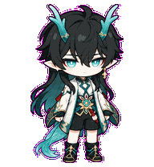
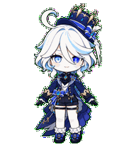
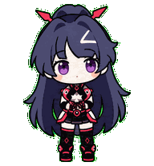

<div align="center">


<p>
  <a href="README.md"><kbd>English</kbd></a>
  <a href="README.fr.md"><kbd>Français</kbd></a>
  <a href="README.zh-CN.md"><kbd><b>中文</b></kbd></a>
</p>

<p><b>把喜欢的角色，变成陪在 Codex 身边的动画伙伴。</b></p>

<p>
  <code>✦ 8 个角色</code>
  <code>✦ 9 个版本</code>
  <code>✦ 9 组动画</code>
  <code>✦ 16 向视线</code>
</p>

<sub>🌙 选择角色 · 解压成品 · 让 TA 陪你一起工作</sub>

</div>

<div align="center">

## ✦ 选择你的伙伴 ✦

<sub>这里的每张角色卡都已经动了起来。看一会儿，再选出最喜欢的那位。</sub>

</div>

<table align="center">
  <tr>
    <td align="center" width="33%">
      <sub>✦ 角色 01 · 仙人 ✦</sub><br>
      <br>
      <b>「 魈 · Xiao 」</b><br>
      <sub>◇ 警觉 · 克制 · 仙家气息 ◇</sub>
    </td>
    <td align="center" width="33%">
      <sub>✦ 角色 02 · 持明龙尊 ✦</sub><br>
      <br>
      <b>「 丹恒·饮月 · Imbibitor Lunae 」</b><br>
      <sub>◇ 清冷优雅 · 安静从容 ◇</sub>
    </td>
    <td align="center" width="33%">
      <sub>✦ 角色 03 · 神策将军 ✦</sub><br>
      <br>
      <b>「 景元 · Jing Yuan 」</b><br>
      <sub>◇ 松弛从容 · 始终敏锐 ◇</sub>
    </td>
  </tr>
  <tr>
    <td align="center" width="33%">
      <sub>✦ 角色 04 · 往生堂客卿 ✦</sub><br>
      <br>
      <b>「 钟离 · Zhongli 」</b><br>
      <sub>◇ 沉稳 · 可靠 · 自有威仪 ◇</sub>
    </td>
    <td align="center" width="33%">
      <sub>✦ 角色 05 · 蛇柱 ✦</sub><br>
      <br>
      <b>「 伊黑小芭内 · Obanai 」</b><br>
      <sub>◇ 安静警觉 · 镝丸相伴 ◇</sub>
    </td>
    <td align="center" width="33%">
      <sub>✦ 角色 06 · 女武神 ✦</sub><br>
      <br>
      <b>「 雷电芽衣 · Raiden Mei 」</b><br>
      <sub>◇ 冷静 · 好奇 · 随时行动 ◇</sub>
    </td>
  </tr>
</table>

<table align="center">
  <tr>
    <td align="center" width="50%">
      <sub>✦ 角色 07 · 宫司大人 ✦</sub><br>
      <br>
      <b>「 八重神子 · Yae Miko 」</b><br>
      <sub>◇ 从容优雅 · 狐系灵动 · 藏着一点坏心思 ◇</sub>
    </td>
    <td align="center" width="50%">
      <sub>✦ 角色 08 · 枫丹之星 ✦</sub><br>
      <br>
      <b>「 芙宁娜 · Furina 」</b><br>
      <sub>◇ 舞台魅力 · 水色雅意 · 灵动俏皮 ◇</sub>
    </td>
  </tr>
</table>

<div align="center">
  
</div>

<div align="center">

## ✦ 动起来的小瞬间 ✦

<sub>呼吸、跳跃、招呼、思考——正是这些小动作，让角色真正陪在桌面旁。</sub>

</div>

<table>
  <tr>
    <td align="center">
      <br>
      <b>跳跃</b><br>
      <sub>轻盈升起，在最高处短暂停留</sub>
    </td>
    <td align="center">
      <br>
      <b>审阅</b><br>
      <sub>从容地看看刚刚完成的工作</sub>
    </td>
    <td align="center">
      <br>
      <b>挥手</b><br>
      <sub>一个很轻、却很符合他性格的招呼</sub>
    </td>
    <td align="center">
      <br>
      <b>处理中</b><br>
      <sub>任务进行时的安静专注</sub>
    </td>
    <td align="center">
      <br>
      <b>等待</b><br>
      <sub>认真等你做出下一步决定</sub>
    </td>
  </tr>
</table>

<div align="center">
  
</div>

<div align="center">

## ✦ 角色档案 ✦

<sub>展开档案，即可查看角色细节、完整动作表和下载入口。</sub>

</div>

<details open>
<summary><b>🌙 档案 01 — 魈 · Xiao</b>　<sub>护法夜叉 / 2D 版本</sub></summary>

<br>

<table>
  <tr>
    <td align="center"></td>
    <td>
      <b>风格：</b>2D 动漫贴纸<br>
      <b>标志细节：</b>金色眼睛、额心紫菱、青色发梢、仙人纹身、玉饰与夜叉面具<br>
      <b>气质：</b>警觉而克制，缩小到桌面尺寸后又多了一点柔和<br><br>
      <a href="xiao/xiao-2d.zip"><b>⬇️ 下载 2D 版本</b></a> ·
      <a href="work/xiao/2d/qa/contact-sheet-extended.png">完整动作表</a> ·
      <a href="work/xiao/2d/qa/look-directions.png">16 向视线</a>
    </td>
  </tr>
</table>

</details>

<details>
<summary><b>🐉 档案 02 — 丹恒·饮月 · Dan Heng · Imbibitor Lunae</b>　<sub>持明龙尊 / 2D 版本</sub></summary>

<br>

<table>
  <tr>
    <td align="center"></td>
    <td>
      <b>风格：</b>2D 动漫贴纸<br>
      <b>标志细节：</b>青色龙角、尖耳、青黑长发、白色披袖与玉金饰件<br>
      <b>气质：</b>清冷、克制，带着不张扬的优雅<br><br>
      <a href="hongkai/dan-heng-imbibitor-lunae-2d-codex-pet-v2.zip"><b>⬇️ 下载 2D 版本</b></a> ·
      <a href="work/dan-heng-imbibitor-lunae/2d/qa/contact-sheet-extended.png">完整动作表</a> ·
      <a href="work/dan-heng-imbibitor-lunae/2d/qa/look-directions.png">16 向视线</a>
    </td>
  </tr>
</table>

</details>

<details>
<summary><b>🦁 档案 03 — 景元 · Jing Yuan</b>　<sub>神策将军 / 2D 版本</sub></summary>

<br>

<table>
  <tr>
    <td align="center"></td>
    <td>
      <b>风格：</b>2D 动漫贴纸<br>
      <b>标志细节：</b>银白长发、金色眼睛、红色发带与黑白红金制服<br>
      <b>气质：</b>从容、敏锐，总有一种游刃有余的松弛感<br><br>
      <a href="jingyuan/jing-yuan-2d-codex-pet-v2.zip"><b>⬇️ 下载 2D 版本</b></a> ·
      <a href="work/jing-yuan/2d/qa/contact-sheet-extended.png">完整动作表</a> ·
      <a href="work/jing-yuan/2d/qa/look-directions.png">16 向视线</a>
    </td>
  </tr>
</table>

</details>

<details>
<summary><b>🔶 档案 04 — 钟离 · Zhongli</b>　<sub>往生堂客卿 / 2D 版本</sub></summary>

<br>

<table>
  <tr>
    <td align="center"></td>
    <td>
      <b>风格：</b>2D 动漫贴纸<br>
      <b>标志细节：</b>琥珀色眼睛、古典长衣与温暖的棕金配色<br>
      <b>气质：</b>沉稳、可靠，自然而然带着端庄感<br><br>
      <a href="zhongli/zhongli-2d-codex-pet-v2.zip"><b>⬇️ 下载 2D 版本</b></a> ·
      <a href="work/zhongli/2d/qa/contact-sheet-extended.png">完整动作表</a> ·
      <a href="work/zhongli/2d/qa/look-directions.png">16 向视线</a>
    </td>
  </tr>
</table>

</details>

<details>
<summary><b>🐍 档案 05 — 伊黑小芭内 · Obanai</b>　<sub>蛇柱 / 2D 版本</sub></summary>

<br>

<table>
  <tr>
    <td align="center"></td>
    <td>
      <b>风格：</b>2D 动漫贴纸<br>
      <b>标志细节：</b>异色瞳、黑白条纹羽织，以及依偎在身旁的镝丸<br>
      <b>气质：</b>安静、警觉，注意力始终很集中<br><br>
      <a href="obanai/obanai-2d-codex-pet-v2.zip"><b>⬇️ 下载 2D 版本</b></a> ·
      <a href="obanai/qa/contact-sheet.png">完整动作表</a> ·
      <a href="obanai/qa/direction-qa.png">16 向视线</a>
    </td>
  </tr>
</table>

</details>

<details>
<summary><b>⚡ 档案 06 — 雷电芽衣 · Raiden Mei</b>　<sub>女武神 / 两种视觉版本</sub></summary>

<br>

同一个角色，两种不同的视觉演绎：

<table>
  <tr>
    <th align="center">2D 动漫贴纸</th>
    <th align="center">3D 渲染 Q 版手办</th>
  </tr>
  <tr>
    <td align="center"></td>
    <td align="center"></td>
  </tr>
  <tr>
    <td align="center">
      <a href="Raiden-Mei雷电芽衣/raiden-mei-2d-codex-pet-v2.zip"><b>⬇️ 下载 2D</b></a><br>
      <a href="Raiden-Mei雷电芽衣/qa/raiden-mei-2d-contact-sheet.png">完整动作表</a> ·
      <a href="Raiden-Mei雷电芽衣/qa/raiden-mei-2d-look-directions.png">16 向视线</a>
    </td>
    <td align="center">
      <a href="Raiden-Mei雷电芽衣/raiden-mei-3d-codex-pet-v2.zip"><b>⬇️ 下载 3D 风格</b></a><br>
      <a href="Raiden-Mei雷电芽衣/qa/raiden-mei-3d-contact-sheet.png">完整动作表</a> ·
      <a href="Raiden-Mei雷电芽衣/qa/raiden-mei-3d-look-directions.png">16 向视线</a>
    </td>
  </tr>
</table>

这里的 3D 指视觉上的渲染风格；和其他宠物一样，它最终仍是轻量的 2D 精灵图集。

</details>

<details>
<summary><b>🌸 档案 07 — 八重神子 · Yae Miko</b>　<sub>鸣神大社宫司 / 2D 版本</sub></summary>

<br>

<table>
  <tr>
    <td align="center"></td>
    <td>
      <b>风格：</b>2D 动漫贴纸<br>
      <b>标志细节：</b>樱粉色长发、紫色眼眸、金色发冠与宝石耳饰，以及红白黑紫相间的巫女服<br>
      <b>气质：</b>从容优雅、灵动狡黠，总像藏着一点小心思<br><br>
      <a href="yae%20miko/yae-miko-2d-codex-pet-v2.zip"><b>⬇️ 下载 2D 版本</b></a> ·
      <a href="work/yae-miko/2d/qa/contact-sheet-extended.png">完整动作表</a> ·
      <a href="work/yae-miko/2d/qa/look-directions.png">16 向视线</a>
    </td>
  </tr>
</table>

</details>

<details>
<summary><b>💧 档案 08 — 芙宁娜 · Furina</b>　<sub>枫丹之星 / 2D 版本</sub></summary>

<br>

<table>
  <tr>
    <td align="center"></td>
    <td>
      <b>风格：</b>2D 动漫贴纸<br>
      <b>标志特征：</b>泛着浅青色的白色短发、水滴般的蓝眼睛、冠冕造型的深蓝礼帽、白色荷叶边、蓝宝石与金边枫丹礼服<br>
      <b>气质：</b>从容而富有舞台感，神态里始终闪着灵动俏皮的光<br><br>
      <a href="furina/furina-2d-codex-pet-v2.zip"><b>⬇️ 下载 2D 版本</b></a> ·
      <a href="work/furina/2d/qa/contact-sheet-extended.png">完整动作表</a> ·
      <a href="work/furina/2d/qa/look-directions.png">16 向视线</a>
    </td>
  </tr>
</table>

</details>

<div align="center">
  
</div>

## 📦 成品下载

| 角色 | 版本 | Pet ID | 成品包 |
| --- | --- | --- | --- |
| 魈 · Xiao | 2D | `xiao` | [下载 ZIP](xiao/xiao-2d.zip) |
| 丹恒·饮月 · Dan Heng · Imbibitor Lunae | 2D | `dan-heng-imbibitor-lunae` | [下载 ZIP](hongkai/dan-heng-imbibitor-lunae-2d-codex-pet-v2.zip) |
| 景元 · Jing Yuan | 2D | `jing-yuan` | [下载 ZIP](jingyuan/jing-yuan-2d-codex-pet-v2.zip) |
| 钟离 · Zhongli | 2D | `zhongli` | [下载 ZIP](zhongli/zhongli-2d-codex-pet-v2.zip) |
| 伊黑小芭内 · Obanai | 2D | `obanai` | [下载 ZIP](obanai/obanai-2d-codex-pet-v2.zip) |
| 雷电芽衣 · Raiden Mei | 2D | `raiden-mei` | [下载 ZIP](Raiden-Mei雷电芽衣/raiden-mei-2d-codex-pet-v2.zip) |
| 雷电芽衣 · Raiden Mei | 3D 渲染风 | `raiden-mei-3d` | [下载 ZIP](Raiden-Mei雷电芽衣/raiden-mei-3d-codex-pet-v2.zip) |
| 八重神子 · Yae Miko | 2D | `yae-miko` | [下载 ZIP](yae%20miko/yae-miko-2d-codex-pet-v2.zip) |
| 芙宁娜 · Furina | 2D | `furina` | [下载 ZIP](furina/furina-2d-codex-pet-v2.zip) |

每个压缩包都可以直接解压：

```text
pet.json
spritesheet.webp
README.md
```

<div align="center">
  
</div>

## ⚡ 安装一个宠物

以魈为例：

```bash
mkdir -p ~/.codex/pets/xiao
unzip xiao/xiao-2d.zip -d ~/.codex/pets/xiao
```

解压后的目录如下：

```text
~/.codex/pets/xiao/
├── pet.json
├── spritesheet.webp
└── README.md
```

如果想同时保留雷电芽衣的两个版本，请分别安装到 `raiden-mei/` 和 `raiden-mei-3d/`；它们使用不同的 ID。

<div align="center">
  
</div>

## 🧪 动起来之后，仍然要像这个角色

一个好的桌面伙伴，应该在小尺寸下依然清楚，动作衔接自然，而且从待机到奔跑、从等待到审阅，都保留角色原本的神态与气质。

| 项目 | Codex v2 格式 |
| --- | --- |
| 图集 | 8 列 × 11 行，`1536×2288` |
| 单格 | `192×208` |
| 角色状态 | 待机、右移、左移、挥手、跳跃、失败、等待、处理中、审阅 |
| 视线 | 16 个顺时针方向，上、右、下、左都有清晰基准 |
| 透明度 | RGBA WebP，空余单元格保持干净 |
| 版本 | `spriteVersionNumber: 2` |
| 检查 | 逐帧检查、GIF 回放、边缘检查、视线语义、连续性与最终视觉复核 |

这些技术检查最终只服务于一件事：每一段动画看起来都还是同一个角色。

<div align="center">
  
</div>

## 🎨 从角色图开始

这个系列使用一套可以复用的制作流程：

```text
角色参考图
    ↓
理解身份与视觉风格
    ↓
九组角色动画
    ↓
四个方向基准与 16 向视线循环
    ↓
图集组装与视觉复核
    ↓
可下载的 Codex v2 宠物
```

如果你也想制作自己的角色系列，可以从 [Codex Pet Dual Style 制作指南](codex-pet-dual-style/SKILL.md) 开始。里面整理了 2D/3D 配对风格、角色一致性、动作设计、方向检查、打包方式和批量生产思路。

<div align="center">
  
</div>

## 🤝 贡献角色

欢迎提交新宠物、动画修复、展示优化和流程改进。一个可以分发的宠物，最基本的内容是：

```text
<pet-id>/
├── pet.json
└── spritesheet.webp
```

如果希望角色出现在上面的动态展示区，请再附上一张完整动作表，或者几张 `192×208` 的 GIF 预览。

<div align="center">
  
</div>

## ⭐ 让代码旁边多一点角色感

Codex 也许住在输入框里，但陪伴它的角色可以呼吸、等待，也可以在任务完成时给你一点回应。那些夹在工作之间的安静时刻，也因此多了一点存在感。

<div align="center">

**给 Codex 一个让你愿意反复回来的角色。**

如果你喜欢这个系列，欢迎 Star、Fork，或者带来下一个角色。

</div>

<div align="center">
  
</div>

<sub>角色形象的相关权利归各自权利人所有。本仓库是非官方的技术与动画展示；公开分发或商业使用前，请确认角色与原始素材的授权范围。</sub>
