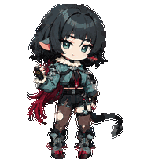

<div align="center">


<p>
  <a href="README.md"><kbd>English</kbd></a>
  <a href="README.fr.md"><kbd>Français</kbd></a>
  <a href="README.zh-CN.md"><kbd><b>中文</b></kbd></a>
  <a href="README.ja.md"><kbd>日本語</kbd></a>
</p>

<p><b>把喜欢的角色，变成陪在 Codex 身边的动画伙伴。</b></p>

<p>
  <code>✦ 30 个角色</code>
  <code>✦ 31 个版本</code>
  <code>✦ 9 组动画</code>
  <code>✦ 16 向视线</code>
</p>

<sub>🌙 选择角色 · 解压成品 · 让 TA 陪你一起工作</sub>

</div>

> **仅限桌面端：** 自定义宠物包目前只支持 Codex 桌面应用。Codex 移动端无法显示宠物，也不支持在手机上安装或跨设备同步宠物。

<p align="center">
  
</p>

<div align="center">

## ✦ 动起来的小瞬间 ✦

<sub>呼吸、跳跃、招呼、思考——正是这些小动作，让角色真正陪在桌面旁。</sub>

</div>

<table align="center">
  <tr>
    <td align="center" valign="top" width="33%">
      <br>
      <b>跳跃</b><br>
      <sub>满怀希望地轻轻跃起，银发也在最高处扬起</sub>
    </td>
    <td align="center" valign="top" width="33%">
      <br>
      <b>审阅</b><br>
      <sub>从容看过结果，也把下一步悄悄算在心里</sub>
    </td>
    <td align="center" valign="top" width="33%">
      <br>
      <b>挥手</b><br>
      <sub>星期日带着安静而庄重的从容，轻轻向你致意</sub>
    </td>
  </tr>
  <tr>
    <td align="center" valign="top" width="33%">
      <br>
      <b>处理中</b><br>
      <sub>任务进行时的安静专注</sub>
    </td>
    <td align="center" valign="top" width="33%">
      <br>
      <b>等待</b><br>
      <sub>认真等你做出下一步决定</sub>
    </td>
    <td align="center" valign="top" width="33%">
      <br>
      <b>招呼</b><br>
      <sub>轻盈而从容的舞台式问候</sub>
    </td>
  </tr>
</table>

<div align="center">
  
</div>

<div align="center">

## ✦ 选择你的伙伴 ✦

<sub>每张角色图都在悄悄动着。点击角色图，即可前往对应档案。</sub>

</div>

<table align="center" width="100%">
  <tr>
    <td align="center" valign="middle" width="24%">
      <a href="https://github.com/liu-weida/elysia_codex_pet"></a>
    </td>
    <td valign="middle" width="76%">
      <sub>✦ 创作者推荐 · 爱莉希雅专场 ✦</sub><br>
      <b>一位角色，无限种爱莉希雅。</b><br>
      <sub>liu-weida 独立制作的 Codex 宠物企划，专注收录爱莉希雅的不同视觉版本、服装与后续皮肤。</sub><br><br>
      <code>爱莉希雅专精</code> <code>2D + 3D</code> <code>持续更新</code><br><br>
      <a href="https://github.com/liu-weida/elysia_codex_pet"><kbd>进入专属项目 ↗</kbd></a>
    </td>
  </tr>
</table>

<table align="center">
  <tr>
    <td align="center" valign="top" width="33%">
      <sub>✦ 角色 01 ✦</sub><br>
      <a href="#character-01-xiao"></a><br>
      <b>「 魈 」</b><br>
      <sub>◇ 警觉 · 克制 · 仙家气息 ◇</sub>
    </td>
    <td align="center" valign="top" width="33%">
      <sub>✦ 角色 02 ✦</sub><br>
      <a href="#character-02-dan-heng-imbibitor-lunae"></a><br>
      <b>「 丹恒 」</b><br>
      <sub>◇ 清冷优雅 · 安静从容 ◇</sub>
    </td>
    <td align="center" valign="top" width="33%">
      <sub>✦ 角色 03 ✦</sub><br>
      <a href="#character-03-jing-yuan"></a><br>
      <b>「 景元 」</b><br>
      <sub>◇ 松弛从容 · 始终敏锐 ◇</sub>
    </td>
  </tr>
  <tr>
    <td align="center" valign="top" width="33%">
      <sub>✦ 角色 04 ✦</sub><br>
      <a href="#character-04-zhongli"></a><br>
      <b>「 钟离 」</b><br>
      <sub>◇ 沉稳 · 可靠 · 自有威仪 ◇</sub>
    </td>
    <td align="center" valign="top" width="33%">
      <sub>✦ 角色 05 ✦</sub><br>
      <a href="#character-05-raiden-mei"></a><br>
      <b>「 雷电芽衣 」</b><br>
      <sub>◇ 冷静 · 好奇 · 随时行动 ◇</sub>
    </td>
    <td align="center" valign="top" width="33%">
      <sub>✦ 角色 06 ✦</sub><br>
      <a href="#character-06-obanai"></a><br>
      <b>「 伊黑小芭内 」</b><br>
      <sub>◇ 安静警觉 · 镝丸相伴 ◇</sub>
    </td>
  </tr>
  <tr>
    <td align="center" valign="top" width="33%">
      <sub>✦ 角色 07 ✦</sub><br>
      <a href="#character-07-yae-miko"></a><br>
      <b>「 八重神子 」</b><br>
      <sub>◇ 从容优雅 · 狐系灵动 · 藏着一点坏心思 ◇</sub>
    </td>
    <td align="center" valign="top" width="33%">
      <sub>✦ 角色 08 ✦</sub><br>
      <a href="#character-08-furina"></a><br>
      <b>「 芙宁娜 」</b><br>
      <sub>◇ 舞台魅力 · 水色雅意 · 灵动俏皮 ◇</sub>
    </td>
    <td align="center" valign="top" width="33%">
      <sub>✦ 角色 09 ✦</sub><br>
      <a href="#character-09-acheron"></a><br>
      <b>「 黄泉 」</b><br>
      <sub>◇ 沉静克制 · 紫色风暴 · 遥远目光 ◇</sub>
    </td>
  </tr>
  <tr>
    <td align="center" valign="top" width="33%">
      <sub>✦ 角色 10 ✦</sub><br>
      <a href="#character-10-ellen-joe"></a><br>
      <b>「 艾莲·乔 」</b><br>
      <sub>◇ 慵懒从容 · 目光锐利 · 行动迅捷 ◇</sub>
    </td>
    <td align="center" valign="top" width="33%">
      <sub>✦ 角色 11 ✦</sub><br>
      <a href="#character-11-hu-tao"></a><br>
      <b>「 胡桃 」</b><br>
      <sub>◇ 灵动俏皮 · 梅花雅意 · 洒脱无畏 ◇</sub>
    </td>
    <td align="center" valign="top" width="33%">
      <sub>✦ 角色 12 ✦</sub><br>
      <a href="#character-12-robin"></a><br>
      <b>「 知更鸟 」</b><br>
      <sub>◇ 宁静优雅 · 天籁歌声 · 羽翼轻盈 ◇</sub>
    </td>
  </tr>
  <tr>
    <td align="center" valign="top" width="33%">
      <sub>✦ 角色 13 ✦</sub><br>
      <a href="#character-13-kaeya"></a><br>
      <b>「 凯亚 」</b><br>
      <sub>◇ 从容自信 · 轻松风趣 · 目光敏锐 ◇</sub>
    </td>
    <td align="center" valign="top" width="33%">
      <sub>✦ 角色 14 ✦</sub><br>
      <a href="#character-14-firefly"></a><br>
      <b>「 流萤 」</b><br>
      <sub>◇ 温柔希望 · 安静勇气 · 自己选择的人生 ◇</sub>
    </td>
    <td align="center" valign="top" width="33%">
      <sub>✦ 角色 15 ✦</sub><br>
      <a href="#character-15-kevin-kaslana"></a><br>
      <b>「 凯文 」</b><br>
      <sub>◇ 冰冷决意 · 沉静力量 · 意志不移 ◇</sub>
    </td>
  </tr>
  <tr>
    <td align="center" valign="top" width="33%">
      <sub>✦ 角色 16 ✦</sub><br>
      <a href="#character-16-kamisato-ayaka"></a><br>
      <b>「 绫华 」</b><br>
      <sub>◇ 端庄雅致 · 霜蓝清韵 · 温柔从容 ◇</sub>
    </td>
    <td align="center" valign="top" width="33%">
      <sub>✦ 角色 17 ✦</sub><br>
      <a href="#character-17-blade"></a><br>
      <b>「 刃 」</b><br>
      <sub>◇ 锋芒内敛 · 赤色剑意 · 执念不灭 ◇</sub>
    </td>
    <td align="center" valign="top" width="33%">
      <sub>✦ 角色 18 ✦</sub><br>
      <a href="#character-18-ruan-mei"></a><br>
      <b>「 阮·梅 」</b><br>
      <sub>◇ 清雅洞见 · 花意流转 · 弦音从容 ◇</sub>
    </td>
  </tr>
  <tr>
    <td align="center" valign="top" width="33%">
      <sub>✦ 角色 19 ✦</sub><br>
      <a href="#character-19-kaedehara-kazuha"></a><br>
      <b>「 万叶 」</b><br>
      <sub>◇ 枫意清寂 · 行旅从容 · 风中坚韧 ◇</sub>
    </td>
    <td align="center" valign="top" width="33%">
      <sub>✦ 角色 20 ✦</sub><br>
      <a href="#character-20-hoshimi-miyabi"></a><br>
      <b>「 雅 」</b><br>
      <sub>◇ 沉静专注 · 赤红目光 · 凛然剑意 ◇</sub>
    </td>
    <td align="center" valign="top" width="33%">
      <sub>✦ 角色 21 ✦</sub><br>
      <a href="#character-21-aventurine"></a><br>
      <b>「 砂金 」</b><br>
      <sub>◇ 从容下注 · 金色锋芒 · 胜券在握 ◇</sub>
    </td>
  </tr>
  <tr>
    <td align="center" valign="top" width="33%">
      <sub>✦ 角色 22 ✦</sub><br>
      <a href="#character-22-ganyu"></a><br>
      <b>「 甘雨 」</b><br>
      <sub>◇ 温柔耐心 · 霜色清雅 · 仙麟静意 ◇</sub>
    </td>
    <td align="center" valign="top" width="33%">
      <sub>✦ 角色 23 ✦</sub><br>
      <a href="#character-23-sunday"></a><br>
      <b>「 星期日 」</b><br>
      <sub>◇ 从容优雅 · 金色目光 · 静默乐章 ◇</sub>
    </td>
    <td align="center" valign="top" width="33%">
      <sub>✦ 角色 24 ✦</sub><br>
      <a href="#character-24-mitsuri-kanroji"></a><br>
      <b>「 蜜璃 」</b><br>
      <sub>◇ 热烈真诚 · 元气明亮 · 温柔而坚定 ◇</sub>
    </td>
  </tr>
  <tr>
    <td align="center" valign="top" width="33%">
      <sub>✦ 角色 25 ✦</sub><br>
      <a href="#character-25-kafka"></a><br>
      <b>「 卡芙卡 」</b><br>
      <sub>◇ 从容优雅 · 危险魅力 · 一切尽在掌握 ◇</sub>
    </td>
    <td align="center" valign="top" width="33%">
      <sub>✦ 角色 26 ✦</sub><br>
      <a href="#character-26-otto-apocalypse"></a><br>
      <b>「 奥托 」</b><br>
      <sub>◇ 从容得体 · 绿眸沉静 · 谋定后动 ◇</sub>
    </td>
    <td align="center" valign="top" width="33%">
      <sub>✦ 角色 27 ✦</sub><br>
      <a href="#character-27-nicole-demara"></a><br>
      <b>「 妮可 」</b><br>
      <sub>◇ 街头机敏 · 明快自信 · 生意头脑 ◇</sub>
    </td>
  </tr>
  <tr>
    <td align="center" valign="top" width="33%">
      <sub>✦ 新角色 ✦</sub><br>
      <a href="#character-28-jane-doe"></a><br>
      <b>「 简·杜 」</b><br>
      <sub>◇ 从容敏锐 · 鼠尾轻摆 · 危险而迷人 ◇</sub>
    </td>
    <td align="center" valign="top" width="33%">
      <sub>✦ 新角色 ✦</sub><br>
      <a href="#character-29-anby-demara"></a><br>
      <b>「 安比 」</b><br>
      <sub>◇ 冷静专注 · 自律可靠 · 温柔克制 ◇</sub>
    </td>
    <td align="center" valign="top" width="33%">
      <sub>✦ 新角色 ✦</sub><br>
      <a href="#character-30-kiana-kaslana"></a><br>
      <b>「 琪亚娜 」</b><br>
      <sub>◇ 明朗勇敢 · 白发蓝眸 · 女武神锋芒 ◇</sub>
    </td>
  </tr>
</table>

<div align="center">
  
</div>

<div align="center">

## ✦ 角色档案 ✦

<sub>展开档案，即可查看角色细节、完整动作表和下载入口。</sub>

</div>

<a id="character-01-xiao" name="character-01-xiao"></a>
<details open>
<summary><b>01 · 魈</b></summary>

<br>

<table>
  <tr>
    <td align="center"></td>
    <td>
      <b>风格：</b>2D 动漫贴纸<br>
      <b>标志细节：</b>金色眼睛、额心紫菱、青色发梢、仙人纹身、玉饰与夜叉面具<br>
      <b>气质：</b>警觉而克制，缩小到桌面尺寸后又多了一点柔和<br><br>
      <a href="genshin-impact/xiao/xiao-2d.zip"><b>⬇️ 下载 2D 版本</b></a> ·
      <a href="work/xiao/2d/qa/contact-sheet-extended.png">完整动作表</a> ·
      <a href="work/xiao/2d/qa/look-directions.png">16 向视线</a>
    </td>
  </tr>
</table>

</details>

<a id="character-02-dan-heng-imbibitor-lunae" name="character-02-dan-heng-imbibitor-lunae"></a>
<details>
<summary><b>02 · 丹恒·饮月</b></summary>

<br>

<table>
  <tr>
    <td align="center"></td>
    <td>
      <b>风格：</b>2D 动漫贴纸<br>
      <b>标志细节：</b>青色龙角、尖耳、青黑长发、白色披袖与玉金饰件<br>
      <b>气质：</b>清冷、克制，带着不张扬的优雅<br><br>
      <a href="honkai-star-rail/dan-heng-imbibitor-lunae/dan-heng-imbibitor-lunae-2d-codex-pet-v2.zip"><b>⬇️ 下载 2D 版本</b></a> ·
      <a href="work/dan-heng-imbibitor-lunae/2d/qa/contact-sheet-extended.png">完整动作表</a> ·
      <a href="work/dan-heng-imbibitor-lunae/2d/qa/look-directions.png">16 向视线</a>
    </td>
  </tr>
</table>

</details>

<a id="character-03-jing-yuan" name="character-03-jing-yuan"></a>
<details>
<summary><b>03 · 景元</b></summary>

<br>

<table>
  <tr>
    <td align="center"></td>
    <td>
      <b>风格：</b>2D 动漫贴纸<br>
      <b>标志细节：</b>银白长发、金色眼睛、红色发带与黑白红金制服<br>
      <b>气质：</b>从容、敏锐，总有一种游刃有余的松弛感<br><br>
      <a href="honkai-star-rail/jing-yuan/jing-yuan-2d-codex-pet-v2.zip"><b>⬇️ 下载 2D 版本</b></a> ·
      <a href="work/jing-yuan/2d/qa/contact-sheet-extended.png">完整动作表</a> ·
      <a href="work/jing-yuan/2d/qa/look-directions.png">16 向视线</a>
    </td>
  </tr>
</table>

</details>

<a id="character-04-zhongli" name="character-04-zhongli"></a>
<details>
<summary><b>04 · 钟离</b></summary>

<br>

<table>
  <tr>
    <td align="center"></td>
    <td>
      <b>风格：</b>2D 动漫贴纸<br>
      <b>标志细节：</b>琥珀色眼睛、古典长衣与温暖的棕金配色<br>
      <b>气质：</b>沉稳、可靠，自然而然带着端庄感<br><br>
      <a href="genshin-impact/zhongli/zhongli-2d-codex-pet-v2.zip"><b>⬇️ 下载 2D 版本</b></a> ·
      <a href="work/zhongli/2d/qa/contact-sheet-extended.png">完整动作表</a> ·
      <a href="work/zhongli/2d/qa/look-directions.png">16 向视线</a>
    </td>
  </tr>
</table>

</details>

<a id="character-05-raiden-mei" name="character-05-raiden-mei"></a>
<details>
<summary><b>05 · 雷电芽衣</b></summary>

<br>

同一个角色，两种不同的视觉演绎：

<table>
  <tr>
    <th align="center">2D 动漫贴纸</th>
    <th align="center">3D 渲染 Q 版手办</th>
  </tr>
  <tr>
    <td align="center"></td>
    <td align="center"></td>
  </tr>
  <tr>
    <td align="center">
      <a href="honkai-impact-3rd/raiden-mei/raiden-mei-2d-codex-pet-v2.zip"><b>⬇️ 下载 2D</b></a><br>
      <a href="honkai-impact-3rd/raiden-mei/qa/raiden-mei-2d-contact-sheet.png">完整动作表</a> ·
      <a href="honkai-impact-3rd/raiden-mei/qa/raiden-mei-2d-look-directions.png">16 向视线</a>
    </td>
    <td align="center">
      <a href="honkai-impact-3rd/raiden-mei/raiden-mei-3d-codex-pet-v2.zip"><b>⬇️ 下载 3D 风格</b></a><br>
      <a href="honkai-impact-3rd/raiden-mei/qa/raiden-mei-3d-contact-sheet.png">完整动作表</a> ·
      <a href="honkai-impact-3rd/raiden-mei/qa/raiden-mei-3d-look-directions.png">16 向视线</a>
    </td>
  </tr>
</table>

这里的 3D 指视觉上的渲染风格；和其他宠物一样，它最终仍是轻量的 2D 精灵图集。

</details>

<a id="character-06-obanai" name="character-06-obanai"></a>
<details>
<summary><b>06 · 伊黑小芭内</b></summary>

<br>

<table>
  <tr>
    <td align="center"></td>
    <td>
      <b>风格：</b>2D 动漫贴纸<br>
      <b>标志细节：</b>异色瞳、黑白条纹羽织，以及依偎在身旁的镝丸<br>
      <b>气质：</b>安静、警觉，注意力始终很集中<br><br>
      <a href="others/obanai-iguro/obanai-2d-codex-pet-v2.zip"><b>⬇️ 下载 2D 版本</b></a> ·
      <a href="others/obanai-iguro/qa/contact-sheet.png">完整动作表</a> ·
      <a href="others/obanai-iguro/qa/direction-qa.png">16 向视线</a>
    </td>
  </tr>
</table>

</details>

<a id="character-07-yae-miko" name="character-07-yae-miko"></a>
<details>
<summary><b>07 · 八重神子</b></summary>

<br>

<table>
  <tr>
    <td align="center"></td>
    <td>
      <b>风格：</b>2D 动漫贴纸<br>
      <b>标志细节：</b>樱粉色长发、紫色眼眸、金色发冠与宝石耳饰，以及红白黑紫相间的巫女服<br>
      <b>气质：</b>从容优雅、灵动狡黠，总像藏着一点小心思<br><br>
      <a href="genshin-impact/yae-miko/yae-miko-2d-codex-pet-v2.zip"><b>⬇️ 下载 2D 版本</b></a> ·
      <a href="work/yae-miko/2d/qa/contact-sheet-extended.png">完整动作表</a> ·
      <a href="work/yae-miko/2d/qa/look-directions.png">16 向视线</a>
    </td>
  </tr>
</table>

</details>

<a id="character-08-furina" name="character-08-furina"></a>
<details>
<summary><b>08 · 芙宁娜</b></summary>

<br>

<table>
  <tr>
    <td align="center"></td>
    <td>
      <b>风格：</b>2D 动漫贴纸<br>
      <b>标志特征：</b>泛着浅青色的白色短发、水滴般的蓝眼睛、冠冕造型的深蓝礼帽、白色荷叶边、蓝宝石与金边枫丹礼服<br>
      <b>气质：</b>从容而富有舞台感，神态里始终闪着灵动俏皮的光<br><br>
      <a href="genshin-impact/furina/furina-2d-codex-pet-v2.zip"><b>⬇️ 下载 2D 版本</b></a> ·
      <a href="work/furina/2d/qa/contact-sheet-extended.png">完整动作表</a> ·
      <a href="work/furina/2d/qa/look-directions.png">16 向视线</a>
    </td>
  </tr>
</table>

</details>

<a id="character-09-acheron" name="character-09-acheron"></a>
<details>
<summary><b>09 · 黄泉</b></summary>

<br>

<table>
  <tr>
    <td align="center"></td>
    <td>
      <b>风格：</b>2D 动漫贴纸<br>
      <b>标志特征：</b>深靛紫色长发、遮住一只眼睛的不对称刘海、紫红色眼眸、白紫黑火焰纹服饰，以及贴身携带的长刀<br>
      <b>气质：</b>沉静难测，像一场尚在远方的风暴<br><br>
      <a href="honkai-star-rail/acheron/acheron-2d-codex-pet-v2.zip"><b>⬇️ 下载 2D 版本</b></a> ·
      <a href="work/acheron/2d/qa/contact-sheet-extended.png">完整动作表</a> ·
      <a href="work/acheron/2d/qa/look-directions.png">16 向视线</a>
    </td>
  </tr>
</table>

</details>

<a id="character-10-ellen-joe" name="character-10-ellen-joe"></a>
<details>
<summary><b>10 · 艾莲·乔</b></summary>

<br>

<table>
  <tr>
    <td align="center"></td>
    <td>
      <b>风格：</b>2D 动漫贴纸<br>
      <b>标志特征：</b>带红色内层的炭黑短发、略显困倦的红色眼眸、带金属尖饰的女仆头饰、黑白工业风制服，以及极具辨识度的鲨鱼尾巴<br>
      <b>气质：</b>平时懒洋洋又很从容，真正开工时却利落得让人措手不及<br><br>
      <a href="zenless-zone-zero/ellen-joe/ellen-joe-2d-codex-pet-v2.zip"><b>⬇️ 下载 2D 版本</b></a> ·
      <a href="work/ellen-joe/2d/qa/contact-sheet-extended.png">完整动作表</a> ·
      <a href="work/ellen-joe/2d/qa/look-directions.png">16 向视线</a>
    </td>
  </tr>
</table>

</details>

<a id="character-11-hu-tao" name="character-11-hu-tao"></a>
<details>
<summary><b>11 · 胡桃</b></summary>

<br>

<table>
  <tr>
    <td align="center"></td>
    <td>
      <b>风格：</b>2D 动漫贴纸<br>
      <b>标志特征：</b>梅花形赤色眼眸、带符纹与梅枝装饰的深色高帽、由深棕渐向暗红的长发，以及棕黑、赤红与金色交织的制服<br>
      <b>气质：</b>灵动、爱逗人又无所畏惧，安静下来时也藏不住眼里的小小火花<br><br>
      <a href="genshin-impact/hu-tao/hu-tao-2d-codex-pet-v2.zip"><b>⬇️ 下载 2D 版本</b></a> ·
      <a href="work/hu-tao/2d/qa/contact-sheet-extended.png">完整动作表</a> ·
      <a href="work/hu-tao/2d/qa/look-directions.png">16 向视线</a>
    </td>
  </tr>
</table>

</details>

<a id="character-12-robin" name="character-12-robin"></a>
<details>
<summary><b>12 · 知更鸟</b></summary>

<br>

<table>
  <tr>
    <td align="center"></td>
    <td>
      <b>风格：</b>2D 动漫贴纸<br>
      <b>标志特征：</b>银蓝长发与后方玫瑰发髻、青绿渐紫的眼眸、花枝状金色光环、耳侧白色羽翼，以及白色、深靛紫、浅紫与金色交叠的舞台礼服<br>
      <b>气质：</b>宁静优雅，带着歌者从容而温暖的舞台光芒<br><br>
      <a href="honkai-star-rail/robin/robin-2d-codex-pet-v2.zip"><b>⬇️ 下载 2D 版本</b></a> ·
      <a href="work/robin/2d/qa/contact-sheet-extended.png">完整动作表</a> ·
      <a href="work/robin/2d/qa/look-directions.png">16 向视线</a>
    </td>
  </tr>
</table>

</details>

<a id="character-13-kaeya" name="character-13-kaeya"></a>
<details>
<summary><b>13 · 凯亚</b></summary>

<br>

<table>
  <tr>
    <td align="center"></td>
    <td>
      <b>风格：</b>2D 动漫贴纸<br>
      <b>标志特征：</b>带冷蓝挑染的深海军蓝短发、暖棕肤色、浅紫色眼眸与黑色眼罩、白色毛领、蓝紫双色披风，以及带金色细节的深色骑兵制服<br>
      <b>气质：</b>松弛而自信，谈笑间带着一点狡黠，也始终留意着周围的动静<br><br>
      <a href="genshin-impact/kaeya/kaeya-2d-codex-pet-v2.zip"><b>⬇️ 下载 2D 版本</b></a> ·
      <a href="work/kaeya/2d/qa/contact-sheet-extended.png">完整动作表</a> ·
      <a href="work/kaeya/2d/qa/look-directions.png">16 向视线</a>
    </td>
  </tr>
</table>

</details>

<a id="character-14-firefly" name="character-14-firefly"></a>
<details>
<summary><b>14 · 流萤</b></summary>

<br>

<table>
  <tr>
    <td align="center"></td>
    <td>
      <b>风格：</b>2D 动漫贴纸<br>
      <b>标志特征：</b>末端泛着冷灰的珍珠银长发、粉青渐变眼睛、黑色发带、薄荷色叶形发饰与深蓝蝴蝶结、黑金短披肩、橙金胸饰、薄荷渐变短裙，以及带青色点缀的白色短靴<br>
      <b>气质：</b>温柔而明亮，安静的勇气藏在每个小动作里，也始终向往能够选择自己的道路<br><br>
      <a href="honkai-star-rail/firefly/firefly-2d-codex-pet-v2.zip"><b>⬇️ 下载 2D 版本</b></a> ·
      <a href="work/firefly/2d/qa/contact-sheet-extended.png">完整动作表</a> ·
      <a href="work/firefly/2d/qa/look-directions.png">16 向视线</a>
    </td>
  </tr>
</table>

</details>

<a id="character-15-kevin-kaslana" name="character-15-kevin-kaslana"></a>
<details>
<summary><b>15 · 凯文·卡斯兰娜</b></summary>

<br>

<table>
  <tr>
    <td align="center"></td>
    <td>
      <b>风格：</b>2D 动漫贴纸<br>
      <b>标志特征：</b>凌乱白色短发、冰蓝眼眸、带金色滚边与扣件的黑白高领长战斗服、胸口与腰间的青色光点，以及不对称的黑色装甲袖<br>
      <b>气质：</b>沉静而极具压迫感，仿佛庞大的力量始终被收束在近乎静止的从容之中<br><br>
      <a href="honkai-impact-3rd/kevin-kaslana/kevin-kaslana-2d-codex-pet-v2.zip"><b>⬇️ 下载 2D 版本</b></a> ·
      <a href="work/kevin-kaslana/2d-repair-v3/qa/contact-sheet-extended.png">完整动作表</a> ·
      <a href="work/kevin-kaslana/2d-repair-v3/qa/look-directions.png">16 向视线</a>
    </td>
  </tr>
</table>

</details>

<a id="character-16-kamisato-ayaka" name="character-16-kamisato-ayaka"></a>
<details>
<summary><b>16 · 神里绫华</b></summary>

<br>

<table>
  <tr>
    <td align="center"></td>
    <td>
      <b>风格：</b>2D 动漫贴纸<br>
      <b>标志特征：</b>冰蓝色高马尾与齐刘海、黑金冠形发饰、粉色侧结、清澈蓝眸、深蓝与浅蓝叠成的和服裙装、金色滚边与樱花纹样、品红腰绳、裙侧甲片，以及动作间自然收展的折扇<br>
      <b>气质：</b>端庄而从容，霜蓝色的清雅里始终带着温柔亲近的暖意<br><br>
      <a href="genshin-impact/kamisato-ayaka/kamisato-ayaka-2d-codex-pet-v2.zip"><b>⬇️ 下载 2D 版本</b></a> ·
      <a href="work/kamisato-ayaka/2d/qa/contact-sheet-extended.png">完整动作表</a> ·
      <a href="work/kamisato-ayaka/2d/qa/look-directions.png">16 向视线</a>
    </td>
  </tr>
</table>

</details>

<a id="character-17-blade" name="character-17-blade"></a>
<details>
<summary><b>17 · 刃</b></summary>

<br>

<table>
  <tr>
    <td align="center"></td>
    <td>
      <b>风格：</b>2D 动漫贴纸<br>
      <b>标志特征：</b>深蓝长发与紫红发梢、刘海下的赤色眼眸、带金色扣饰与暗红内衬的黑色长衣、银色甲片、缠着绷带的双手，以及始终随身的暗色长剑<br>
      <b>气质：</b>寡言而危险，克制的每一次呼吸与动作里，都藏着不肯折断的执念<br><br>
      <a href="honkai-star-rail/blade/blade-2d-codex-pet-v2.zip"><b>⬇️ 下载 2D 版本</b></a> ·
      <a href="work/blade/2d/qa/contact-sheet-extended.png">完整动作表</a> ·
      <a href="work/blade/2d/qa/look-directions.png">16 向视线</a>
    </td>
  </tr>
</table>

</details>

<a id="character-18-ruan-mei" name="character-18-ruan-mei"></a>
<details>
<summary><b>18 · 阮·梅</b></summary>

<br>

<table>
  <tr>
    <td align="center"></td>
    <td>
      <b>风格：</b>2D 动漫贴纸<br>
      <b>标志特征：</b>深棕长发与青色眼眸、金珠花形发饰、白色披帛、带精细金纹的青蓝与深蓝礼服、腰间粉花、深色长手套，以及纹饰华美的蓝色阮琴<br>
      <b>气质：</b>安静而敏锐，既有学者洞察万物的从容，也有乐者收放有度的清雅<br><br>
      <a href="honkai-star-rail/ruan-mei/ruan-mei-2d-codex-pet-v2.zip"><b>⬇️ 下载 2D 版本</b></a> ·
      <a href="work/ruan-mei/2d/qa/contact-sheet-extended.png">完整动作表</a> ·
      <a href="work/ruan-mei/2d/qa/look-directions.png">16 向视线</a>
    </td>
  </tr>
</table>

</details>

<a id="character-19-kaedehara-kazuha" name="character-19-kaedehara-kazuha"></a>
<details>
<summary><b>19 · 枫原万叶</b></summary>

<br>

<table>
  <tr>
    <td align="center"></td>
    <td>
      <b>风格：</b>2D 动漫贴纸<br>
      <b>标志特征：</b>象牙白短发与鲜明红色挑染、赤橙色眼眸、短围巾、黑红米白相间的不对称武士装束、暗红袴裤、草履，以及稳固系在腰侧的入鞘佩刀<br>
      <b>气质：</b>安静而敏锐，既有旅人随风而行的从容，也有剑士不动声色的坚定<br><br>
      <a href="genshin-impact/kaedehara-kazuha/kazuha-chibi-2d-codex-pet-v2.zip"><b>⬇️ 下载 2D 版本</b></a> ·
      <a href="work/kazuha-chibi/2d/qa/contact-sheet-extended.png">完整动作表</a> ·
      <a href="work/kazuha-chibi/2d/qa/look-directions.png">16 向视线</a>
    </td>
  </tr>
</table>

</details>

<a id="character-20-hoshimi-miyabi" name="character-20-hoshimi-miyabi"></a>
<details>
<summary><b>20 · 星见雅</b></summary>

<br>

<table>
  <tr>
    <td align="center"></td>
    <td>
      <b>风格：</b>2D 动漫贴纸风<br>
      <b>标志细节：</b>高挑的深色狐耳、藏青黑长发、赤红双眼、青绿白黑制服、缠有红绳的非对称机械臂，以及贴近腰侧收好的佩刀<br>
      <b>气质：</b>安静而专注，有种无需急着出手也足以让人屏息的剑士锋芒<br><br>
      <a href="zenless-zone-zero/hoshimi-miyabi/miyabi-2d-codex-pet-v2.zip"><b>⬇️ 下载 2D 版本</b></a> ·
      <a href="work/miyabi/2d/qa/contact-sheet-extended.png">完整动作表</a> ·
      <a href="work/miyabi/2d/qa/look-directions.png">16 向视线</a>
    </td>
  </tr>
</table>

</details>

<a id="character-21-aventurine" name="character-21-aventurine"></a>
<details>
<summary><b>21 · 砂金</b></summary>

<br>

<table>
  <tr>
    <td align="center"></td>
    <td>
      <b>风格：</b>2D 动漫贴纸风<br>
      <b>标志细节：</b>层次分明的浅金短发、洋红到青蓝渐变的眼睛、青色水滴耳饰、白色毛领、黑青金修身外套、白色长裤、黑手套、紫色手链、腰侧饰件与连在衣摆上的蓝色流苏<br>
      <b>气质：</b>从容又带一点玩味，像是早已看清筹码与胜算，仍愿意微笑着等待下一局<br><br>
      <a href="honkai-star-rail/aventurine/aventurine-2d-codex-pet-v2.zip"><b>⬇️ 下载 2D 版本</b></a> ·
      <a href="work/aventurine/2d/qa/contact-sheet-extended.png">完整动作表</a> ·
      <a href="work/aventurine/2d/qa/look-directions.png">16 向视线</a>
    </td>
  </tr>
</table>

</details>

<a id="character-22-ganyu" name="character-22-ganyu"></a>
<details>
<summary><b>22 · 甘雨</b></summary>

<br>

<table>
  <tr>
    <td align="center"></td>
    <td>
      <b>风格：</b>2D 动漫贴纸风<br>
      <b>标志细节：</b>淡霜蓝色层次长发与翘起发梢、黑红相间的麒麟角、紫粉色双眼、颈前金铃、深棕色上衣、不对称白金前片、白蓝渐变袖套、蓝色后摆，以及带双流苏的红色编绳腰饰<br>
      <b>气质：</b>温柔而专注，带着仙家秘书特有的沉静耐心，也总能留意到那些容易被忽略的小细节<br><br>
      <a href="genshin-impact/ganyu/ganyu-2d-codex-pet-v2.zip"><b>⬇️ 下载 2D 版本</b></a> ·
      <a href="work/ganyu/2d/qa/contact-sheet-extended.png">完整动作表</a> ·
      <a href="work/ganyu/2d/qa/look-directions.png">16 向视线</a>
    </td>
  </tr>
</table>

</details>

<a id="character-23-sunday" name="character-23-sunday"></a>
<details>
<summary><b>23 · 星期日</b></summary>

<br>

<table>
  <tr>
    <td align="center"></td>
    <td>
      <b>风格：</b>2D 动漫贴纸风<br>
      <b>标志细节：</b>层次分明的浅蓝灰色头发、金色双眼、耳侧羽翼状饰件、带菱形尖角的金色日轮，以及白色、钴蓝、深蓝与金色交织的不对称长外套，配以深色手套、修身长裤和长靴<br>
      <b>气质：</b>平静而一丝不乱，不必提高声音，也能像指挥家一样让周围的节奏自然落入他的掌控<br><br>
      <a href="honkai-star-rail/sunday/sunday-2d-codex-pet-v2.zip"><b>⬇️ 下载 2D 版本</b></a> ·
      <a href="work/sunday/2d/qa/contact-sheet-extended.png">完整动作表</a> ·
      <a href="work/sunday/2d/qa/look-directions.png">16 向视线</a>
    </td>
  </tr>
</table>

</details>

<a id="character-24-mitsuri-kanroji" name="character-24-mitsuri-kanroji"></a>
<details>
<summary><b>24 · 甘露寺蜜璃</b></summary>

<br>

<table>
  <tr>
    <td align="center"></td>
    <td>
      <b>风格：</b>2D 动漫贴纸风<br>
      <b>标志细节：</b>由粉色渐变至草绿色的粗双辫、明亮绿眸、深色队服外的白色羽织、绿色条纹长袜与草履<br>
      <b>气质：</b>真诚热烈、活力十足；她表达喜欢时毫不扭捏，温柔与坚定也同样坦荡<br><br>
      <a href="others/mitsuri-kanroji/mitsuri-kanroji-2d-codex-pet-v2.zip"><b>⬇️ 下载 2D 版本</b></a> ·
      <a href="others/mitsuri-kanroji/qa/contact-sheet.png">完整动作表</a> ·
      <a href="others/mitsuri-kanroji/qa/direction-qa.png">16 向视线</a>
    </td>
  </tr>
</table>

</details>

<a id="character-25-kafka" name="character-25-kafka"></a>
<details>
<summary><b>25 · 卡芙卡</b></summary>

<br>

<table>
  <tr>
    <td align="center"></td>
    <td>
      <b>风格：</b>2D 动漫贴纸风<br>
      <b>标志细节：</b>酒紫色层次短发与修长鬓发、稳稳架在头顶的墨镜、紫粉色双眼、白色高领上衣、带蛛网纹样的黑紫色不对称外套、深色丝袜与洋红色腿带、酒紫色手套和黑色短靴<br>
      <b>气质：</b>优雅而神秘，总是不疾不徐，仿佛故事的结局早已在她掌握之中<br><br>
      <a href="honkai-star-rail/Kafka/kafka-2d-codex-pet-v2.zip"><b>⬇️ 下载 2D 版本</b></a> ·
      <a href="honkai-star-rail/Kafka/qa/contact-sheet.png">完整动作表</a> ·
      <a href="honkai-star-rail/Kafka/qa/direction-qa.png">16 向视线</a>
    </td>
  </tr>
</table>

</details>

<a id="character-26-otto-apocalypse" name="character-26-otto-apocalypse"></a>
<details>
<summary><b>26 · 奥托·阿波卡利斯</b></summary>

<br>

<table>
  <tr>
    <td align="center"></td>
    <td>
      <b>风格：</b>2D 动漫贴纸风<br>
      <b>标志细节：</b>束成低侧马尾的浅金色层次长发、绿色双眼、带金色滚边与肩饰的深蓝紫长外套、白色荷叶边衬衫、玫瑰色领结、淡紫马甲、白手套、深灰长裤和棕色长靴<br>
      <b>气质：</b>举止优雅而沉着，安静的目光里总像已经想好了接下来的几步<br><br>
      <a href="honkai-impact-3rd/Otto-Apocalypse/otto-apocalypse-2d-codex-pet-v2.zip"><b>⬇️ 下载 2D 版本</b></a> ·
      <a href="honkai-impact-3rd/Otto-Apocalypse/qa/contact-sheet.png">完整动作表</a> ·
      <a href="honkai-impact-3rd/Otto-Apocalypse/qa/direction-qa.png">16 向视线</a>
    </td>
  </tr>
</table>

</details>

<a id="character-27-nicole-demara" name="character-27-nicole-demara"></a>
<details>
<summary><b>27 · 妮可·德玛拉</b></summary>

<br>

<table>
  <tr>
    <td align="center"></td>
    <td>
      <b>风格：</b>2D 动漫贴纸风<br>
      <b>标志细节：</b>粉色双马尾、黑色蝴蝶结、青绿色双眼、黑白短款街头服饰、橙色点缀、不对称长袜、厚底靴、绿色邦布挂包与随身黑色提箱<br>
      <b>气质：</b>机敏、爽朗又很有生意头脑，再乱的场面也能被她谈成一笔委托<br><br>
      <a href="zenless-zone-zero/nicole-demara/nicole-demara-2d-codex-pet-v2.zip"><b>⬇️ 下载 2D 版本</b></a> ·
      <a href="work/nicole-demara/2d/qa/contact-sheet-extended.png">完整动作表</a> ·
      <a href="work/nicole-demara/2d/qa/look-directions.png">16 向视线</a>
    </td>
  </tr>
</table>

</details>

<a id="character-28-jane-doe" name="character-28-jane-doe"></a>
<details>
<summary><b>28 · 简·杜</b></summary>

<br>

<table>
  <tr>
    <td align="center"></td>
    <td>
      <b>风格：</b>2D 动漫贴纸风<br>
      <b>标志细节：</b>黑色短发与酒红色后发、粉色鼠耳、狭长绿眸、米白毛领、蓝灰短夹克、战术短裤、不对称长袜与靴子、红色点缀和一条修长的深灰鼠尾<br>
      <b>气质：</b>从容、敏锐又暗藏危险，轻快的姿态里始终保留着观察局势与随时脱身的余裕<br><br>
      <a href="zenless-zone-zero/jane-doe/jane-doe-2d-codex-pet-v2.zip"><b>⬇️ 下载 2D 版本</b></a> ·
      <a href="work/jane-doe/2d/qa/contact-sheet-extended.png">完整动作表</a> ·
      <a href="work/jane-doe/2d/qa/look-directions.png">16 向视线</a>
    </td>
  </tr>
</table>

</details>

<a id="character-29-anby-demara" name="character-29-anby-demara"></a>
<details>
<summary><b>29 · 安比·德玛拉</b></summary>

<br>

<table>
  <tr>
    <td align="center"></td>
    <td>
      <b>风格：</b>2D 动漫贴纸风<br>
      <b>标志细节：</b>银灰色短发、黑色发箍、琥珀色双眼、荧光绿色与黑色的战术短夹克、百褶裙、不对称长袜、运动鞋、机械背包组件和随身佩剑<br>
      <b>气质：</b>冷静自律、专注可靠，克制的神情里保留着一点不动声色的温柔<br><br>
      <a href="zenless-zone-zero/anby-demara/anby-demara-2d-codex-pet-v2.zip"><b>⬇️ 下载 2D 版本</b></a> ·
      <a href="work/anby-demara/2d/qa/contact-sheet-extended.png">完整动作表</a> ·
      <a href="work/anby-demara/2d/qa/look-directions.png">16 向视线</a>
    </td>
  </tr>
</table>

</details>

<a id="character-30-kiana-kaslana" name="character-30-kiana-kaslana"></a>
<details>
<summary><b>30 · 琪亚娜·卡斯兰娜</b></summary>

<br>

<table>
  <tr>
    <td align="center"></td>
    <td>
      <b>风格：</b>2D 动漫贴纸风<br>
      <b>标志细节：</b>明亮蓝眸、白色双辫、星形发饰、白黑配色并带橙色点缀的女武神战斗服，以及一对造型统一的紧凑双枪<br>
      <b>气质：</b>明朗勇敢、充满向前的力量，始终保留着女武神奔向明日的坚定与自信<br><br>
      <a href="honkai-impact-3rd/Kiana%20Kaslana/kiana-kaslana-2d-codex-pet-v2.zip"><b>⬇️ 下载 2D 版本</b></a> ·
      <a href="work/kiana-kaslana/2d/qa/contact-sheet-extended.png">完整动作表</a> ·
      <a href="work/kiana-kaslana/2d/qa/look-directions.png">16 向视线</a>
    </td>
  </tr>
</table>

</details>

<div align="center">
  
</div>

<p align="center">
  
</p>

## 📦 成品下载

> ✦ 选择下方作品分类，点击即可查看角色与下载。

<details>
<summary><b>🌙 原神</b>　<kbd>展开下载</kbd></summary>

| 角色 | 版本 | Pet ID | 成品包 |
| --- | --- | --- | --- |
| 魈 | 2D | `xiao` | [下载 ZIP](genshin-impact/xiao/xiao-2d.zip) |
| 钟离 | 2D | `zhongli` | [下载 ZIP](genshin-impact/zhongli/zhongli-2d-codex-pet-v2.zip) |
| 八重神子 | 2D | `yae-miko` | [下载 ZIP](genshin-impact/yae-miko/yae-miko-2d-codex-pet-v2.zip) |
| 芙宁娜 | 2D | `furina` | [下载 ZIP](genshin-impact/furina/furina-2d-codex-pet-v2.zip) |
| 胡桃 | 2D | `hu-tao` | [下载 ZIP](genshin-impact/hu-tao/hu-tao-2d-codex-pet-v2.zip) |
| 凯亚 | 2D | `kaeya` | [下载 ZIP](genshin-impact/kaeya/kaeya-2d-codex-pet-v2.zip) |
| 神里绫华 | 2D | `kamisato-ayaka` | [下载 ZIP](genshin-impact/kamisato-ayaka/kamisato-ayaka-2d-codex-pet-v2.zip) |
| 枫原万叶 | 2D | `kazuha-chibi` | [下载 ZIP](genshin-impact/kaedehara-kazuha/kazuha-chibi-2d-codex-pet-v2.zip) |
| 甘雨 | 2D | `ganyu` | [下载 ZIP](genshin-impact/ganyu/ganyu-2d-codex-pet-v2.zip) |

</details>

<details>
<summary><b>🚂 崩坏：星穹铁道</b>　<kbd>展开下载</kbd></summary>

| 角色 | 版本 | Pet ID | 成品包 |
| --- | --- | --- | --- |
| 丹恒·饮月 | 2D | `dan-heng-imbibitor-lunae` | [下载 ZIP](honkai-star-rail/dan-heng-imbibitor-lunae/dan-heng-imbibitor-lunae-2d-codex-pet-v2.zip) |
| 景元 | 2D | `jing-yuan` | [下载 ZIP](honkai-star-rail/jing-yuan/jing-yuan-2d-codex-pet-v2.zip) |
| 黄泉 | 2D | `acheron` | [下载 ZIP](honkai-star-rail/acheron/acheron-2d-codex-pet-v2.zip) |
| 知更鸟 | 2D | `robin` | [下载 ZIP](honkai-star-rail/robin/robin-2d-codex-pet-v2.zip) |
| 流萤 | 2D | `firefly` | [下载 ZIP](honkai-star-rail/firefly/firefly-2d-codex-pet-v2.zip) |
| 刃 | 2D | `blade` | [下载 ZIP](honkai-star-rail/blade/blade-2d-codex-pet-v2.zip) |
| 阮·梅 | 2D | `ruan-mei` | [下载 ZIP](honkai-star-rail/ruan-mei/ruan-mei-2d-codex-pet-v2.zip) |
| 砂金 | 2D | `aventurine` | [下载 ZIP](honkai-star-rail/aventurine/aventurine-2d-codex-pet-v2.zip) |
| 星期日 | 2D | `sunday` | [下载 ZIP](honkai-star-rail/sunday/sunday-2d-codex-pet-v2.zip) |
| 卡芙卡 | 2D | `kafka` | [下载 ZIP](honkai-star-rail/Kafka/kafka-2d-codex-pet-v2.zip) |

</details>

<details>
<summary><b>⚡ 崩坏3</b>　<kbd>展开下载</kbd></summary>

| 角色 | 版本 | Pet ID | 成品包 |
| --- | --- | --- | --- |
| 雷电芽衣 | 2D | `raiden-mei` | [下载 ZIP](honkai-impact-3rd/raiden-mei/raiden-mei-2d-codex-pet-v2.zip) |
| 雷电芽衣 | 3D 渲染风 | `raiden-mei-3d` | [下载 ZIP](honkai-impact-3rd/raiden-mei/raiden-mei-3d-codex-pet-v2.zip) |
| 凯文·卡斯兰娜 | 2D | `kevin-kaslana` | [下载 ZIP](honkai-impact-3rd/kevin-kaslana/kevin-kaslana-2d-codex-pet-v2.zip) |
| 奥托·阿波卡利斯 | 2D | `otto-apocalypse` | [下载 ZIP](honkai-impact-3rd/Otto-Apocalypse/otto-apocalypse-2d-codex-pet-v2.zip) |
| 琪亚娜·卡斯兰娜 | 2D | `kiana-kaslana` | [下载 ZIP](honkai-impact-3rd/Kiana%20Kaslana/kiana-kaslana-2d-codex-pet-v2.zip) |

</details>

<details>
<summary><b>📼 绝区零</b>　<kbd>展开下载</kbd></summary>

| 角色 | 版本 | Pet ID | 成品包 |
| --- | --- | --- | --- |
| 艾莲·乔 | 2D | `ellen-joe` | [下载 ZIP](zenless-zone-zero/ellen-joe/ellen-joe-2d-codex-pet-v2.zip) |
| 星见雅 | 2D | `miyabi` | [下载 ZIP](zenless-zone-zero/hoshimi-miyabi/miyabi-2d-codex-pet-v2.zip) |
| 妮可·德玛拉 | 2D | `nicole-demara` | [下载 ZIP](zenless-zone-zero/nicole-demara/nicole-demara-2d-codex-pet-v2.zip) |
| 简·杜 | 2D | `jane-doe` | [下载 ZIP](zenless-zone-zero/jane-doe/jane-doe-2d-codex-pet-v2.zip) |
| 安比·德玛拉 | 2D | `anby-demara` | [下载 ZIP](zenless-zone-zero/anby-demara/anby-demara-2d-codex-pet-v2.zip) |

</details>

<details>
<summary><b>✨ 其他</b>　<kbd>展开下载</kbd></summary>

| 角色 | 版本 | Pet ID | 成品包 |
| --- | --- | --- | --- |
| 伊黑小芭内 | 2D | `obanai` | [下载 ZIP](others/obanai-iguro/obanai-2d-codex-pet-v2.zip) |
| 甘露寺蜜璃 | 2D | `mitsuri-kanroji` | [下载 ZIP](others/mitsuri-kanroji/mitsuri-kanroji-2d-codex-pet-v2.zip) |

</details>

每个压缩包都可以直接解压：

```text
pet.json
spritesheet.webp
README.md
```

<div align="center">
  
</div>

## ⚡ 安装一个宠物

以魈为例：

```bash
mkdir -p ~/.codex/pets/xiao
unzip genshin-impact/xiao/xiao-2d.zip -d ~/.codex/pets/xiao
```

解压后的目录如下：

```text
~/.codex/pets/xiao/
├── pet.json
├── spritesheet.webp
└── README.md
```

如果想同时保留雷电芽衣的两个版本，请分别安装到 `raiden-mei/` 和 `raiden-mei-3d/`；它们使用不同的 ID。

<div align="center">
  
</div>

## 🧪 动起来之后，仍然要像这个角色

一个好的桌面伙伴，应该在小尺寸下依然清楚，动作衔接自然，而且从待机到奔跑、从等待到审阅，都保留角色原本的神态与气质。

| 项目 | Codex v2 格式 |
| --- | --- |
| 图集 | 8 列 × 11 行，`1536×2288` |
| 单格 | `192×208` |
| 角色状态 | 待机、右移、左移、挥手、跳跃、失败、等待、处理中、审阅 |
| 视线 | 16 个顺时针方向，上、右、下、左都有清晰基准 |
| 透明度 | RGBA WebP，空余单元格保持干净 |
| 版本 | `spriteVersionNumber: 2` |
| 检查 | 逐帧检查、GIF 回放、边缘检查、视线语义、连续性与最终视觉复核 |

这些技术检查最终只服务于一件事：每一段动画看起来都还是同一个角色。

<div align="center">
  
</div>

## 🎨 从角色图开始

这个系列使用一套可以复用的制作流程：

```text
角色参考图
    ↓
理解身份与视觉风格
    ↓
九组角色动画
    ↓
四个方向基准与 16 向视线循环
    ↓
图集组装与视觉复核
    ↓
可下载的 Codex v2 宠物
```

如果你也想制作自己的角色系列，可以从 [Codex Pet Dual Style 制作指南](codex-pet-dual-style/SKILL.md) 开始。里面整理了 2D/3D 配对风格、角色一致性、动作设计、方向检查、打包方式和批量生产思路。

<div align="center">
  
</div>

<a id="contribute-a-character"></a>

## 🤝 贡献角色

欢迎提交新宠物、动画修复、展示优化和流程改进。一个可以分发的宠物，最基本的内容是：

```text
<pet-id>/
├── pet.json
└── spritesheet.webp
```

如果希望角色出现在上面的动态展示区，请再附上一张完整动作表，或者几张 `192×208` 的 GIF 预览。

<div align="center">
  
</div>

## ⭐ 让代码旁边多一点角色感

Codex 也许住在输入框里，但陪伴它的角色可以呼吸、等待，也可以在任务完成时给你一点回应。那些夹在工作之间的安静时刻，也因此多了一点存在感。

<div align="center">

**给 Codex 一个让你愿意反复回来的角色。**

如果你喜欢这个系列，欢迎 Star、Fork，或者带来下一个角色。

</div>

<div align="center">
  
</div>

<sub>本项目所使用的米哈游角色及相关原始素材，其原版权归属于米哈游；其他作品角色的相关权利归各自权利人所有。本仓库是非官方的技术与动画展示；公开分发或商业使用前，请确认角色与原始素材的授权范围。</sub>
